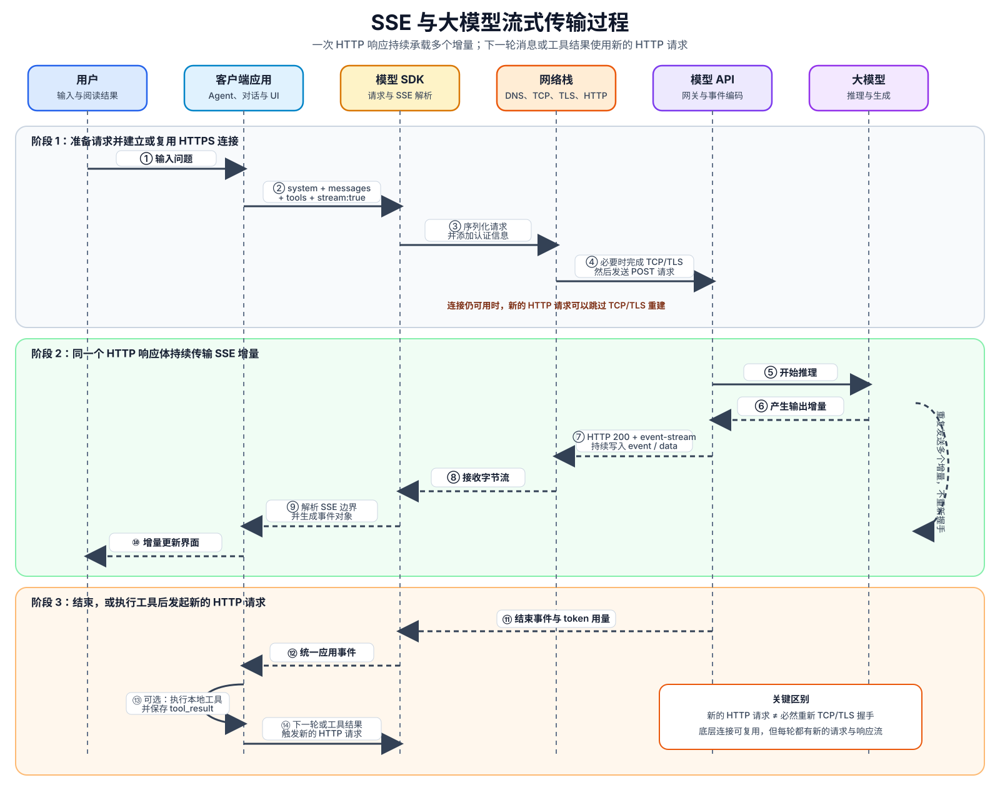

+++
date = 2026-08-10
title = "SSE 与 LLM 流式传输"
+++

# SSE 与 LLM 流式传输

# 一、SSE 的核心概念

Server-Sent Events（SSE）是一种基于 HTTP 响应流的服务端推送机制。在大模型流式输出场景中，客户端先发送一次完整请求，服务端返回响应头后暂不结束响应体，而是在同一个响应体里持续写入文本增量、思考增量、工具调用参数和结束事件。

所谓“长连接”，重点是这个 HTTP 响应体会保持一段时间。它不表示通信完全不需要握手，而是表示连接建立之后，不需要为每个输出增量重复建立连接。

## 1. 建立连接时仍然需要握手

首次通过新的 HTTPS 连接访问模型服务时，通常依次经历：

1. DNS 将域名解析为服务器地址。DNS 查询不是 TCP 握手，但属于通信前的准备工作。
2. 客户端与服务器完成 TCP 三次握手。
3. 双方完成 TLS 握手，协商加密参数并验证服务器身份。
4. 客户端发送 HTTP 请求头和完整请求体。
5. 服务端返回 HTTP 响应头，例如 `200 OK` 和 `Content-Type: text/event-stream`。
6. 服务端保持响应体打开，持续发送 SSE 事件。
7. 模型生成结束后，服务端结束本次 HTTP 响应。

因此，更准确的说法是：**SSE 需要正常的 HTTP/HTTPS 建连过程，但在一次流式响应期间，不会为每个 delta 重复 TCP 或 TLS 握手。**

## 2. SSE 与 WebSocket 的区别

SSE 没有 WebSocket 那样的 `Upgrade` 升级握手。它仍然是普通 HTTP 请求与响应，只是响应媒体类型为 `text/event-stream`，并且响应体不会立即结束。

SSE 在应用层是单向的：服务端通过响应流向客户端推送事件。客户端不能把下一条用户消息反向写入当前响应体，所以多轮对话仍然需要新的 HTTP 请求。

# 二、客户端与大模型服务端的完整传输流程



## 1. 请求阶段

客户端应用先准备 `system`、对话历史、工具描述和模型参数，然后调用模型 SDK。SDK 负责序列化 JSON、添加认证信息，并通过运行时网络栈发送流式 HTTP 请求。

概念上的请求类似：

```http
POST /v1/responses HTTP/1.1
Authorization: Bearer <api-key>
Content-Type: application/json

{
  "model": "example-model",
  "stream": true,
  "messages": [
    { "role": "user", "content": "解释这个函数" }
  ]
}
```

这里的 `stream: true` 表示服务端应当返回流式事件，而不是等待全部内容生成后一次性返回。

## 2. 响应阶段

服务端开始生成后，会先返回响应头，然后在同一个 HTTP 响应体中连续写入多个 SSE 事件。下面是一个与具体供应商无关的概念示例：

```text
HTTP/1.1 200 OK
Content-Type: text/event-stream

event: response.started
data: {"requestId":"req_42"}

event: text.delta
data: {"text":"Hello"}

event: text.delta
data: {"text":" world"}

event: response.completed
data: {"inputTokens":12,"outputTokens":2}
```

每个事件通常由空行分隔。SDK 会从响应字节流中识别 `event:`、`data:` 和事件边界，再把它们转换为可供程序消费的事件对象。

## 3. SSE 事件不等于 TCP 数据包，也不等于 token

必须区分三种边界：

- token 是模型内部处理文本时使用的单位；
- SSE event 是应用协议中的事件单位；
- TCP packet 是底层网络传输单位。

一个 SSE `text.delta` 可能包含一个或多个 token。一个 TCP 数据包也可能包含多个 SSE 事件；反过来，一个较大的 SSE 事件也可能被拆到多个数据包中。因此，应用不能假设“一次网络读取等于一个 token”或“一次网络读取等于一个完整事件”。

# 三、为什么下一轮消息需要新的 HTTP 请求

当前 SSE 流属于当前 HTTP 响应，方向是服务端到客户端。以下情况都需要发起新的 HTTP 请求：

- 用户发送下一轮消息；
- 模型要求调用本地工具，应用执行后回传 `tool_result`；
- 输出达到 token 上限，需要继续生成；
- 请求因限流或可恢复错误而重试。

不过，**新的 HTTP 请求不等于必然重新进行 TCP/TLS 握手**。

如果连接池中的底层连接仍然可用：

- HTTP/1.1 可以通过 keep-alive 复用连接；
- HTTP/2 可以在同一条网络连接上创建新的逻辑 stream。

新请求仍然拥有独立的请求头、请求体和响应流，只是可能复用已经建立好的底层连接。

# 四、应用、SDK 与网络栈的职责边界

## 1. 应用代码负责什么

应用层通常需要负责：

- 维护 `system`、对话历史和工具描述；
- 将内部消息转换为模型 API 要求的格式；
- 把不同供应商的流式事件转换为统一事件；
- 累积文本、思考内容和分段到达的工具参数；
- 执行本地工具，并把工具结果加入对话历史；
- 决定正常结束、继续请求、重试或中断；
- 增量更新 UI，并通过节流减少过于频繁的渲染；
- 将 SDK 错误转换为应用可以处理的领域错误。

## 2. 模型 SDK 负责什么

模型 SDK 通常负责：

- JSON 请求序列化；
- API Key 等认证请求头；
- 发起流式 HTTP 请求；
- 按 SSE 规则解析响应字节流；
- 将事件暴露为 `AsyncIterable`、异步生成器或回调；
- 将 `AbortSignal` 传递给网络请求；
- 将非成功 HTTP 响应包装为 SDK 错误。

## 3. 运行时与操作系统负责什么

运行时和操作系统网络栈通常负责：

- DNS 查询；
- TCP 建连、可靠传输与重传；
- TLS 加密与证书验证；
- HTTP/1.1 keep-alive 或 HTTP/2 连接复用；
- 网络缓冲、分包和连接关闭。

可以用一句话概括边界：**SDK 管“怎样从网络获得结构化流事件”，应用管“得到事件后业务上应该做什么”。**

# 五、TypeScript 流式适配器示例

下面用一个与具体模型供应商无关的适配器说明两层异步迭代关系：SDK 先提供供应商事件流，应用再把它转换成稳定的内部事件流。

```typescript
type AppStreamEvent =
  | { type: "text_delta"; text: string }
  | { type: "tool_call_complete"; name: string; arguments: unknown }
  | { type: "stream_end"; inputTokens: number; outputTokens: number };

async function* streamModel(
  history: Array<{ role: string; content: string }>,
  signal?: AbortSignal,
): AsyncGenerator<AppStreamEvent> {
  // SDK 负责发送 HTTP 请求，并把 SSE 字节流解析成供应商事件对象。
  const vendorStream = await modelSdk.createResponse(
    {
      messages: history,
      stream: true,
    },
    { signal },
  );

  let toolArguments = "";

  for await (const event of vendorStream) {
    // 应用负责把供应商事件转换成稳定的内部事件。
    if (event.type === "vendor.text.delta") {
      yield { type: "text_delta", text: event.text };
    }

    // 工具参数可能被拆成很多段，因此需要先累积再解析。
    if (event.type === "vendor.tool_arguments.delta") {
      toolArguments += event.text;
    }

    if (event.type === "vendor.tool_call.done") {
      yield {
        type: "tool_call_complete",
        name: event.name,
        arguments: JSON.parse(toolArguments || "{}"),
      };
      toolArguments = "";
    }

    if (event.type === "vendor.response.done") {
      yield {
        type: "stream_end",
        inputTokens: event.usage.inputTokens,
        outputTokens: event.usage.outputTokens,
      };
    }
  }
}
```

上层 Agent 只依赖 `AppStreamEvent`，不依赖供应商原始事件。当模型供应商发生变化时，只需修改适配层，而不必重写完整的对话和工具执行循环。

# 六、结论

SSE 的关键不是“没有握手”，而是“一次 HTTP 响应可以持续传输多个事件”。首次建立 HTTPS 连接仍可能涉及 DNS、TCP 和 TLS；流式期间的多个增量共享当前响应，不会逐个重新握手。下一轮消息或工具结果需要新的 HTTP 请求，但只要底层连接仍然可用，新请求就可能复用原来的 TCP/TLS 连接。

在实现层面，网络栈负责可靠连接，模型 SDK 负责请求与 SSE 解析，应用负责统一事件、对话状态、工具循环和界面更新。把这些层次分开，是理解和实现大模型流式客户端的核心。
