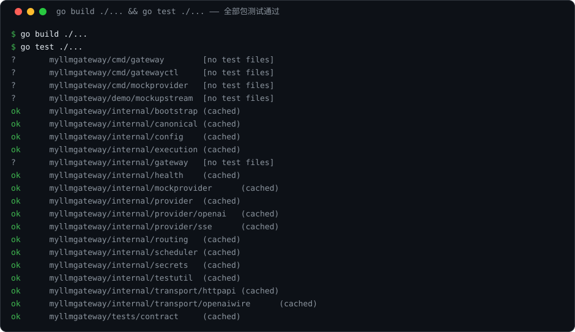
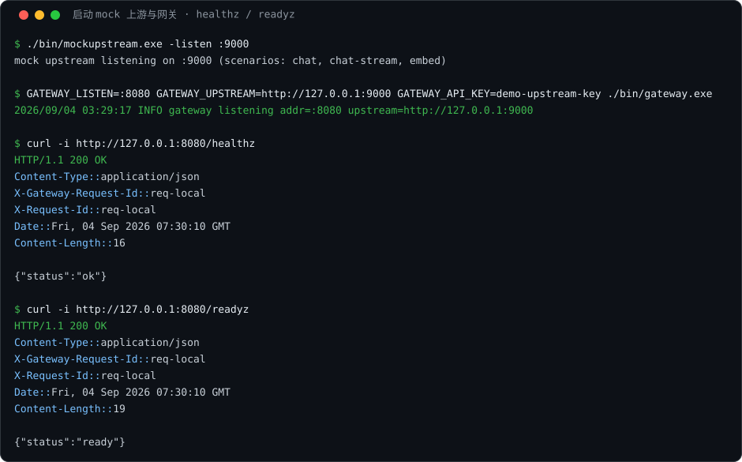
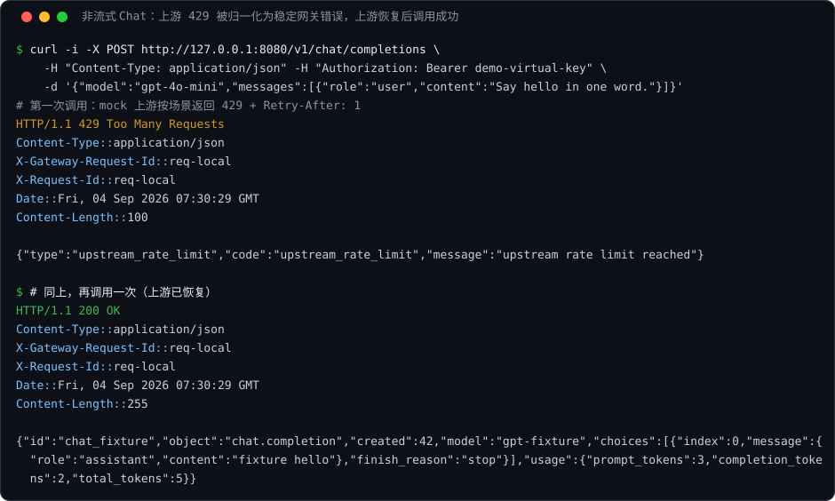
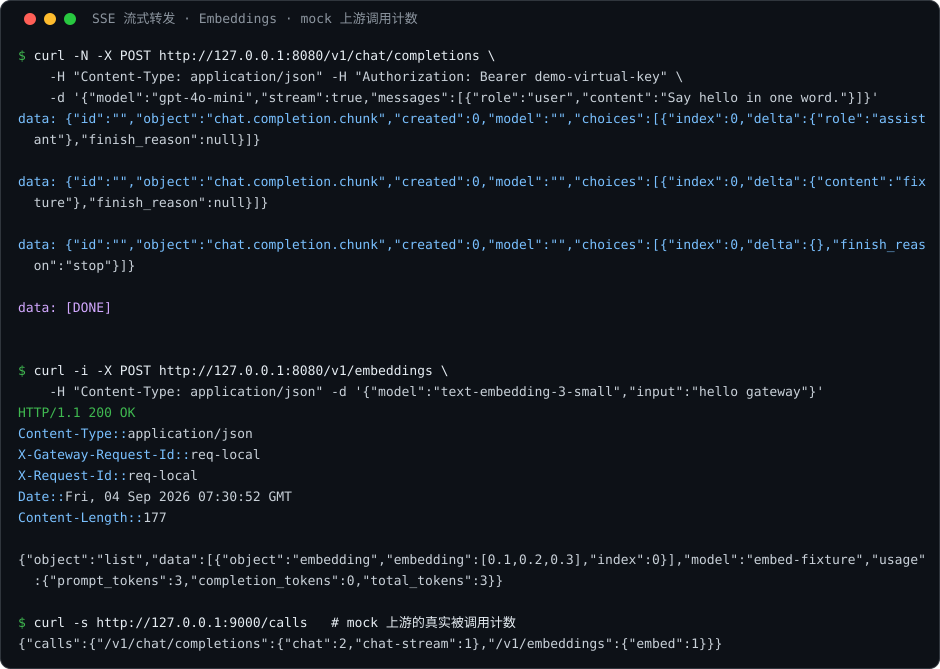

+++
date = 2026-09-04
title = "MyLLMGateway"
+++

# MyLLMGateway

> 本文是基于仓库当前代码的**已实现方案**说明与**真实运行验证**。
> 说明：文中所有截图均为 `.svg` 文件，内容来自本机真实运行的终端输出捕获（非手绘示意图），复现方法见第 6 节。

## 1. 项目概述

MyLLMGateway 是一个用 Go 实现的 **LLM API 网关**：对应用暴露 OpenAI 兼容的 Chat Completions / Embeddings 接口，对内以"逻辑模型"屏蔽真实供应商、部署与凭证，并在请求路径上提供路由、重试、流式边界、故障域隔离、健康熔断等网关语义。

当前状态：

- **已可用**：OpenAI 兼容的非流式 / SSE 流式 Chat、Embeddings 端到端转发；统一错误归一化；能力校验；契约测试与全量单测通过。
- **已建成并通过单测、待接入主链路**：路由 AttemptPlan（ordered / weighted / lowest-cost）、重试执行引擎、三车道并发调度器、熔断器与健康注册表、版本化配置快照与校验器。
- **尚未实现**：PostgreSQL 预算账本与 outbox、Redis 分布式限流、Anthropic / Azure OpenAI 适配器、gatewayctl 管理命令、OTel 指标。

本文第 4 章逐项说明实现方案，第 5 章给出系统真实运行的截图证据。

## 2. 技术选型

| 层 | 选择 | 理由 |
|---|---|---|
| 数据平面 | Go 1.26，标准库 `net/http` | 并发模型清晰、流式与取消易控制、单二进制部署、可用 race detector |
| 配置 | YAML 单文档 + 严格解码 + 语义校验 | 配置不可变、可校验、可回滚（快照 + checksum） |
| 上游测试 | 自研 mockprovider（确定性场景引擎） | 无真实供应商即可复现 429/5xx/慢响应/半截 SSE 等全部关键故障 |
| 密钥 | `env://` 引用 + TTL 缓存解析器 | 配置与日志只出现引用，不出现明文 |
| 部署 | Dockerfile + docker-compose + Makefile | 本地三命令即可构建、测试、起服务 |
| 质量门禁 | golangci-lint（CI 锁定）+ `go test -race` | 回归基线：全量测试通过、lint `0 issues` |

依赖极少（直接依赖仅 pgx、redis、prometheus、otel、yaml 等 8 项，见 `go.mod`），其余均为 lint/工具链间接依赖。

## 3. 总体架构与代码布局

```text
应用 / OpenAI SDK
      │  POST /v1/chat/completions（OpenAI 兼容，只改 base_url + key）
      ▼
┌────────────────────────────────────────────────────────────┐
│ MyLLMGateway（Go 单进程，模块化单体）                        │
│                                                            │
│  transport/httpapi    HTTP Server、healthz/readyz、请求 ID  │
│  transport/openaiwire OpenAI wire ⇄ Canonical IR 双向转换   │
│  gateway              Service 编排（能力校验→构建→执行→归一化）│
│  routing              AttemptPlan：候选过滤 + 三种排序策略    │
│  execution            重试循环、退避、尝试记录               │
│  scheduler            request/stream/probe 三车道并发隔离    │
│  health               熔断器（Closed→Open→HalfOpen）+ 注册表 │
│  provider/openai      OpenAI 适配器（Chat/Embedding/SSE）   │
│  provider/sse         通用 SSE 解析器（任意字节分片）        │
│  canonical            统一中间表示 IR、统一错误、能力契约     │
│  config / secrets     版本化配置快照、密钥引用解析           │
└───────────────┬────────────────────────────────────────────┘
                │  OpenAI 协议（HTTP/SSE）
                ▼
        LLM Provider（验收环境由 mockprovider 扮演）
```

实际目录与入口：

```text
cmd/
  gateway/        # 数据平面入口（cmd/gateway/main.go）
  gatewayctl/     # 管理命令入口（当前为占位骨架）
  mockprovider/   # 确定性 mock 供应商入口
internal/         # 全部业务模块（见上图，均为小接口组合）
tests/
  contract/       # Provider 契约测试（golden fixtures 驱动）
  fixtures/openai/# 契约样本：chat / embedding / error / stream
demo/
  mockupstream/   # 本报告运行截图所用的演示上游（见 6.2）
```

## 4. 核心实现方案

### 4.1 Canonical IR：统一中间表示

所有供应商协议先转换为统一的 Canonical IR（`internal/canonical`），网关内部只处理 IR，不处理任何供应商私有格式：

- **Chat**（`chat.go`）：消息（system/developer/user/assistant/tool 五种角色、文本与图片多部分 content）、工具定义 / 工具调用 / 工具选择、response_format（text / json_object / json_schema）、采样参数、`provider_options` 受控扩展命名空间。
- **Usage**（`usage.go`）：输入 / 输出 / 缓存 / 推理 token 四类用量。
- **流式事件**（`stream.go`）：`MessageStart / ContentDelta / ToolDelta / Usage / Finish` 五种事件，是流式状态机的基本单元。
- **统一错误**（`errors.go`）：14 种稳定错误类别（`invalid_request`、`rate_limited`、`upstream_rate_limit`、`timeout`、`gateway_overloaded`、`partial_stream`……），每种映射固定 HTTP 状态码，并携带 `Retryable` / `FallbackAllowed` / `RetryAfter` 三个重试决策字段。对外只暴露脱敏后的 `PublicError`（`errors.go:84`）。
- **能力契约**（`capability.go`）：每个字段的处理结果必须是 `Native / Transformed / Dropped / Rejected / Passthrough` 五者之一，默认"不能正确转换就拒绝"，禁止静默丢字段。

### 4.2 OpenAI 兼容传输层

`internal/transport/openaiwire` 负责 OpenAI wire 格式 ⇄ Canonical IR 的双向转换：

- **严格解码**（`request.go:359`）：`DisallowUnknownFields` 拒绝未知字段；单请求必须是恰好一个 JSON 值；请求体默认上限 1 MiB，字符串 / 工具载荷分别有 64 KiB / 256 KiB 上限——超限在访问上游之前返回 4xx。
- **入站映射**（`request.go:38`）：`max_tokens` 与 `max_completion_tokens` 互斥校验、stop 字符串/数组归一、tool_choice 三种形态归一、embedding input 支持文本 / token / 批量同构数组。
- **出站映射**（`response.go`）：Canonical 响应重新编码为标准 OpenAI `chat.completion` / embedding `list` JSON；SSE 侧由 `stream.go` 的编码器逐事件写出并以 `[DONE]` 收尾。
- **错误封装**（`error.go`）：网关错误以稳定的 `{"type","code","message"}` 信封返回。

### 4.3 Provider 抽象与 OpenAI 适配器

Provider 接口按能力拆分（`internal/provider/adapter.go`），不为不支持的能力实现空方法。OpenAI 适配器（`internal/provider/openai`）实现四件事：

1. `BuildRequest`（`chat.go:38`）：Canonical → OpenAI DTO，附带 `Authorization: Bearer <运行时凭证>`；
2. `ParseResponse`：上游 JSON → Canonical，提取上游 `X-Request-ID` 进入 `ProviderMeta` 用于对账；
3. `PrepareStream`（`stream.go`）：把上游 SSE 字节流解析为 Canonical 事件流——支持任意分片、心跳注释跳过、`[DONE]` 终止、usage 尾包、流内错误信封识别；
4. `NormalizeError`（`errors.go`）：上游状态码 → 统一错误——401/403→`upstream_auth_error`（不可重试）、429→`upstream_rate_limit`（解析 ≤30s 的 `Retry-After`）、5xx→`upstream_server_error`、普通 4xx→`invalid_request`（不可重试不可回退）。

底层还有：适配器注册表（`registry.go`）、按故障域隔离的 HTTP client（`httpclient.go`）、通用 SSE 分帧解析器（`provider/sse/parser.go`，覆盖半个 JSON、多行 data、空行等畸形输入的确定性测试）。

### 4.4 路由：不可变 AttemptPlan

路由器不直接发请求，只生成**不可变执行计划**（`internal/routing`）：

- `Router.Plan`（`router.go`）：从配置快照取出模型策略，生成带 `SnapshotVersion` / `SnapshotChecksum` / `MaxAttempts` / `Deadline` 的 `AttemptPlan`；候选 deployment 不存在时记入 `Excluded` 并附原因（可解释路由）。
- 三种首版策略（`strategies.go`）：`ordered`（按配置序）、`weighted`（按 requestID 做 FNV 散列的确定性加权排序，同一请求结果稳定）、`lowest-cost`（按快照价格表的输入+输出单价排序）。
- 计划一旦生成即固化：配置切换不影响执行到一半的请求。

### 4.5 执行引擎：重试判定与退避

`internal/execution` 实现候选内重试：

- `RunWithRetry`（`loop.go`）：逐次执行、每次生成 `AttemptRecord`（起止时间、结果、usage、错误）；错误不可重试或达到上限即停止。
- `ShouldRetry`（`retry.go:9`）：只有 `Retryable && FallbackAllowed && 未提交首事件` 三者同时成立才允许重试——这是"首事件提交后禁止透明回退"规则的代码落点。
- `Backoff`（`retry.go:12`）：有上限的指数退避 + 抖动，尊重上游 `Retry-After`，并被请求剩余时间预算 clamp。

### 4.6 故障域并发调度

`internal/scheduler` 把并发容量划分为 **request / stream / probe 三条独立车道**（`lane.go`），防止长流式连接耗尽非流式容量：

- `Acquire`（`scheduler.go:50`）获取有界 `Lease`，支持 ctx 取消（客户端离开时不会永久占槽）；
- `Reconfigure` 支持车道容量**热更新**且不影响已持有的 lease；
- `View` 暴露 limit/in-use/waiting 观测面。

### 4.7 健康与熔断

`internal/health` 实现标准熔断状态机（`breaker.go`）：`Closed → Open → HalfOpen`，失败计数达阈值熔断，冷却期内拒绝，冷却结束后只允许**单个探测请求**（`probe` 标志保证并发下探测唯一），探测成功即闭合复位。注册表（`registry.go`）按 failure-domain 复用 breaker 并区分端点 5xx / 凭证 401 / 凭证 429 三类故障。

### 4.8 配置与密钥

- **配置**（`internal/config`）：严格 YAML 单文档解码（多文档直接拒绝）、`Snapshot` 深拷贝 + checksum、语义校验覆盖 HTTPS 端点、凭证引用、策略、权重、超时与 attempt 上限。
- **密钥**（`internal/secrets`）：`env://` 引用解析器，带 TTL 缓存与 single-flight（并发解析同一引用只回源一次），配置与日志全程不出现明文。
- 目标形态的完整配置样例见 `configs/gateway.example.yaml`（含 PostgreSQL/Redis 依赖声明、四类体积上限、限流降级策略、优雅退出排空时间）。

### 4.9 HTTP API 与进程装配

- HTTP Server（`internal/transport/httpapi/server.go`）：`/healthz`（进程存活）、`/readyz`（就绪闸门的函数注入）、`/v1/chat/completions`（非流式 + SSE 自动分流）、`/v1/embeddings`；统一 request-ID 中间件回写 `X-Request-ID` / `X-Gateway-Request-ID` 响应头；错误统一经 `GatewayError.Public()` 脱敏输出。
- 流式转发（`server.go:79`）：逐 Canonical 事件编码下发并 `Flush()`，`Finish` 事件后补 `[DONE]`；流中出现网关错误时以 SSE 错误事件终止。
- 入口（`cmd/gateway/main.go`）：环境变量装配（`GATEWAY_LISTEN` / `GATEWAY_UPSTREAM` / `GATEWAY_API_KEY` / `GATEWAY_MODEL`）→ 构造 OpenAI 适配器与 `AdapterService`（`internal/gateway/service.go`：能力校验 → 构建请求 → 执行 → 错误归一化）→ 启动 HTTP Server；收到 SIGINT 后 10s 优雅退出。

### 4.10 Mock 上游与契约测试

`internal/mockprovider` 是确定性供应商模拟引擎：JSON 场景序列（状态码 / 头 / 延迟，序列耗尽后重复末位响应）、SSE 场景（逐 chunk 字节级控制 + 延迟注入）、按"端点 × 场景"的**调用计数**与 `/reset`。它让 429、慢响应、半截流等故障在无真实供应商时也能稳定复现。`tests/contract` 以 `fixtures` 中的 golden 样本对 OpenAI 适配器做契约测试。

## 5. 运行验证（真实运行截图）

以下截图全部来自本机真实运行：网关二进制 `bin/gateway.exe`（:8080）+ 演示上游 `demo/mockupstream`（:9000，由 mockprovider 引擎驱动，加载仓库自带契约 fixtures）。截图是终端输出的 SVG 渲染，内容与 `.cache/report-capture/` 下的原始捕获逐字一致。

### 5.1 构建与全量测试



**观察点**：`go build ./...` 与 `go test ./...` 全部通过——13 个有测试的包全 `ok`（含 `tests/contract` 契约测试），lint 同为 `0 issues`。

### 5.2 服务启动与健康检查



**观察点**：mock 上游加载 `chat` / `chat-stream` / `embed` 三个场景；网关日志确认监听 :8080 并指向上游 :9000；`/healthz` 返回 `{"status":"ok"}`、`/readyz` 返回 `{"status":"ready"}`，两者都携带 `X-Gateway-Request-Id` 响应头。

### 5.3 非流式 Chat：上游 429 → 错误归一化 → 恢复后成功



**观察点**：mock 场景设定第一次调用返回 429 + `Retry-After: 1`。网关没有透传上游私有错误体，而是归一化为稳定网关错误 `{"type":"upstream_rate_limit", ...}`（HTTP 429）；再次调用（上游已恢复）返回标准 OpenAI `chat.completion` 响应，usage 三类 token 完整。调用方只看到稳定契约，不感知上游差异。

### 5.4 SSE 流式 · Embeddings · 上游调用计数



**观察点**：

1. `"stream":true` 时网关切换到流式路径，上游 SSE 被逐事件解析为 Canonical 事件、重新编码为标准 `chat.completion.chunk` 下发，以 `data: [DONE]` 收尾；
2. `/v1/embeddings` 返回标准 embedding `list` 结构；
3. mock 上游 `/calls` 计数 `{"chat":2,"chat-stream":1,"embed":1}` 与演示调用次数**精确一致**——证明每一次上游访问都是可计数、可对账的真实调用，没有多发或漏发。

## 6. 复现步骤

### 6.1 构建与测试

```bash
go build ./...
go test ./...
go tool golangci-lint run   # 预期：0 issues.
```

### 6.2 端到端运行

```bash
# 终端 1：演示上游（须在仓库根目录运行，加载 tests/fixtures）
go run ./demo/mockupstream -listen :9000

# 终端 2：网关
go build -trimpath -o bin/gateway.exe ./cmd/gateway
GATEWAY_LISTEN=:8080 GATEWAY_UPSTREAM=http://127.0.0.1:9000 GATEWAY_API_KEY=demo-upstream-key ./bin/gateway.exe

# 终端 3：调用（Windows/Git Bash 均可）
curl -i http://127.0.0.1:8080/healthz
curl -i -X POST http://127.0.0.1:8080/v1/chat/completions \
  -H "Content-Type: application/json" -H "Authorization: Bearer demo-virtual-key" \
  -d '{"model":"gpt-4o-mini","messages":[{"role":"user","content":"Say hello in one word."}]}'
curl -N -X POST http://127.0.0.1:8080/v1/chat/completions \
  -H "Content-Type: application/json" \
  -d '{"model":"gpt-4o-mini","stream":true,"messages":[{"role":"user","content":"hi"}]}'
curl -s http://127.0.0.1:9000/calls
```

> 说明：截图使用的 `.svg` 由 `.cache/report-capture/make_svg.py` 将真实捕获文本渲染生成；接真实 OpenAI 时只需把 `GATEWAY_UPSTREAM` 改为 `https://api.openai.com` 并设置真实 `GATEWAY_API_KEY`，无需改动代码。

## 7. 当前边界与后续计划

为避免误读，明确当前版本的边界：

1. **主链路目前是单 deployment 直连**：路由 AttemptPlan、重试引擎、三车道调度、熔断器均已建成并有单测，但尚未装配进 `cmd/gateway` 的请求热路径。
2. **治理与账务未开始**：PostgreSQL 预算预占/结算账本、Redis 分布式 RPM/TPM、transactional outbox、虚拟密钥持久化均未实现。
3. **供应商覆盖**：当前仅 OpenAI 适配器；Anthropic、Azure OpenAI 适配器待按既有 Provider 接口扩展。
4. **request ID 中间件**目前透传客户端 `X-Request-ID` 或使用占位值，正式的 logical_request_id 生成与幂等键校验将随生命周期模块落地。
5. **gatewayctl**（配置校验 / dry-run / 迁移）目前是入口骨架。

后续顺序：先把路由/执行/调度/健康接入主链路并补齐 E2E，再做多供应商与治理闭环，最后生产化控制面。
