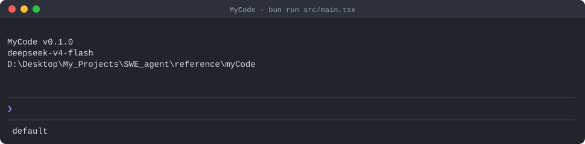
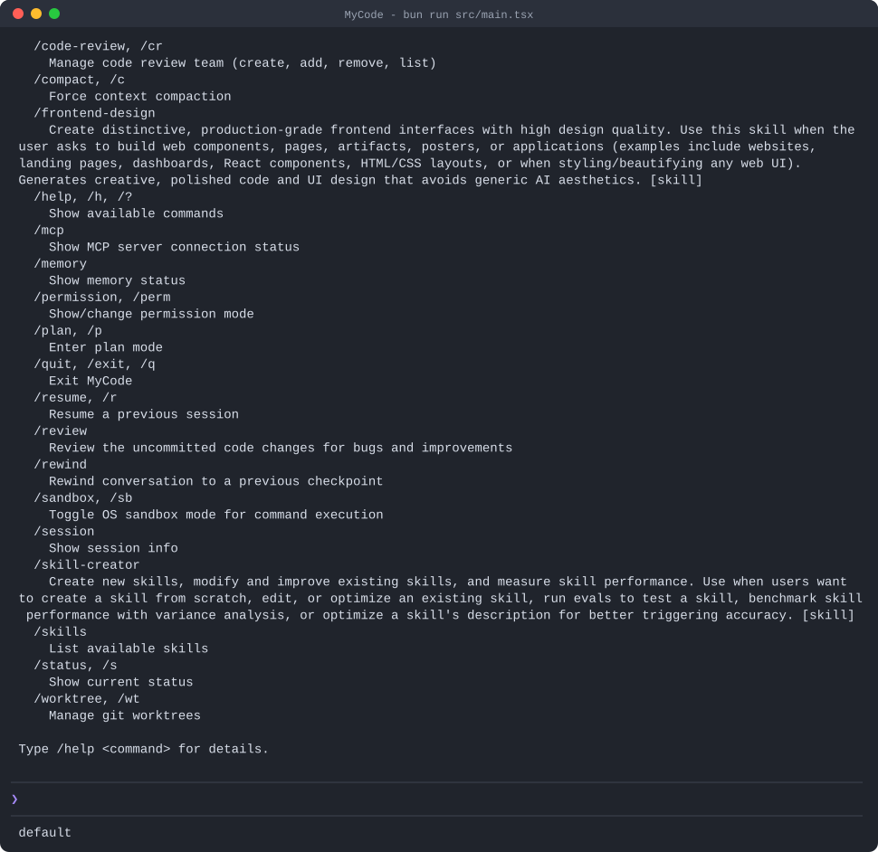
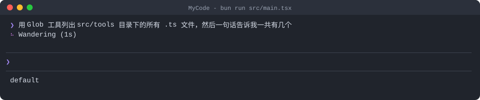
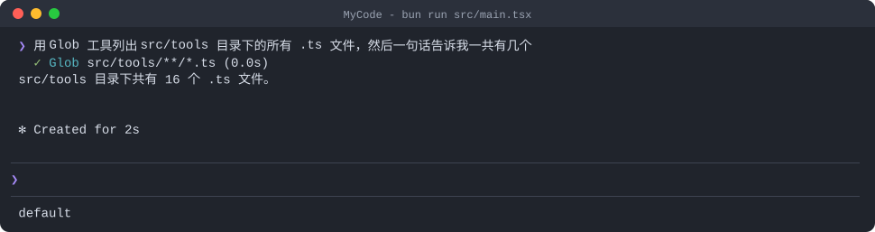

+++
date = 2026-09-04
title = "MyCode"
+++

# MyCode

> MyCode 是一个用 **TypeScript + Bun + Ink** 实现的终端 AI 编程助手（AI Coding Agent），以「模型推理 → 工具调用 → 结果反馈」的 Agent 循环为核心，外围挂载权限系统、上下文治理、长期记忆、Skill / MCP / 子 Agent / 多智能体团队等扩展能力。
>

## 1. 它能做什么

MyCode 把「AI 编程助手」拆成一条可恢复、可扩展的 Agent 运行时：

- **能做事**：内置读文件 / 写文件 / 编辑 / 执行命令 / 搜索等工具，模型可读写文件、运行命令、检索代码；
- **能扩展**：MCP 外部工具、Skill（SOP 模板）、自定义子 Agent、多智能体团队（Teams）四套扩展机制；
- **能长跑**：上下文超限自动压缩、工具大结果溢写磁盘、限流等待重试、输出截断续写、进程重启后从压缩边界恢复；
- **能记住事**：后台记忆提取把会话沉淀为长期记忆文件，后续会话按相关性召回，并定期后台整理去重；
- **能管住**：四种权限模式 + 危险命令拦截 + 路径沙箱 + OS 级沙箱（bwrap/seatbelt）+ Hooks 事件钩子。

## 2. 技术栈

| 类别 | 选型 | 用途 |
| --- | --- | --- |
| 运行时 | Bun 1.x | 直接运行 TS/TSX，无构建步骤；`bun test` 跑测试 |
| 语言 | TypeScript 5.8（strict） | `tsc --noEmit` 做类型检查 |
| TUI | Ink 5 + React 18 + ink-spinner / ink-text-input | 用 React 组件渲染终端界面 |
| LLM SDK | @anthropic-ai/sdk、openai | 协议适配层的底层客户端 |
| MCP | @modelcontextprotocol/sdk | stdio / Streamable HTTP / SSE 三种传输 |
| Markdown | marked + marked-terminal | 终端内渲染模型输出的 Markdown |
| 模糊匹配 | fuse.js | 斜杠命令补全排序 |
| 配置 | js-yaml | 配置与权限规则文件解析 |
| WebSocket | ws | 远程模式服务器 |

## 3. 三种使用形态

同一个入口按参数分发到不同形态：

- **TUI（默认）**：Ink + React 渲染的交互式终端界面，是主要使用方式；
- **print 模式**：非交互执行，结果写 stdout 后退出，便于脚本集成与评测；支持纯文本或逐事件 JSON 两种输出，并附轮数 / 工具调用数 / token 用量 / 耗时汇总；
- **远程模式**：启动 WebSocket 服务器（:18888）+ 内置单文件 Web UI，浏览器即客户端。

此外还有第四种内部入口——**teammate 模式**：由多智能体后端（tmux/iTerm）拉起的独立进程，跑精简工具集（无团队/子 Agent 工具，防止无限裂变）。

## 4. 总体架构

```text
┌──────────────────────────── 接入层 ────────────────────────────┐
│  Ink TUI (React)   │   print 模式   │   Remote WS + Web UI      │
└──────────────────────────────┬─────────────────────────────────┘
                               │ 同一套 Agent 配置接口注入
┌──────────────────────────────▼─────────────────────────────────┐
│  编排层  Agent.run()（异步生成器）                              │
│   ├─ 权限链 PermissionChecker · HookEngine                     │
│   ├─ 工具调度 StreamingExecutor（只读并行 / 写·命令串行）       │
│   └─ 恢复策略（限流等待 · 上下文压缩 · max_tokens 续写 · 中断） │
├────────────────────────────────────────────────────────────────┤
│  能力层  ToolRegistry（统一 Tool 接口）                         │
│   ├─ 内建工具（ReadFile/Bash/Glob/Grep/WriteFile/EditFile/…）   │
│   ├─ MCP 工具（mcp__server__tool 包装，延迟加载 + ToolSearch）  │
│   ├─ Skill（LoadSkill 激活 / inline / fork 子 Agent）           │
│   ├─ Agent 工具（一次性子 Agent · fork · 长驻队友）             │
│   └─ Teams（TeamCreate/SpawnTeammate/SendMessage/共享任务板）   │
├────────────────────────────────────────────────────────────────┤
│  状态层  ConversationManager（消息历史 + usage 锚点）           │
│   ├─ toolresult 预算与磁盘溢写 · compact 两层压缩 · RecoveryState│
│   ├─ session JSONL 持久化 · compact_boundary 跨进程恢复         │
│   ├─ memory 提取/召回/整理 · filehistory 快照与 rewind          │
│   └─ todo 个人任务 · planfile 计划文件 · prompt 历史            │
├────────────────────────────────────────────────────────────────┤
│  模型层  LLMClient：anthropic / openai / openai-compat          │
└────────────────────────────────────────────────────────────────┘
```

一次普通请求的完整链路：

```text
用户输入（支持 @文件引用内联、/斜杠命令）
  ↓ 写入 user message，会话落盘 JSONL
  ↓ Agent 主循环
    ├─ 注入计划提醒 / Hook 通知 / 团队通知
    ├─ 工具结果预算检查：超限输出溢写磁盘，上下文只留预览
    ├─ 上下文管理：按 usage 锚点 + 增量估算判断，超阈值自动压缩
    ├─ 模型流式调用：统一产出文本/思考增量、工具调用、usage 事件
    ├─ 工具执行：连续只读工具合并并行批次；写/命令工具单独串行
    │   （执行前统一过 Hook + 权限检查 + 用户确认对话框）
    ├─ 工具结果写回会话 → 进入下一轮
    └─ 直到模型结束 / 中断 / 达到迭代上限
  ↓ 循环结束：后台记忆提取；会话与快照持久化
```

## 5. 核心设计

### 5.1 Agent 执行循环：可恢复的流式状态机

Agent 主循环是一个**异步生成器**：模型返回的每个增量事件（文本、思考、工具调用、usage）立即向上层抛出，TUI/远程客户端实时渲染；一轮流结束后把完整 assistant 消息写入会话，执行工具，把结果作为下一轮输入，直到模型结束回合。

**统一事件模型**让上层不需要知道任何协议细节：

| 事件 | 含义 |
| --- | --- |
| `stream_text` / `thinking_text` / `thinking_complete` | 正文/思考流式增量 |
| `tool_use` / `tool_result` | 工具调用开始/完成（含耗时、是否错误） |
| `turn_complete` / `loop_complete` | 一轮工具循环结束 / 整个 Agent 结束 |
| `usage` | API 返回的真实 token 用量（含缓存读/写） |
| `compact` / `retry` / `error` | 压缩发生 / 限流或续写重试 / 错误 |
| `permission_request` | 需要用户确认权限 |

**工具调度策略**：工具按类别分为 `read / write / command` 三类。Agent 不按 `Promise.all` 一把梭，而是按模型给出的调用顺序切批：**连续的只读工具合并为一个并行批次**（降低等待），**遇到写/命令工具就建立单调用的串行批次**（避免竞态）；分类缺失时按最保守的 `command` 处理。实际执行前每个调用仍统一经过 Hook 和权限检查——并行只作用于已通过策略的安全读操作。

**恢复优先**是这套循环的最大特点，可恢复错误都会回到同一状态机继续：

| 失败/压力场景 | 处理方式 |
| --- | --- |
| API 限流 | 读 `Retry-After`，可中断睡眠后重试 |
| 用户中断（Esc/Ctrl+C） | 同一个中止信号打断流读取与限流等待 |
| 上下文超限 | 先压缩工具结果预算，再强制整体压缩，重注入长期记忆后**重试本轮** |
| 输出达到 max_tokens | 先把上限提升到 64000，再最多 3 次「从断点继续写」的多轮续写 |
| 单条工具输出过大 | 溢写到会话目录下的磁盘文件，上下文只留路径 + 预览 |
| 未知工具连续调用 | 超过上限才终止循环，防止模型跑偏空转 |

### 5.2 模型接入层：统一接口与三种协议适配

模型层对外只暴露一个最小接口：给定会话与工具列表，流式产出统一事件；系统提示可随时替换。按 provider 配置的协议懒加载三种客户端实现：

- **anthropic**：Anthropic Messages API 原生流式协议，`input_json_delta` 增量累积 JSON 参数、内容块结束时解析为完整工具调用；
- **openai**：OpenAI Responses API；
- **openai-compat**：OpenAI 兼容的 Chat Completions（DeepSeek 等第三方网关）。

三种客户端把各自的供应商事件映射为同一组流式事件，差异（消息格式、工具 schema 形状、usage 字段）全部收敛在模型层内部；工具 schema 也按协议在 Anthropic 风格与 OpenAI function 风格之间自动转写。

两个配套机制：

- **模型别名与热切换**：`haiku/sonnet/opus` 等短名映射到完整模型 ID，同一 provider 配置下可替换模型派生新 client——主 Agent、记忆子 Agent、Skill fork、自定义子 Agent 都复用这套解析；
- **上下文窗口四层解析**：配置显式指定 → Anthropic 协议自动查询模型元信息（带记忆化缓存）→ 内置模型名匹配表 → 保守默认值（claude 200k / 其他 128k）。

### 5.3 工具系统：分类、注册表与渐进式披露

所有工具实现同一个接口（名称 / 描述 / 类别 / schema / 执行），因此内置工具、MCP 工具、团队工具都走**同一条权限 + Hook + 调度 + 结果预算链路**。

TUI 下注册的内建工具：

| 类别 | 工具 |
| --- | --- |
| 文件与命令 | ReadFile、WriteFile、EditFile、Bash、Glob、Grep |
| 检索扩展 | ToolSearch（搜索/选中延迟加载的工具） |
| 计划模式 | ExitPlanMode |
| 工作区隔离 | EnterWorktree、ExitWorktree（git worktree） |
| 任务清单 | TaskCreate / TaskGet / TaskList / TaskUpdate（个人 todo，延迟加载） |
| Skill | LoadSkill、InstallSkill |
| 交互 | AskUserQuestion（结构化多选提问，委托给 UI 弹窗） |
| 多智能体 | Agent（子 Agent/队友/fork 统一入口）、TeamCreate、SpawnTeammate、SendMessage、ListTeams、TeamDelete |

**渐进式披露（progressive disclosure）**：标记为延迟加载的工具（MCP 工具、任务工具等）默认**不把 schema 发给模型**；模型先用 `ToolSearch` 关键词搜索或按名精确选中，注册表把对应工具标记为「已发现」后才进入请求。MCP 工具多的场景下，这显著降低了无关 schema 对上下文窗口和 prompt cache 的占用。

**Bash 工具的工程细节**值得一提：

- `bash -c` 执行，默认 120s 超时（上限 600s），stdout/stderr 合并；
- **退出码语义化**：grep/rg/diff/test 等命令退出码 1 不算错误（如 grep exit 1 = "no matches found"），并给 LLM 附加语义提示，避免模型把「没搜到」当成「命令失败」；
- 可被注入 OS 沙箱包装器（见 5.4）。

**文件状态缓存**：跟踪已读文件的 mtime/内容哈希，编辑前校验「读之后没被外部改过」，防止基于陈旧上下文的盲写。

### 5.4 权限与安全：分层检查链 + OS 沙箱

每次工具调用按顺序走以下分层检查：

```text
Layer 0  plan 模式例外：放行对计划文件的写
Layer 2  安全只读命令白名单（ls/cat/git status/bun test…）自动放行
         —— 含元字符防护：带 > | ; && $( ` 的命令一律不算「安全」
Layer 3  危险命令正则拦截（rm -rf /、mkfs、fork bomb、curl|sh、
         git push --force、git reset --hard 等 14 类，直接 deny）
Layer 3.5 沙箱自动放行：OS 沙箱开启且非危险命令时跳过人工确认；
         复合命令先按 && || ; | 拆分逐条过规则，防止拼接绕过
Layer 4  路径沙箱：文件工具限定在项目目录 + /tmp；
         配置文件、权限规则文件、skills 目录永远禁写
Layer 4b 会话级临时放行（内存 Set，进程退出即失效）
Layer 5  规则引擎：用户级 → 项目级 → 项目本地级权限规则文件，
         Tool(glob) 格式，文件内后写优先
Layer 6  权限模式矩阵兜底
```

四种**权限模式**（TUI 里 Shift+Tab 循环切换，输入框底部彩色提示）：

| 模式 | 行为 |
| --- | --- |
| `default` | 读自动放行，写/命令弹窗询问 |
| `acceptEdits` | 读+写放行，命令询问 |
| `plan` | 只读放行，写/命令询问（配合计划文件例外） |
| `bypassPermissions` | 全部放行（YOLO，红色警示） |

用户在确认对话框选「Yes, and don't ask again」时，派生的 `Tool(前缀*)` 规则会**持久化到本地权限规则文件**，重启后仍生效；规则引擎每次检查时重读文件，刚写入的规则立即生效。

**OS 级沙箱**（三档：沙箱+自动放行 / 沙箱+常规权限 / 关闭）：Linux 用 **bubblewrap**（根目录只读挂载、按路径放行写、可断网），macOS 用 **seatbelt**（动态生成 `(deny default)` profile，硬编码 sandbox-exec 路径防 PATH 注入）；Windows 检测为不可用后回退，不影响主流程。

### 5.5 上下文治理：预算、压缩与可恢复状态

这是「Agent 能长跑」的关键子系统，分四层：

**① 工具结果预算（局部压缩）**。单条工具结果超过 5 万字符、或单条消息聚合超过 20 万字符时，把完整输出溢写到磁盘，上下文中只保留路径 + 前 2KB 预览。带幂等标记避免重复溢写，模型需要细节时可按路径读回。

**② 真实 usage 锚点 + 增量估算**。每轮流结束记录 API 返回的 `input + cache_read + cache_creation + output` 作为基线和当时的消息数；下一轮只估算锚点之后新增的消息。冷启动或供应商不返回 usage 时退化为字符估算。比「每轮全量猜 token」既准又快。

**③ 两层渐进压缩（整体压缩）**。发送前先跑 ①，再判断：超过「窗口 − 输出预留 − 安全余量」阈值时自动摘要压缩。压缩保留策略不是简单留最近 N 条，而是**按 token 预算（1 万）+ 最少消息数（5 条）+ 上限（4 万）**保留近期尾部，并回退边界避免拆开工具调用/结果配对。摘要请求自身超限时按 API 轮次从最老的组删减并重试。

**④ 恢复附件与跨进程恢复**。压缩清空工作记忆后，恢复机制负责「让模型想起来自己在干嘛」：最近读过的 5 个文件（每个约 5000 token 预算）、已激活的 Skill（总预算 2.5 万 token）、可用工具清单，作为附件拼在摘要之后。压缩结果同时以边界记录**追加写入会话日志**（摘要 + 保留尾部内联），进程重启后只认最后一个边界，重建「摘要 + 保留尾部 + 边界后新消息」；无边界的旧会话完整回放，向后兼容。

### 5.6 长期记忆：提取、召回与后台整理闭环

把「一次性对话」转化为「长期知识」的三段闭环：

- **提取（会后写）**：主 Agent 每轮结束后异步触发记忆提取——一个只有文件操作工具的**子 Agent**，prompt 里附带已有记忆文件的清单（名称+描述），要求「先查重再写入」，按类型分别写入用户级或项目级记忆目录，写完重建索引。进行中标记 + 待处理上下文合并并发到达的内容，不阻塞主回复、不丢最后一轮。
- **召回（按需读）**：只把轻量清单交给选择器模型，最多选 5 个文件再读全文，作为系统提醒注入。召回以**非阻塞**方式与当前模型请求并行，工具执行完若已就绪就注入下一轮——不是所有记忆常驻上下文。
- **整理（定期合并）**：三重门控（距上次 ≥24 小时、期间 ≥5 个新会话、拿到进程锁文件）满足后才后台 fork 整理子 Agent，合并近重复文件、删除矛盾事实、维护索引；失败回滚锁，避免并发整理。

### 5.7 Skill 系统：三层发现、热重载与两种执行方式

Skill 是「带 frontmatter 的 Markdown SOP 模板」，机制：

- **三层发现**：内置层 → 用户全局层 → 项目层，**后加载的同名 Skill 覆盖先加载的**（项目优先级最高）；
- **热重载**：每次获取按文件 mtime 检测变更并重解析，改完立即生效；
- **按需激活**：模型通过 LoadSkill 工具把某个 Skill 的正文拉进上下文（而非开局全塞），激活状态写入恢复机制，压缩后仍能恢复；
- **参数注入**：正文中的 `$ARGUMENTS` 占位符替换为用户参数，无占位符则追加用户请求原文；
- **两种执行方式**：`inline`（正文作为 SOP 注入当前会话）与 `fork`（派生独立子 Agent 执行，可选带父会话最近上下文）；
- **变成斜杠命令**：inline skill 注册为提示型命令、fork skill 注册为派生命令，用户在输入框 `/skill名` 直接调用；
- **工具面收敛**：Skill 激活后可按白名单只放行允许的工具 schema（系统工具始终保留），让 Skill 不只是 prompt 模板，还能动态改变当前 Agent 的能力集合；
- **安装**：InstallSkill 工具从本地路径或 URL 拉取 SKILL.md 写入项目 skills 目录并即时重载。

### 5.8 MCP 接入：多传输、工具包装与延迟加载

- **三种传输**：stdio（命令 + 参数）、Streamable HTTP、SSE；配置中的环境变量/请求头支持 `${VAR}` 展开，密钥不落配置文件；
- **工具包装**：每个 MCP 工具包装成内部统一工具，命名 `mcp__server__tool`，默认延迟加载（配合 5.3 的 ToolSearch 渐进披露），调用时映射回 MCP 原始名；
- **容错接入**：统一连接所有配置服务器，单个失败进入错误列表不阻塞其他；各 server 的 instructions 会注入系统提示；
- **权限直通**：`mcp__` 前缀工具在协调者过滤、子 Agent 过滤中始终放行（见 5.9/5.10）。

### 5.9 子 Agent：三种派生路径与工具过滤

**定义加载**：内置（通用 / 计划 / 探索三个角色）→ 用户级目录 → 项目级目录，同名覆盖；定义文件 = 工具白/黑名单、模型、轮数上限、权限模式、是否后台、worktree 隔离等元信息 + 正文初始提示。

**统一的 Agent 工具是入口，三条路径**：

1. **定义路径**：按类型找到定义，创建**独立上下文**的子 Agent（新会话、独立权限检查器、模型按「调用级 > 定义级 > 父模型」解析）；
2. **fork 路径**：不传类型时**继承父对话全部历史**（字节对齐 prompt-cache 前缀），注入 fork 样板指令（禁止再 fork、限范围、报告 <500 字）；嵌套 fork 有来源标记 + 历史标签扫描**双层防护**；
3. **队友路径**：指定团队时作为**长驻队友**运行（见 5.10），注册表额外注入本名的消息工具和团队共享任务板工具。

**工具过滤**六层规则：MCP 直通 → 全局禁用（禁止子 Agent 再派 Agent 等递归风险工具）→ 自定义 Agent 附加限制 → 后台任务白名单 → 定义级黑名单 → 定义级白名单交集。

**后台任务**：支持异步派生子 Agent，完成/失败经通知队列上报主会话。

### 5.10 Teams 多智能体：文件邮箱 + 共享任务板

「一个 Lead + 多个 Teammate」的团队协作：

- **队友运行后端三选一**：tmux 窗口 / iTerm 标签页 / 进程内协程。**Windows 一律回退进程内**（tmux 命令在 Windows 终端下会失败），外部后端拉起失败也自动降级进程内，跨平台不崩；
- **文件邮箱是唯一通信通道**：每个成员一个消息文件 + 读游标文件；写消息用独占锁文件（最多 10 次随机退避重试，**超过 10s 的 stale 锁自动删除**防崩溃僵死）；读游标持久化，进程重启接着读。Lead 与队友、进程内与跨进程，全部走这一套；
- **idle-poll-continue 队友循环**：队友跑完一轮 → 向 lead 信箱发空闲通知 → 500ms 轮询自己信箱 → 收到关闭指令退出，否则把新消息拼成下一轮任务继续；
- **共享任务板**：任务文件落盘团队目录，四个任务管理工具支持「阻塞/被阻塞」依赖（双向维护），每次读前重读文件保证跨进程一致；
- **Lead 感知团队**：定期读所有团队 lead 信箱未读消息，包装后注入主 Agent 下一轮；
- **协调者模式**：Lead 可被限制为「只调度不动手」——只放行 Agent / 消息 / 任务管理 / 团队管理和只读工具；团队全部拆除后下一轮自动恢复完整工具集；
- **TUI 可视化**：`Ctrl+T` 打开 Teams 对话框（成员列表/详情/终止/关闭），状态栏显示在线队友数，流式期间渲染队友进度树（环形缓冲记录最近 5 条活动）。

### 5.11 TUI：终端渲染、流式 Markdown 与交互组件

**渲染架构**：Ink 的静态区放已提交消息（写进终端滚动缓冲区，不重绘不闪），动态区放活动消息 + 流式文本 + 活动工具 + Spinner + 对话框 + 输入框。

**流式 Markdown 的性能优化**：以最后一个空行为稳定边界，**只重解析尾部不稳定块**，稳定前缀缓存复用，把每帧全量重渲染的 O(n²) 降为 O(n)；并按终端宽度把逻辑行折算物理行、从末尾裁剪，防止动态区超高触发清屏。

**工具调用展示**：进行中为彩色圆点 + 动词 Spinner（约 100 个随机动词 + token 数 + 秒数）；完成后 ✓/✗ + 耗时；一轮结束后折叠成回合摘要（"Thought for 4s, read 2 files, ran 1 command"）；编辑工具的 diff 默认展开红绿着色，其余输出 Ctrl+O 展开、超 500 字截断。

**输入框**：

- 多行编辑（Shift+Enter/Ctrl+J 断行）、上下键翻 prompt 历史（落盘保存，200 条上限）；
- **斜杠命令补全**：空查询时把「最近使用」排前（使用频率追踪：次数 × 7 天半衰期衰减，落盘保存），否则按 精确名→别名→前缀→模糊匹配（fuse.js 加权）排序，附 ghost text 灰色提示；
- **`@` 文件补全**：扫描工作目录（跳过 node_modules 等，上限 2000 文件），前缀优先取前 8；提交时 `@path` 内联为带路径标签的文件内容（≤100KB）；
- Shift+Tab 循环权限模式，底部彩色显示当前模式。

**对话框组件**：权限确认（Yes / always / No）、计划批准（YOLO / 逐条批准 / 打回修改，可输入反馈）、rewind 两阶段快照恢复、AskUserQuestion 多问题向导（标签页导航 + 单/多选 + Other 自由输入）、Teams 管理、Provider 选择（多 provider 时启动显示）。

**消闪**：检测终端支持后（Windows Terminal / WezTerm / iTerm 等）monkey-patch `stdout.write`，用微任务队列把同一帧的多次写入合并进 DEC 2026 同步输出信封（BSU/ESU），整帧原子渲染。

**Ctrl+C 语义**：流式中 = 中断当前轮；空闲时双击退出（2s 内第二次），首次按显示提示。

### 5.12 远程模式：WebSocket + 内置单文件 Web UI

远程模式监听 `:18888`：HTTP 对所有路径返回同一个内置单文件 Web 前端（Tokyo Night 深色主题、CDN 引入 marked.js、断线 3s 重连、10s 应用层 ping）。WebSocket 双向协议：

| 方向 | 消息类型 |
| --- | --- |
| client→server | `user_message`、`permission_response`、`ask_user_response`、`cancel`、`ping` |
| server→client | `connected`、`commands`、`stream_text`/`thinking_text`、`tool_use`/`tool_result`、`turn_complete`/`loop_complete`、`usage`、`compact`、`retry`、`permission_request`、`ask_user`、`system` 等 |

服务端**完整复刻 TUI 的初始化**（工具注册表、记忆注入、Hooks、Skills、团队工具、Agent 工具），权限确认和提问通过挂起 Promise + 前端弹窗应答实现——同一套 Agent 核心因此同时服务两种前端，互不耦合。

### 5.13 Hooks 引擎：事件、条件 DSL 与四种动作

在配置文件中声明 hooks 列表，在 Agent 生命周期九个事件（`session_start / session_end / turn_start / turn_end / pre_send / post_receive / pre_tool_use / post_tool_use / shutdown`）上触发动作：

- **四种动作**：`command`（执行外部命令，注入事件相关环境变量，30s 超时）、`prompt`（文本直接注入）、`http`（POST JSON）、`agent`（子 Agent 动作的扩展点）；
- **条件 DSL**：`==` / `!=` / `=~`（正则）/ `=*`（glob）+ `&&` `||` `!`，从 `tool/event/file_path/message/args[key]` 取值；
- **行为开关**：`once` 只触发一次、`async` 后台执行（结果进通知队列下一轮注入）、`reject` 可拦截工具调用前事件直接否决、`on_error` 决定错误时 ignore/fail/reject。

典型用途：保存前自动格式化、危险目录写保护、操作审计上报等。

### 5.14 状态持久化：一切皆文件

所有状态都以纯文件形式落盘（用户级与项目级分离），可审计、可恢复：会话消息与压缩边界、溢写的超大工具输出、编辑前备份与快照、计划文件、个人任务清单、团队邮箱与共享任务板、长期记忆与索引、自定义 Skill / 命令 / 子 Agent 定义、输入历史与命令使用频率。进程重启、多进程协作都能从磁盘重建一致状态。

## 6. 运行截图

**① TUI 启动界面** —— 版本头（`MyCode v0.1.0` + 当前模型 + 工作目录），底部为输入框（`❯` 提示符）与当前权限模式（`default`）：



**② `/help` 斜杠命令列表** —— 内建命令（`/compact`、`/plan`、`/resume`、`/rewind`、`/sandbox`、`/code-review` 等）与已安装的 Skill 命令（带 `[skill]` 标记）：



**③ Agent 流式执行中** —— 输入「用 Glob 工具列出 src/tools 目录下的所有 .ts 文件……」：Glob 调用已完成（`✓` + 参数 + 耗时），下方 Spinner 正在转动（随机动词 + 实时 token 数 + 秒数），等待模型汇总回答：



**④ 任务完成** —— 工具调用记录（`✓ Glob src/tools/**/*.ts (0.0s)`）、模型基于工具结果给出的回答，以及底部的完成标记（`✻` + 随机完成动词 + 总耗时）；输入框恢复待输入状态：



**⑤ print 模式** —— 非交互执行，结果直接写 stdout 后退出：


