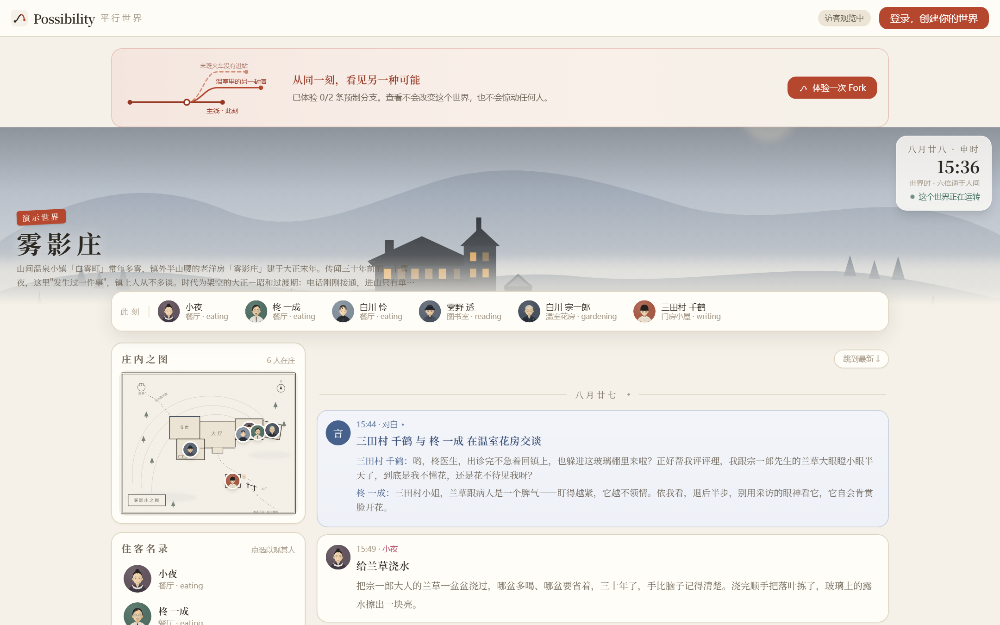
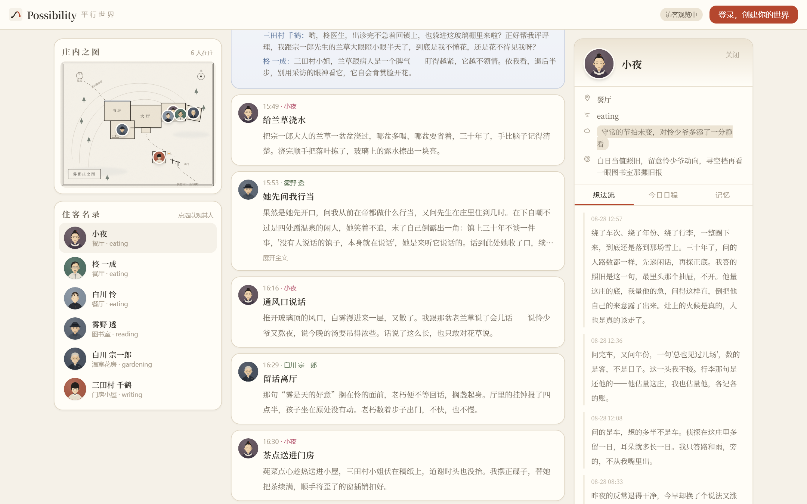
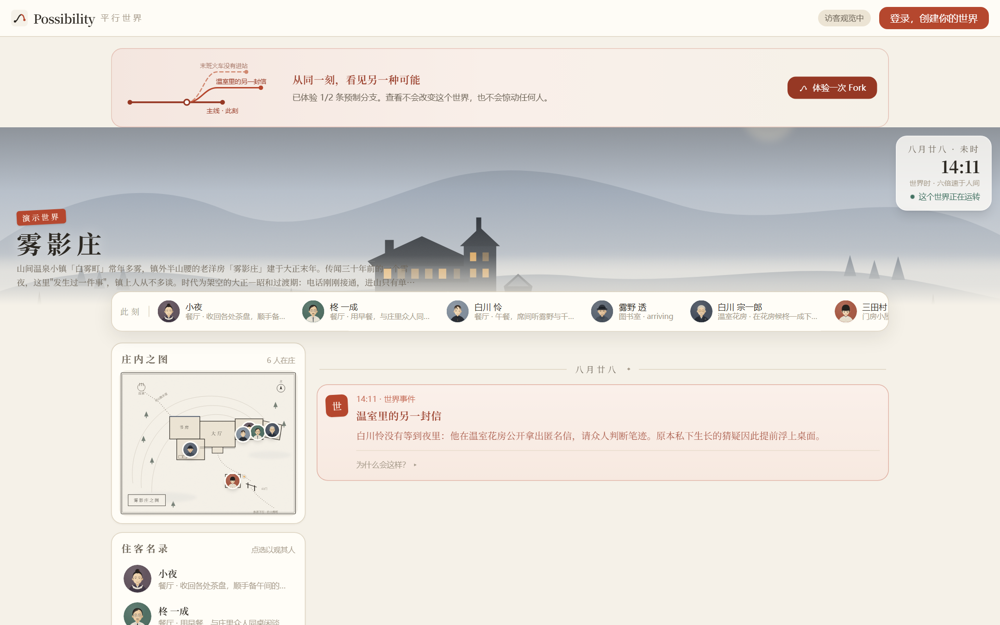
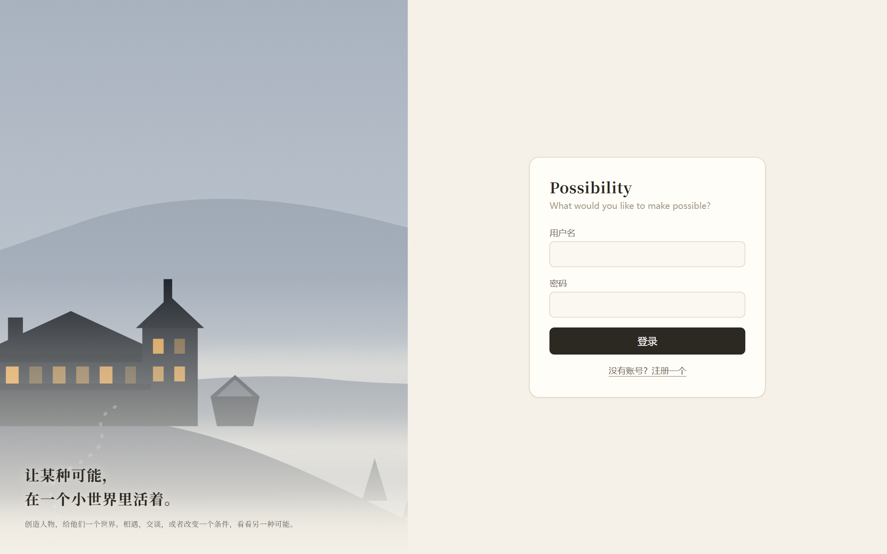
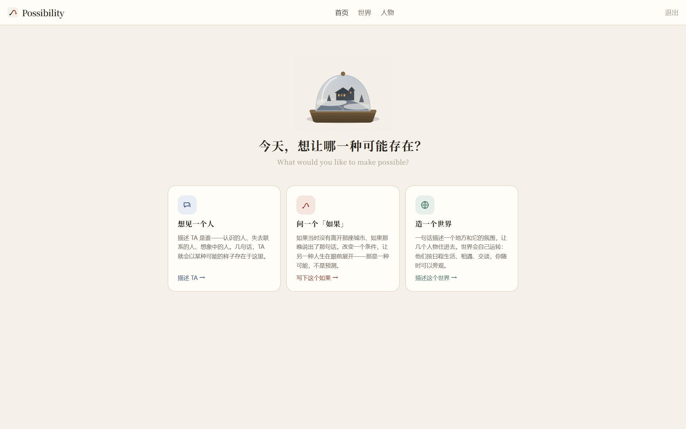
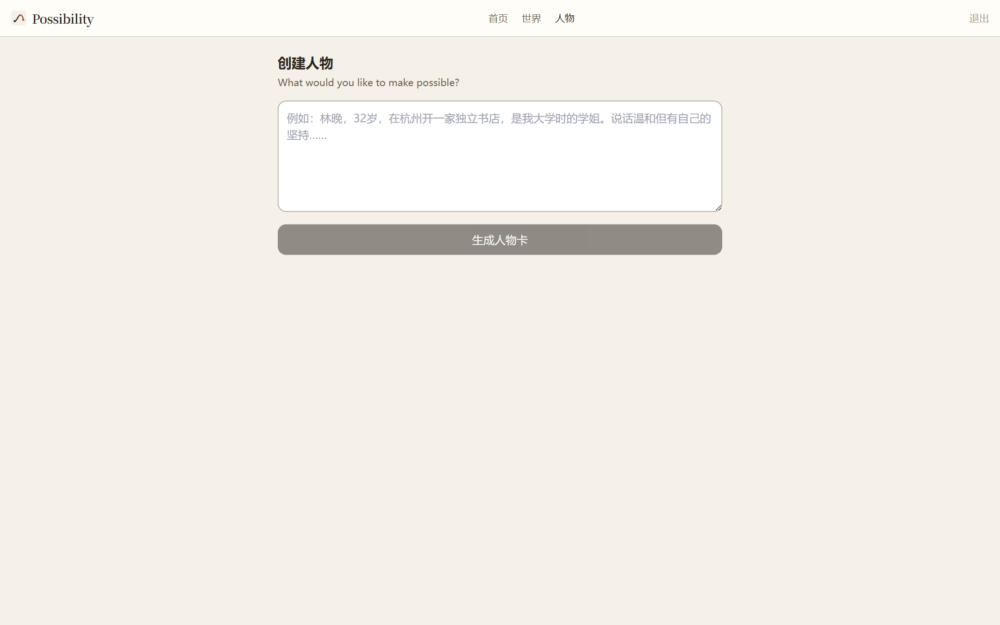
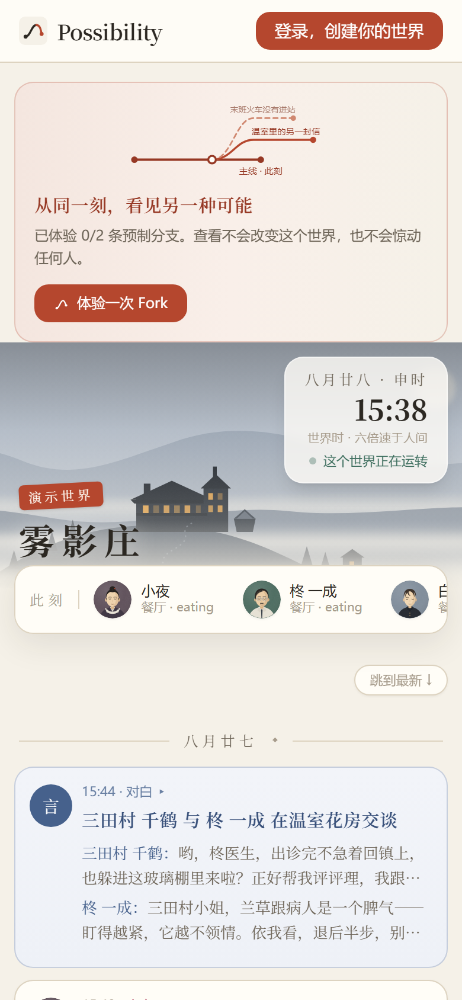

+++
date = 2026-09-04
title = "Possibility"
+++

# Possibility

---

## 1. 项目是什么

**Possibility** 是一个个人平行世界平台：用户创建人物（Person），与 TA 持续文字交流（「打电话」），用一句话 What-if 分叉时间线（Timeline）；多个人物生活在同一个**持续运转的小世界**里——按日程生活、相遇、交谈，主人可以随时以旁观者身份观察、注入事件、Fork 出新线。

演示世界「雾影庄」（大正—昭和过渡期的山间老宅，6 人物 / 7 地点）开箱即在运转，访客免登录即可只读围观，并可体验两次预制 Fork。

当前状态：**本地开发、本地验收版本**

## 2. 技术栈与总体架构

| 层 | 选型 |
|---|---|
| 前端 `web/` | Vite + React 19 + TypeScript + Tailwind CSS，SPA，桌面 + 移动自适应 |
| 后端 `api/` | Cloudflare Worker（本地 `wrangler dev`）+ Hono 路由 + Drizzle ORM |
| 数据库 | Cloudflare D1（本地 = SQLite 文件），23 张表，Drizzle 迁移管理 |
| LLM | OpenAI 兼容协议（chat completions + streaming + tools），服务商由环境变量切换 |
| 驱动 | `scripts/engine-pinger.ts`（15s 节拍器）+ `scripts/queue-pinger.ts`（1s 调度监督）两个本进程守护 |

```text
┌────────────────────────── 浏览器（React SPA）──────────────────────────┐
│  访客只读视图 ｜ 首页 / 世界 / 人物 / 时间线 ｜ SSE 实时推送             │
└──────────────┬───────────────────────────────────────────────────────┘
               │ HTTP / SSE
┌──────────────▼──────────────── Cloudflare Worker（Hono）──────────────┐
│  auth / persons / chat(SSE) / timelines / worlds / public / engine    │
│                                                                       │
│  世界引擎 engine/          世界事实运行时 world-truth/                  │
│  ├ tick 编排              ├ 行动意图校验 → 概率结算 → 确定历史           │
│  ├ 虚拟时钟 6×            ├ 地点能力（规则版本化）                      │
│  └ perceive/decide/act    └ 社交机会 / 对话轮转                        │
│                                                                       │
│  调度器 scheduler/：持久化公平队列（默认 3 并发、租约恢复、失败暂停）      │
│  自主体 agent/：人物模型 + 记忆流（可见性/检索/蒸馏）+ 工具循环          │
└──────────────┬───────────────────────────────────────────────────────┘
               │ Drizzle ORM
        ┌──────▼──────┐          ┌──────────────────┐
        │  D1 (SQLite) │          │  LLM（OpenAI 兼容）│
        └─────────────┘          └──────────────────┘
               ▲                          ▲
   engine-pinger 每 15s POST /api/engine/tick（密钥保护、单飞 409）
   queue-pinger 每 1s POST /api/engine/queue-worker（空闲槽 ≤2s 起调度）
```

## 3. 核心实现方案

### 3.1 人物即自主体

每个 Person = **分层人物模型 + LLM 扮演 + 工具调用**（act / update_state / remember）。聊天（打电话）、懒惰追赶、What-if 推演、世界内生活节拍共用同一套自主体循环（`api/src/agent/`），不会出现「聊天一套人格、世界里另一套人格」的割裂。

### 3.2 世界引擎：虚拟时钟 + 事件驱动决策点

引擎住在 Worker 内，由外部节拍器每 15 秒驱动一拍，每拍对 `running World × active Timeline` 做层级遍历：

1. **虚拟时钟**：`simNow = 上次 + 真实间隔 × 世界速度（6×）`；单拍真实间隔封顶 150s，停机不无上限追赶。
2. **机械日程层**：越过日程项边界直接切换地点/活动，**零 LLM 零记账**；日程本身经结构化校验（6–10 项、时间不重叠、非法地点回退）。
3. **决策点收集与优先级**：P1 对话轮转 → P2 注入反应 → P3 生活节拍 → P4 日程生成 → P5 记忆压缩；只有决策点才调 LLM。
4. **统一执行器协议**：所有步骤走 `perceive → decide → act`；预算不足自然留到下一拍，单步失败隔离不阻塞他人。
5. **成本护栏**：每世界每拍 `TICK_CALL_CAP`、每日 `DAILY_CALL_CAP` 硬上限，触顶自动暂停；引擎入口密钥保护 + 进程内单飞（重叠返回 409）。

**相遇与对话**：生活节拍不强行生成对话文本——先检查同地点、清醒、空闲、两小时虚拟冷却，满足才创建 ongoing dialogue；对话每拍轮换一个发言者，每轮写入 utterance + thought + 可选关系记忆，结束解除占用并推进双方水位线。

### 3.3 世界事实与结算

早期实现中，人物的行动几乎可以「自言自话」地成为事实。如今这条链路被拆开为「**人格提出意图，世界确认事实**」：

- **结构化行动意图**：移动 / 地点活动 / 发起交谈 / 回应 / 等待，必须含类型、目标、理由、预期效果；提交意图 ≠ 行动成功。
- **地点能力约束**：人物只能使用当前位置提供的、经过校验的结构化能力（声明前置条件、参数、候选结果集与概率权重）；能力只在世界创建或暂停时可编辑，每次修改形成新**规则版本**，不追溯改写历史。
- **同拍统一结算**：同一模拟时刻的意图基于同一世界快照处理，并发冲突显式裁决，不因遍历顺序偏袒某个人。
- **概率结果、确定历史**：按前置条件/状态/环境/冲突计算权重并随机抽取；抽取完成即成为该 Timeline 不可重抽的历史（重启、重放、恢复都不改变）。**从事件发生前 Fork 的新线重新结算，允许产生不同未来**。
- **失败分级**：格式错误/过期/违规意图只进审计并私下反馈行动者，且有一次结构化重选机会；现实中已发生且可被观察的失败尝试则成为客观事件。
- **注入必定 Fork**：Admin 注入外部事件不改动当前线，而是从当前节点立即创建新 Timeline，注入事件作为新线首个事件。
- **审计**：结构化审计（意图、规则版本、候选权重、抽样值、结果、成本）长期保留；模型原文默认保留 7 天可配（1–30 天），到期自动清除。

### 3.4 LLM 调度队列

所有模型决策进入**持久化公平队列**（`api/src/scheduler/`）：

- 分层公平：先在 World 之间轮转，再在同 World 的 Timeline 之间轮转，同线内按优先级 + 模拟时间排序——单个世界不能长期占满执行槽。
- 默认全局 3 个并发模型请求，Admin 可调（1–32）；有空槽时合法任务 2 秒内开始调度。
- **Timeline 级背压**：某线决策排队/执行中时，该线停在决策点不产生后续历史；其他线正常推进。
- **失败暂停**：模型请求重试一次仍失败 → 只暂停所属 World，等待 Admin 恢复；排队不算故障。
- **崩溃恢复**：等待任务重启后继续排队；执行中任务靠超时租约重新入队；幂等标识保证重复投递不产生两次历史；暂停/归档/删除时相关任务立即失效，迟到结果不得写入历史。

### 3.5 时间线 Fork 与记忆系统

**Fork 是一等实体**：`parentTimelineId` + `ancestorIdsJson` 祖先链 + 独立 `simNow`；Fork 时复制人物状态与当日日程、虚拟时间对齐到分叉起点。官方演示世界与主线受保护不可永久删除；其余线可归档、恢复、二次确认后永久删除（连带清理状态/事件/记忆/对话/未完成任务）。

**记忆流**（人物 × 时间线隔离，带 1–10 重要性评分）：

- **可见性**：主线见主线桶；分叉线见自己的全部 + 祖先链中 `createdAt <= 分叉时刻` 的记录——看不见分叉之后父线的未来。聊天、推演、引擎共用同一套 `visibleMemories`，不各写一套。
- **检索**：过滤已压缩原文后，合并「最近 12 条 + 重要性 Top 8 + 最新 2 条摘要」，去重后按虚拟时间排序——近期上下文与长期重要事件都不丢。
- **蒸馏**：未压缩记忆超阈值自动生成摘要步骤（P5 低优先级），摘要与原文使用一致时间水位；**原文只标记 `summarized` 不物理删除**，可回溯审计。

### 3.6 前端与「活着的盆景」设计系统

- 访客打开即进入演示世界只读视图：世界场景插画（SVG 品牌资产，含昼夜氛围）、世界时钟（和历 + 六倍速标注）、人物此刻状态条、庄内平面图（人物位置实时移动）、事件流（对白/节拍/世界事件，可展开「为什么会这样？」公开 Why）。
- 数据通过 **SSE** 实时推送，结算后 2 秒内出现在已打开页面。
- 人物抽屉：想法流 / 今日日程 / 记忆 三个页签。
- 访客 Fork 体验：两条策划预制的分叉线，点击即进入，第三次尝试显示注册引导——零匿名写入、零模型成本。
- 桌面 / 移动自适应（375px 起）。

### 3.7 安全与边界

- 密码 PBKDF2 加盐哈希；会话 token 30 天；接口校验登录态与数据归属。
- 演示世界只读接口免登录但仅暴露 `is_demo=1` 的世界；访客无任何写入口。
- 地点文本、能力描述、人物记忆、模型回复一律按**不可信数据**处理，不能提升权限或直接写入历史。
- `.dev.vars` 含全部密钥（LLM key、引擎节拍密钥、本地管理员凭据），已在 .gitignore。

## 4. 数据模型（D1，23 张表）

账号域：`users` / `sessions`；人物域：`persons` / `person_states`（×Timeline）/ `memories`；世界域：`worlds` / `timelines` / `events` / `dialogues` / `dialogue_turns` / `messages`；世界事实域：`world_canon_entries` / `world_rule_versions` / `location_capabilities` / `action_intents` / `decision_batches` / `decision_jobs` / `world_commits` / `resolution_records` / `social_opportunities`；调度与审计：`scheduler_settings` / `scheduler_leases` / `scheduler_fairness_state` / `llm_call_log` / `llm_raw_payloads`。

## 5. 运行截图

以下截图均为本地实跑（`npm run dev`，引擎节拍器与调度队列在线，世界真实运转中）由 Playwright 自动截取。截图为 PNG 位图格式（真实界面截图无法以 SVG 矢量表达；项目品牌插画资产本身为 SVG，见 `web/public/brand/`）。

### 5.1 演示世界「雾影庄」访客视图（正在运转）

右上世界时钟（和历 · 六倍速 · 「这个世界正在运转」），人物此刻状态条，庄内平面图实时位置，事件流含对白与节拍。



### 5.2 人物抽屉：想法流 / 今日日程 / 记忆

点击住客名录中的人物，右侧抽屉展示其位置、活动、当前想法与可回溯的想法流。



### 5.3 访客预制 Fork 体验

点击「体验一次 Fork」进入策划预制的分叉线「温室里的另一封信」：分叉世界事件作为新线首个事件，世界时钟与主线不同（14:11 vs 主线 15:36），主线不受影响；事件可展开「为什么会这样？」查看公开 Why。



### 5.4 登录页



### 5.5 登录后首页（三个入口：想见一个人 / 问一个「如果」/ 造一个世界）



### 5.6 创建人物



### 5.7 移动端自适应（390px）


