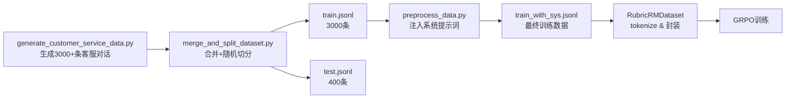
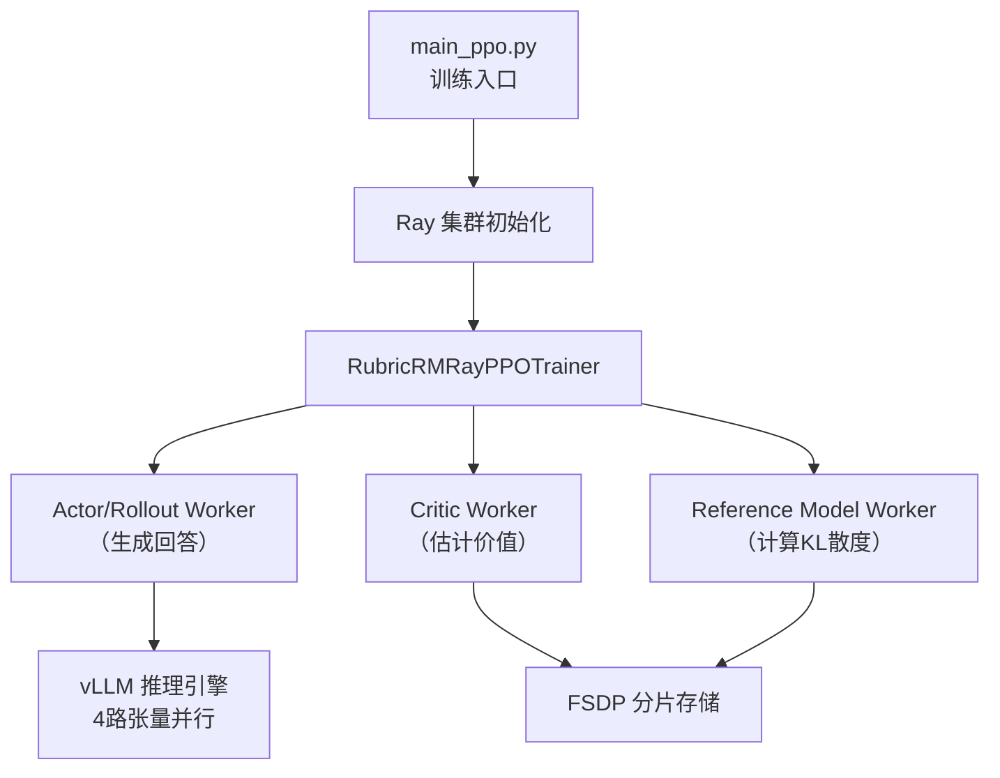
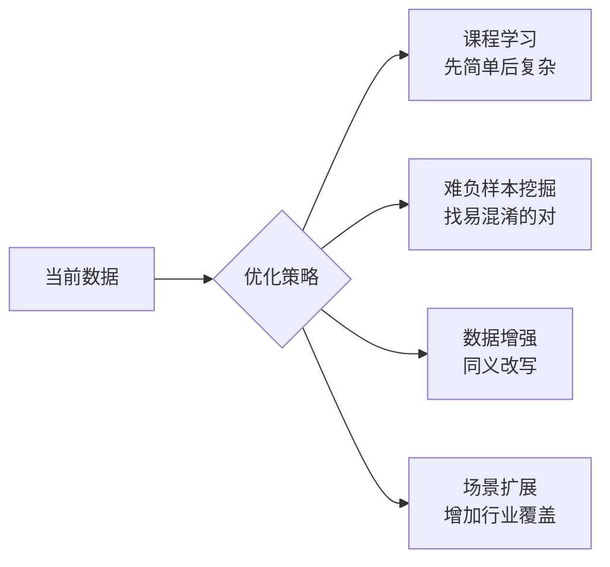
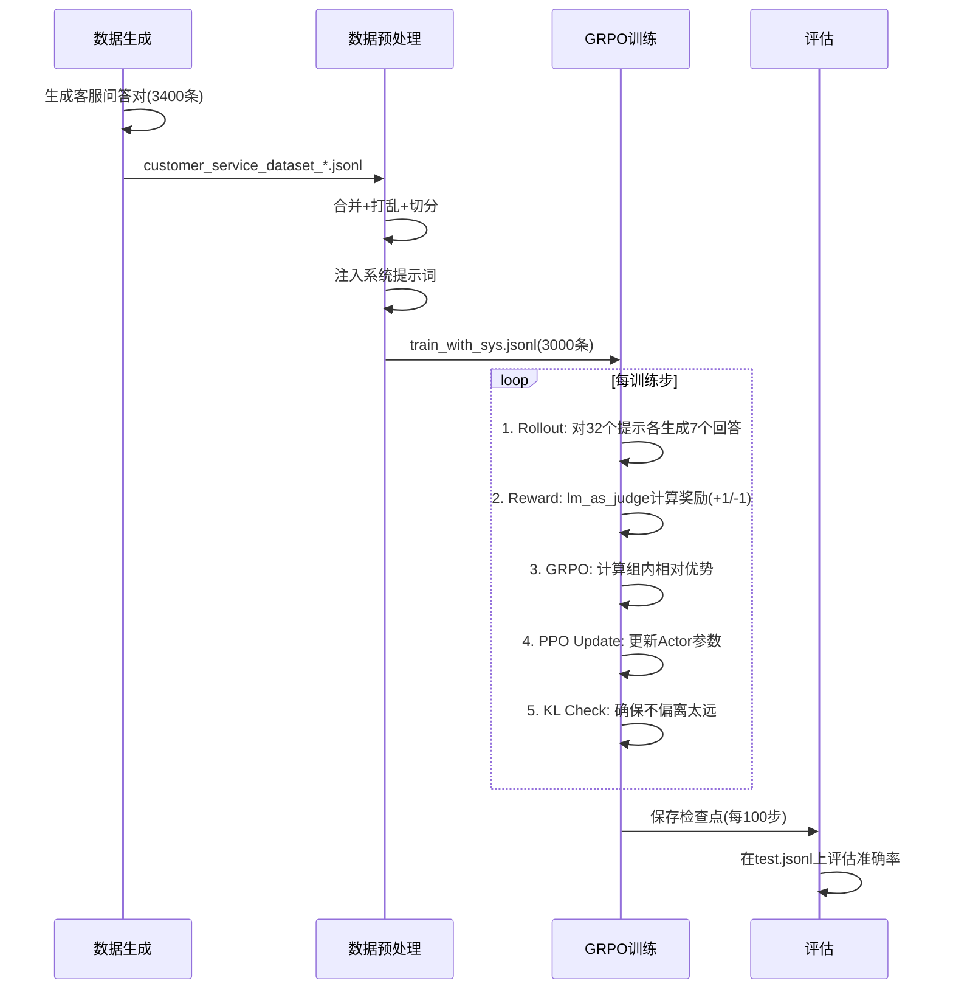

# RM-R1 项目学习笔记

> [!info] 项目定位
> RM-R1 是一个**推理式奖励模型**训练系统，核心创新在于：让模型先"思考"（生成评估标准和推理链），再给出偏好判断，使奖励模型从"黑盒打分"变成"可解释推理"。

---

## 🗺️ 思维导图

```mermaid
mindmap
  root((RM-R1))
    核心思想
      传统RM：直接打分（黑盒）
      RM-R1：先推理再判断（可解释）
      输出格式：&lt;answer&gt;[[A]]&lt;/answer&gt;
    项目结构
      demo/
        demo.py 推理示例
        convert_fsdp_to_hf.py 模型转换
      rm_r1/
        dataset/ 数据集
        scripts/ 训练脚本
        verl/ 训练框架
      generate_customer_service_data.py
      merge_and_split_dataset.py
    训练流水线
      第一步：生成客服数据
      第二步：合并与切分
      第三步：注入系统提示词
      第四步：GRPO强化学习训练
    关键组件
      RubricRMDataset 数据集类
      lm_as_judge 奖励函数
      RubricRMRayPPOTrainer 训练器
      Ray 分布式框架
    优化方向
      数据层：课程学习 数据增强
      算法层：调参 PPO轮数
      架构层：LoRA量化
      评估层：多维指标
```

---

## 第一章：核心概念——什么是奖励模型？

### 1.1 背景：RLHF 中为什么需要奖励模型

在大模型对齐中，我们需要让模型输出人类偏好的内容。但人工标注每次生成结果太慢，所以先训练一个**奖励模型（Reward Model, RM）**，由它代替人类给生成内容打分。

```
RLHF 流程：
人类偏好数据 → 训练奖励模型 → 奖励模型指导策略模型训练（PPO/GRPO）
```

### 1.2 传统 RM vs RM-R1 对比

| 维度 | 传统奖励模型 | RM-R1（推理式奖励模型） |
|------|-------------|----------------------|
| 输出 | 一个浮点数分数 | 评估标准 + 推理链 + 最终判断 |
| 可解释性 | ❌ 黑盒 | ✅ 全程可见 |
| 准确性 | 中等 | 更高（通过思考） |
| 计算成本 | 低 | 较高（生成更多 token） |

> [!example] 具体例子
> **传统 RM**：
> 输入：[客服问题 + 回答A + 回答B] → 输出：`0.73`（A更好）
>
> **RM-R1**：
> 输入：[客服问题 + 回答A + 回答B]
> 输出：
> ```
> 评估标准：
> 1. 问题解决度（权重40%）
> 2. 服务态度（权重30%）
> 3. 表达清晰度（权重30%）
>
> 推理分析：
> 回答A机械罗列政策，未表达同理心；
> 回答B先安抚客户情绪，再给出解决方案...
>
> 最终判断：<answer>[[B]]</answer>
> ```

---

## 第二章：项目结构详解

### 2.1 目录结构

```
RM-R1/
├── demo/                          # 推理演示
│   ├── demo.py                   # 单条推理示例
│   ├── demo.ipynb                # Jupyter 演示笔记本
│   └── convert_fsdp_to_hf.py    # 将训练好的FSDP检查点转为HuggingFace格式
│
├── rm_r1/                         # 核心代码
│   ├── dataset/
│   │   └── mix_data/             # 客服训练数据（中文电商场景）
│   │       ├── train.jsonl       # 3000条训练样本
│   │       ├── test.jsonl        # 400条测试样本
│   │       ├── train_with_sys.jsonl  # 注入系统提示词后的版本
│   │       └── preprocess_data.py    # 数据预处理脚本
│   │
│   ├── scripts/
│   │   └── RLVR/
│   │       ├── local/            # 本地单机训练脚本
│   │       └── slurm/            # 集群训练脚本
│   │
│   └── verl/                      # 定制化训练框架（基于 verl）
│       ├── trainer/
│       │   ├── main_ppo.py       # 训练入口
│       │   ├── ppo/ray_trainer.py # Ray分布式训练器
│       │   └── config/ppo_trainer.yaml # 训练配置
│       ├── utils/
│       │   ├── dataset/rl_dataset.py     # 数据集类
│       │   └── reward_score/lm_as_judge.py # 奖励函数
│       └── workers/fsdp_workers.py       # FSDP分布式worker
│
├── generate_customer_service_data.py  # 数据生成脚本
└── merge_and_split_dataset.py         # 数据合并切分工具
```

### 2.2 各组件职责速查

| 文件 | 职责 | 输入 | 输出 |
|------|------|------|------|
| `generate_customer_service_data.py` | 生成合成客服数据 | 提示词模板 | `customer_service_dataset_*.jsonl` |
| `merge_and_split_dataset.py` | 合并多个数据集并切分 | 多个 `.jsonl` 文件 | `train.jsonl` + `test.jsonl` |
| `preprocess_data.py` | 注入系统提示词 | `train.jsonl` | `train_with_sys.jsonl` |
| `rl_dataset.py` | PyTorch数据集封装 | `.jsonl` 文件 | tokenized batches |
| `lm_as_judge.py` | 计算强化学习奖励 | 模型生成文本 + 真实标签 | `+1.0` 或 `-1.0` |
| `ray_trainer.py` | GRPO训练主循环 | 配置 + 模型 | 训练好的检查点 |

---

## 第三章：数据流水线

### 3.1 整体数据流



### 3.2 数据格式详解

**原始数据格式**（`train.jsonl`）：
```json
{
  "context_messages": [
    {
      "role": "user",
      "content": "[客户问题]\n我的包裹已经7天没有更新物流了，请问怎么回事？\n\n[客服A的回答开始]\n您好，物流信息需要等待更新，请您耐心等待。\n[客服A的回答结束]\n\n[客服B的回答开始]\n您好！非常抱歉给您带来困扰。7天未更新确实需要核查。我已帮您提交了物流查询申请，预计24小时内反馈结果，如有需要我们会主动联系您。\n[客服B的回答结束]"
    }
  ],
  "winner": "model_b"
}
```

**注入系统提示词后**（`train_with_sys.jsonl`）：
```json
{
  "context_messages": [
    {
      "role": "system",
      "content": "你是一个专业的客服质量评估专家。请按照以下步骤评估两个客服回答：\n1. 为该客户问题生成评估标准\n2. 为各评估标准分配权重\n3. 分别分析两个回答\n4. 给出最终判断，格式：<answer>[[A]]</answer> 或 <answer>[[B]]</answer>"
    },
    {
      "role": "user",
      "content": "..."
    }
  ],
  "winner": "model_b"
}
```

### 3.3 数据质量控制策略

> [!tip] 防止数据偏差的三个关键设计

1. **长度均衡**：生成时控制 A/B 两个回答的长度差异不超过 20%
   - 目的：防止模型学到"更长的回答就更好"的捷径（length bias）

2. **标签平衡**：50% 的样本会交换 A/B 并翻转标签
   - 目的：防止模型学到"B总是更好"的偏见

3. **场景多样性**：覆盖 15 种客服场景（物流、退换货、支付等）
   - 目的：提升模型的泛化能力

---

## 第四章：训练算法——GRPO

### 4.1 PPO 基础回顾

PPO（Proximal Policy Optimization）是强化学习中的经典算法：

```
核心思路：
1. 用当前策略（policy）生成样本
2. 计算这些样本的奖励
3. 更新策略，使高奖励的行为概率增大
4. 但限制每次更新幅度（clip），防止策略崩溃
```

### 4.2 GRPO：面向语言模型的改进

GRPO（Group Relative Policy Optimization）是专为 LLM 设计的 PPO 变体：

| 特性 | 标准 PPO | GRPO |
|------|---------|------|
| 优势估计 | 需要单独的 Critic 网络 | 组内相对比较，不需要 Critic |
| 样本效率 | 一个提示生成一个样本 | 一个提示生成 **n=7** 个样本 |
| 计算方式 | 绝对优势 | 组内相对优势 |

> [!example] GRPO 优势计算例子
> 对同一个提示，生成 7 个回答并各自计算奖励：
>
> | 回答 | 奖励 |
> |------|------|
> | 回答1 | +1.0 ✅ |
> | 回答2 | -1.0 ❌ |
> | 回答3 | +1.0 ✅ |
> | 回答4 | -1.0 ❌ |
> | 回答5 | +1.0 ✅ |
> | 回答6 | -1.0 ❌ |
> | 回答7 | +1.0 ✅ |
>
> 组平均奖励 = (4×1 + 3×(-1)) / 7 ≈ 0.14
> 回答1的相对优势 = 1.0 - 0.14 = **+0.86**（被鼓励）
> 回答2的相对优势 = -1.0 - 0.14 = **-1.14**（被抑制）

### 4.3 奖励函数设计

**文件**：`rm_r1/verl/utils/reward_score/lm_as_judge.py`

```python
def lm_as_judge_match(solution_str, ground_truth):
    """
    检查模型输出是否包含正确的答案标记
    """
    # 只检查最后80个字符，避免中间推理过程的干扰
    last_part = solution_str[-80:]

    # 提取 <answer>[[X]]</answer> 中的 X
    predicted = extract_answer(last_part)

    if predicted == ground_truth:
        return 1.0   # 答对了，给正奖励
    else:
        return -1.0  # 答错了，给负奖励
```

> [!warning] 设计要点
> 奖励函数只检查**最后80个字符**的原因：
> - 模型在推理过程中可能提到 "[[A]]" 或 "[[B]]"（如"假设回答A更好..."）
> - 只取最后的答案，避免推理中间过程被误判为最终答案

### 4.4 关键训练参数

```yaml
# 来自 train_rm_r1_rlvr_dpsk_distilled_7b.sh
学习率: 1.0e-6          # 极低，精细调整
rollout批大小: 32        # 每步收集32个提示
PPO mini-batch: 8       # 梯度更新批大小
训练轮数: 1              # 单轮训练防过拟合
最大输入长度: 4096 token  # 提示词上限
最大输出长度: 8192 token  # 生成内容上限（推理链需要大空间）
保存频率: 每100步         # 检查点保存
KL系数: 0.001           # KL散度惩罚权重（很小）
n（每提示样本数）: 7      # GRPO采样数量
```

---

## 第五章：分布式训练架构

### 5.1 整体架构



### 5.2 关键技术组件

| 组件 | 作用 | 配置 |
|------|------|------|
| **Ray** | 多GPU任务调度 | 4块GPU |
| **FSDP** | 模型参数分片存储 | 跨GPU均匀分片 |
| **vLLM** | 高效推理（rollout阶段） | tensor_parallel=4 |
| **Flash Attention 2** | 加速注意力计算 | 约2倍加速 |
| **Hydra** | 配置文件管理 | YAML + 命令行覆盖 |

---

## 第六章：推理演示

### 6.1 基本用法（来自 demo.py）

```python
from transformers import AutoModelForCausalLM, AutoTokenizer

# 1. 加载模型
model_path = "/path/to/your/trained/model"
model = AutoModelForCausalLM.from_pretrained(
    model_path,
    torch_dtype="auto",
    device_map="auto"
)
tokenizer = AutoTokenizer.from_pretrained(model_path)

# 2. 构建输入
question = "我的订单已经超过预计送达时间3天了，请问怎么处理？"
answer_a = "您好，物流偶尔会有延误，请继续等待。"
answer_b = "您好！非常抱歉！我马上为您核查订单状态，如确认延误将为您申请补偿或重新发货，请稍等。"

# 3. 应用聊天模板（含系统提示词）
conversation = [
    {"role": "system", "content": "你是客服质量评估专家..."},
    {"role": "user", "content": f"[客户问题]\n{question}\n\n[客服A]\n{answer_a}\n\n[客服B]\n{answer_b}"}
]

input_ids = tokenizer.apply_chat_template(
    conversation,
    tokenize=True,
    add_generation_prompt=True,
    return_tensors="pt"
).to(model.device)

# 4. 生成（贪婪解码，确保确定性输出）
output = model.generate(
    input_ids=input_ids,
    max_new_tokens=8192,
    do_sample=False
)

# 5. 解码并打印
response = tokenizer.decode(output[0][len(input_ids[0]):], skip_special_tokens=True)
print(response)
# 预期输出包含：<answer>[[B]]</answer>
```

### 6.2 模型检查点转换

训练结束后，FSDP 保存的是分片格式，需要转换才能用 transformers 加载：

```bash
python demo/convert_fsdp_to_hf.py \
    --input_dir /path/to/fsdp_checkpoint \
    --output_dir /path/to/hf_model
```

---

## 第七章：优化方向

### 7.1 数据层优化



### 7.2 训练算法优化

> [!tip] 高优先级调参建议

| 参数 | 当前值 | 建议方向 | 预期效果 |
|------|--------|---------|---------|
| `n`（GRPO样本数）| 7 | 增加到 10-16 | 更稳定的优势估计 |
| PPO训练轮数 | 1 | 增加到 2-3 | 更充分的策略更新 |
| KL系数 | 0.001 | 实验 0.01 | 防止模型过度偏离 |
| 最大输出长度 | 8192 | 按需减小 | 加快训练速度 |

### 7.3 架构优化

- **LoRA 微调**：减少可训练参数量（当前是全参数微调）
- **4-bit 量化（QLoRA）**：降低显存占用
- **知识蒸馏**：用 32B 模型指导 7B 模型训练

### 7.4 评估维度扩展

当前评估：只看最终 A/B 判断的准确率

建议增加：
- **推理质量评估**：生成的推理链是否合理
- **校准性（Calibration）**：置信度是否与准确率匹配
- **跨场景泛化**：在未见过的客服场景上的表现

---

## 第八章：关键概念速查

### 关键术语

| 术语 | 解释 |
|------|------|
| **RLHF** | Reinforcement Learning from Human Feedback，人类反馈强化学习 |
| **RM** | Reward Model，奖励模型，学习人类偏好的评分器 |
| **PPO** | Proximal Policy Optimization，近端策略优化算法 |
| **GRPO** | Group Relative Policy Optimization，组相对策略优化 |
| **FSDP** | Fully Sharded Data Parallel，全分片数据并行（节省显存） |
| **vLLM** | 高效的大模型推理框架 |
| **KL散度** | 衡量两个概率分布差异的指标，用于防止模型偏离太远 |
| **Rollout** | 让当前策略模型生成样本的过程 |
| **Actor** | 训练中被更新的策略模型 |
| **Critic** | 估计状态价值的辅助模型（GRPO中简化掉了） |
| **Rubric** | 评估标准/评分准则 |

### 数字速记

| 数字 | 含义 |
|------|------|
| 3000 | 训练样本数 |
| 400 | 测试样本数 |
| 15 | 客服场景类别数 |
| 7 | GRPO每提示采样数（n） |
| 4096 | 最大输入token数 |
| 8192 | 最大输出token数 |
| 4 | GPU数量 |
| 1e-6 | 学习率 |

---

## 第九章：完整流程图



---

## 附录：常见问题

> [!faq] 为什么用 GRPO 而不是标准 PPO？
> 标准 PPO 需要单独训练一个 Critic 网络，对 LLM 来说显存消耗翻倍。GRPO 通过组内相对比较替代了 Critic，更轻量，且在实验中效果相当甚至更好。

> [!faq] 为什么奖励只有 +1 和 -1？
> 稀疏奖励设计更简单清晰：要么答对要么答错。这避免了设计复杂奖励函数时可能引入的偏差，实验证明在偏好判断任务上效果良好。

> [!faq] FSDP 和普通 DataParallel 有什么区别？
> DataParallel 每张卡存完整模型副本；FSDP 把模型参数分片存到不同卡上，大幅降低每卡显存需求，是训练 7B+ 模型的关键技术。

> [!faq] 为什么最大输出长度设为 8192？
> 因为 RM-R1 需要先生成推理链（评估标准+分析），再给出判断。推理链本身就需要几百到几千 token，所以输出空间要远大于输入空间。

---

#LLM #RewardModel #RLHF #GRPO #强化学习 #客服AI #S3
