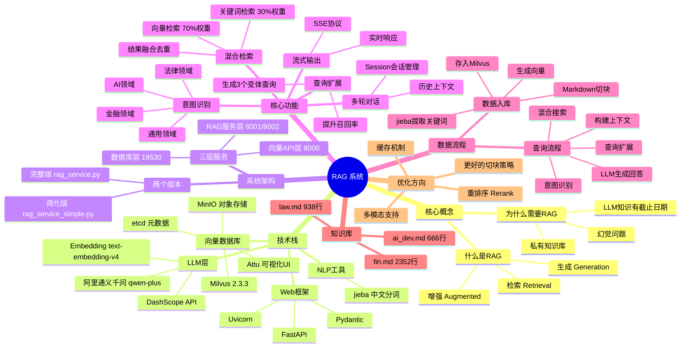
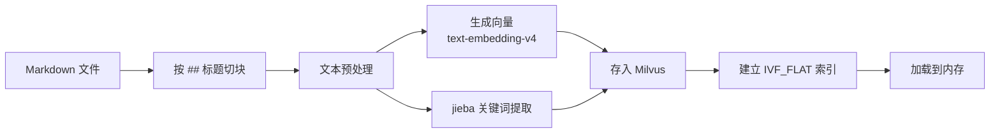
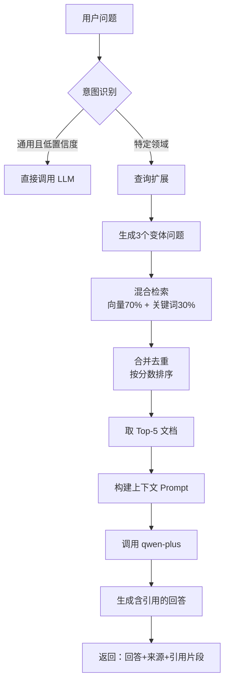

# RAG 检索增强生成系统 — 完整学习笔记

#RAG #Milvus #向量数据库 #LLM #FastAPI

---

## 思维导图



---

## 一、什么是 RAG？

> [!info] 核心定义
> **RAG = Retrieval-Augmented Generation（检索增强生成）**
> 在 LLM 生成回答之前，先从知识库中检索相关文档，把它们作为"参考资料"提供给 LLM，让它基于真实资料来回答。

### 为什么需要 RAG？

| 问题 | 纯 LLM 的缺陷 | RAG 的解决方案 |
|------|-------------|--------------|
| 知识截止日期 | 不知道最新信息 | 动态更新知识库 |
| 幻觉（Hallucination） | 会编造不存在的内容 | 基于检索到的真实内容生成 |
| 私有知识 | 无法访问企业内部资料 | 将私有文档存入向量库 |
| 可溯源性 | 无法说明信息来源 | 附带引用来源和相关分数 |

### 一个简单的类比

> [!example] 类比：开卷考试 vs 闭卷考试
> - **纯 LLM**：闭卷考试，只能靠训练时"记住"的知识，可能记错
> - **RAG**：开卷考试，考试时可以查书，答案更准确、有据可查

---

## 二、项目整体架构

### 服务分层图

```
┌─────────────────────────────────────┐
│         你的应用（网页/APP/Bot）        │
└────────────┬────────────────────────┘
             │ HTTP 请求
┌────────────▼────────────────────────┐
│   RAG 服务层（rag_service.py）         │  ← 端口 8001
│   • 意图识别  • 查询扩展              │
│   • 混合检索  • LLM 生成回答          │
└────────────┬────────────────────────┘
             │ HTTP 请求
┌────────────▼────────────────────────┐
│   向量 API 层（milvus_api.py）         │  ← 端口 8000
│   • 向量搜索  • 关键词搜索            │
│   • 混合搜索  • 数据增删改查          │
└────────────┬────────────────────────┘
             │ gRPC
┌────────────▼────────────────────────┐
│        Milvus 向量数据库              │  ← 端口 19530
│   etcd（元数据）+ MinIO（文件存储）    │
└─────────────────────────────────────┘

LLM 调用（外部 API）：
  阿里 DashScope API → qwen-plus 模型
  Embedding：text-embedding-v4（1024 维）
```

### 端口速查

| 服务 | 端口 | 用途 |
|------|------|------|
| Milvus 数据库 | 19530 | 向量数据库 gRPC |
| Milvus API | 8000 | FastAPI 封装的搜索接口 |
| RAG 完整版 | 8001 | 带意图识别/查询扩展的完整 RAG |
| RAG 简化版 | 8002 | 轻量化 RAG |
| Attu 可视化 | 3000 | 数据库 Web 管理界面 |
| MinIO 控制台 | 9001 | 对象存储管理 |

---

## 三、项目文件结构

```
RAG/
├── 核心服务
│   ├── rag_service.py          # 完整 RAG（意图识别+查询扩展+多轮对话）
│   ├── rag_service_simple.py   # 简化 RAG（快速上手）
│   ├── milvus_api.py           # 向量搜索 API（CRUD + 3种搜索）
│   └── milvus_config.py        # 数据库/Embedding/索引配置
│
├── 数据管理
│   ├── milvus_insert.py        # 从 Markdown 导入数据
│   ├── milvus_query.py         # 交互式查询工具
│   ├── milvus_delete.py        # 删除数据
│   └── milvus_view.py          # 查看数据
│
├── LLM 示例
│   ├── llm.py                  # 基础对话
│   ├── llm_stream.py           # 流式输出
│   └── llm_multiturn.py        # 多轮对话
│
├── 测试文件
│   ├── test_milvus.py          # 测试 Milvus 连接
│   ├── test_rag.py             # 测试完整 RAG
│   ├── test_rag_enhanced.py    # 测试高级功能
│   └── test_rag_simple.py      # 测试简化 RAG
│
├── 配置文件
│   ├── docker-compose.yml      # Docker 服务编排
│   ├── requirements.txt        # Python 依赖
│   └── .env                    # API Key（DASHSCOPE_API_KEY）
│
├── 文档
│   ├── README_RAG.md           # RAG 完整指南
│   ├── README_MILVUS.md        # Milvus 使用指南
│   ├── QUICK_START.md          # 快速启动
│   └── RAG_COMPARISON.md       # 两个版本对比
│
└── milvus.doc/                 # 知识库文档
    ├── ai_dev.md               # AI 开发知识（666行）
    ├── fin.md                  # 金融知识（2352行）
    └── law.md                  # 法律知识（938行）
```

---

## 四、核心概念详解

### 4.1 向量嵌入（Vector Embedding）

> [!tip] 概念
> 把文字转换成一个数字数组（向量），语义相近的文字，对应向量在空间中距离更近。

```python
# 示例：生成向量
text = "人工智能的发展趋势"
# 调用 text-embedding-v4 后得到 1024 维向量
embedding = [0.023, -0.187, 0.445, ..., 0.031]  # 长度 1024

# 相似的文本，向量距离近
text_similar = "AI技术未来走向"
# 两者的 L2 距离很小 → 相似度很高
```

> [!example] 类比：地图坐标
> 把城市转换成经纬度，北京和天津的坐标（向量）距离近，因为它们地理上相近。
> 同理，语义相近的文本，向量坐标也接近。

### 4.2 向量数据库（Milvus）

> [!tip] 概念
> 专门存储和搜索向量的数据库。传统数据库按关键词查，向量数据库按"语义相似度"查。

**数据库 Schema（表结构）：**

```python
Collection: "ai_knowledge_base"

字段：
- id         : INT64      # 自增主键
- text        : VARCHAR   # 文档内容（最多65535字符）
- embedding   : FLOAT_VECTOR(1024)  # 1024维向量
- source      : VARCHAR   # 来源文件名（如 "ai_dev.md"）
- section     : VARCHAR   # 所属章节（如 "第一章 AI趋势"）
- keywords    : VARCHAR   # jieba分词结果（用于关键词搜索）
```

**索引类型 IVF_FLAT 原理：**

```
IVF = Inverted File（倒排文件）
FLAT = 精确计算距离

工作原理：
1. 将向量空间分成 nlist=128 个簇（聚类）
2. 查询时只搜索最近的 nprobe=10 个簇
3. 在这10个簇内精确计算距离
→ 速度快（不用搜全部），精度高（簇内精确）
```

### 4.3 三种搜索方式

#### 向量搜索（语义搜索）

```python
# 把问题转成向量，找语义最相近的文档
query = "什么是机器学习？"
query_vector = embed(query)  # [0.1, -0.3, ...]
# 在向量空间找最近邻
results = milvus.search(query_vector, top_k=5)
```

**适合**：语义理解，近义词查询

#### 关键词搜索（BM25-like）

```python
# 提取关键词，用 LIKE 匹配
query = "机器学习 深度学习"
keywords = jieba.cut(query)  # ["机器学习", "深度学习"]
results = milvus.query(f"keywords LIKE '%机器学习%'")
```

**适合**：精确词汇匹配，专有名词

#### 混合搜索（Hybrid Search）

```python
# 同时运行两种搜索，加权融合
vector_weight = 0.7   # 向量搜索占 70%
keyword_weight = 0.3  # 关键词搜索占 30%

final_score = (
    vector_weight * vector_score +
    keyword_weight * keyword_score
)
```

**适合**：大多数场景，兼顾语义和精确性

> [!example] 实际对比
> 问："什么是 RAG？"
> - **向量搜索**：能找到讲"检索增强"的内容（即使原文没有"RAG"这个词）
> - **关键词搜索**：只能找到含"RAG"字样的文档
> - **混合搜索**：两者都找，综合评分，结果更全面

### 4.4 意图识别（Intent Detection）

> [!tip] 概念
> 在回答问题之前，先用 LLM 判断这个问题属于哪个领域，再针对性地搜索。

```python
# 识别问题领域的 Prompt
prompt = """
判断以下问题属于哪个领域：
- law（法律）
- finance（金融）
- ai（人工智能）
- general（通用）

问题：{question}

返回JSON格式：{"domain": "ai", "confidence": 0.9, "reason": "..."}
"""

# 示例
question = "人工智能会替代人类工作吗？"
result = {"domain": "ai", "confidence": 0.95, "reason": "涉及AI技术影响"}
# → 只搜索 ai_dev.md 相关内容，更精准
```

### 4.5 查询扩展（Query Expansion）

> [!tip] 概念
> 用 LLM 把一个问题扩展成多个变体，提高检索召回率。

```python
原始问题："人工智能有哪些应用场景？"

扩展后：
1. "人工智能有哪些应用场景？"         # 原问题
2. "AI技术在哪些行业落地了？"         # 换说法
3. "机器学习和深度学习的实际应用有哪些？" # 具体技术
4. "大模型在工业、医疗、教育中的应用"   # 具体行业

# 4个查询都去检索，合并去重，召回更多相关文档
```

> [!note] 为什么有效？
> 用户的原始问题可能措辞不准确，扩展查询可以覆盖更多同义表达，
> 提高"找到正确文档"的概率。

### 4.6 数据入库流程



**切块示例（Markdown Chunking）：**

```markdown
# 原始文档（ai_dev.md 片段）

## 第一章 AI发展趋势
人工智能正在快速发展...

### 1.1 大模型时代
GPT、Claude等大模型...

## 第二章 AI应用场景
各行各业都在应用AI...
```

```python
# 切块结果（按 ## 分割）
chunks = [
    {"text": "第一章 AI发展趋势\n人工智能正在快速发展...", "section": "第一章"},
    {"text": "1.1 大模型时代\nGPT、Claude等大模型...", "section": "1.1 大模型时代"},
    {"text": "第二章 AI应用场景\n各行各业都在应用AI...", "section": "第二章"},
]
```

### 4.7 RAG 完整查询流程



---

## 五、关键代码解析

### 5.1 Embedding 生成

```python
# milvus_config.py / milvus_api.py
from openai import OpenAI

client = OpenAI(
    api_key=os.getenv("DASHSCOPE_API_KEY"),
    base_url="https://dashscope.aliyuncs.com/compatible-mode/v1"
)

def get_embedding(text: str) -> list[float]:
    response = client.embeddings.create(
        model="text-embedding-v4",
        input=text,
        dimensions=1024  # 输出1024维向量
    )
    return response.data[0].embedding
```

### 5.2 混合搜索核心逻辑

```python
# milvus_api.py 混合搜索示意
def hybrid_search(query, top_k=5, vector_weight=0.7):
    # 1. 向量搜索
    query_vector = get_embedding(query)
    vector_results = collection.search(
        data=[query_vector],
        anns_field="embedding",
        param={"metric_type": "L2", "params": {"nprobe": 10}},
        limit=top_k * 2
    )

    # 2. 关键词搜索
    keywords = " ".join(jieba.cut(query))
    keyword_results = collection.query(
        expr=f"keywords like '%{keywords[:50]}%'",
        limit=top_k * 2
    )

    # 3. 分数融合
    merged = {}
    for r in vector_results:
        similarity = 1 / (1 + r.distance)  # L2距离转相似度
        merged[r.id] = vector_weight * similarity

    for r in keyword_results:
        if r["id"] in merged:
            merged[r["id"]] += (1 - vector_weight) * 0.8
        else:
            merged[r["id"]] = (1 - vector_weight) * 0.8

    # 4. 排序取 top_k
    sorted_results = sorted(merged.items(), key=lambda x: x[1], reverse=True)
    return sorted_results[:top_k]
```

### 5.3 RAG 回答生成

```python
# rag_service.py 简化版示意
def generate_answer(question: str, context_docs: list) -> str:
    # 构建上下文
    context = ""
    for i, doc in enumerate(context_docs, 1):
        context += f"[参考{i}] 来源：{doc['source']} | {doc['section']}\n"
        context += f"{doc['text'][:500]}\n\n"

    # 构建 Prompt
    prompt = f"""你是一个专业助手，请基于以下参考资料回答问题。
回答时请引用相关参考，格式为[参考N]。

参考资料：
{context}

问题：{question}
"""

    # 调用 LLM
    response = client.chat.completions.create(
        model="qwen-plus",
        messages=[{"role": "user", "content": prompt}],
        temperature=0.7,
        max_tokens=2000
    )
    return response.choices[0].message.content
```

---

## 六、两个版本对比

| 特性 | 简化版（rag_service_simple.py） | 完整版（rag_service.py） |
|------|-------------------------------|------------------------|
| 端口 | 8002 | 8001 |
| 代码量 | ~200 行 | ~660 行 |
| 意图识别 | ❌ | ✅ |
| 查询扩展 | ❌ | ✅ |
| 混合搜索 | 基础 | 多查询融合 |
| 多轮对话 | ❌ | ✅（Session管理）|
| 流式输出 | ❌ | ✅（SSE）|
| 引用溯源 | 基础 | 详细片段+分数 |
| 响应时间 | ~1-2秒 | ~3-8秒（功能更多）|
| 适用场景 | 原型验证、学习 | 生产环境 |

---

## 七、启动步骤

### 完整启动流程

```bash
# 第1步：创建 Python 环境
conda create -n milvus-rag python=3.9 -y
conda activate milvus-rag
pip install -r requirements.txt

# 第2步：配置 API Key
echo "DASHSCOPE_API_KEY=你的密钥" > .env

# 第3步：启动 Milvus（Docker）
docker compose up -d
# 等待30秒后测试
python test_milvus.py

# 第4步：导入知识库数据
python milvus_insert.py

# 第5步：启动向量 API（新终端）
python milvus_api.py

# 第6步：启动 RAG 服务（新终端）
python rag_service.py        # 完整版 :8001
# 或
python rag_service_simple.py # 简化版 :8002
```

### 测试 API

```bash
# 测试 RAG 回答
curl -X POST http://localhost:8001/chat \
  -H "Content-Type: application/json" \
  -d '{
    "question": "人工智能的发展趋势是什么？",
    "use_rag": true,
    "search_type": "hybrid",
    "enable_intent_detection": true
  }'
```

---

## 八、优化方向

> [!warning] 当前局限性

### 8.1 切块策略优化

**当前**：简单按 `##` 标题切割

**改进**：
```python
# 策略1：固定大小 + 重叠（Sliding Window）
chunk_size = 512    # 每块字符数
overlap = 100       # 相邻块重叠100字符
# 防止关键信息被切断

# 策略2：语义切块
# 用 LLM 识别语义边界，而不是按标题硬切

# 策略3：父子切块（Parent-Child Chunking）
# 检索小块（精准），但把父块（更多上下文）喂给LLM
```

### 8.2 重排序（Reranking）

```python
# 当前：只用向量相似度排序
# 改进：用专门的 Reranker 模型二次排序

from FlagEmbedding import FlagReranker
reranker = FlagReranker("BAAI/bge-reranker-v2-m3")

# 先检索 top-20，再 rerank 取 top-5
# Reranker 考虑 Query+Document 的交叉注意力，更精准
```

### 8.3 缓存机制

```python
# 相同问题的向量和搜索结果可以缓存
from functools import lru_cache
import redis

# 嵌入缓存（节省 API 调用费用）
@lru_cache(maxsize=1000)
def get_embedding_cached(text: str):
    return get_embedding(text)

# 搜索结果缓存（提升响应速度）
redis_client = redis.Redis()
cache_key = f"rag:{hash(question)}"
cached = redis_client.get(cache_key)
```

### 8.4 评估体系（RAG Evaluation）

```python
# 缺少自动化评估，应该加入：
metrics = {
    "faithfulness": "回答是否忠实于检索到的内容（无幻觉）",
    "answer_relevancy": "回答是否与问题相关",
    "context_precision": "检索到的文档是否都是相关的",
    "context_recall": "相关文档是否都被检索到了"
}
# 推荐工具：RAGAS、TruLens
```

### 8.5 多模态支持

```
当前：只支持文本（.md 文件）
改进：
- PDF 解析：支持表格、图表提取
- 图片理解：Vision 模型处理图片内容
- 结构化数据：支持 CSV/JSON 查询
```

---

## 九、关键配置参数说明

```python
# milvus_config.py 重要参数

# 索引参数
nlist = 128    # IVF 聚类数量
               # 越大 → 搜索精度越高，但建索引越慢
               # 数据量少时用小值，数据量大时用大值
               # 经验值：nlist ≈ sqrt(数据量)

nprobe = 10    # 查询时搜索的聚类数
               # 越大 → 精度越高，但查询越慢
               # nprobe <= nlist
               # 通常设 nlist 的 5%-10%

# Embedding 维度
dim = 1024     # text-embedding-v4 的输出维度
               # 维度越高 → 表达能力越强，存储越大

# 混合搜索权重
vector_weight = 0.7   # 向量搜索权重
                      # 0.7 意味着语义匹配更重要
                      # 对于专有名词多的场景，可调低（如0.5）
```

---

## 十、测试题

测试题见 [[RAG_测试题]]，答案见 [[RAG_测试题_答案]]

---

## 参考资料

- 项目文档：`README_RAG.md`、`README_MILVUS.md`、`QUICK_START.md`
- 版本对比：`RAG_COMPARISON.md`
- Milvus 官方文档：https://milvus.io/docs
- 阿里灵积 API：https://help.aliyun.com/zh/dashscope/
