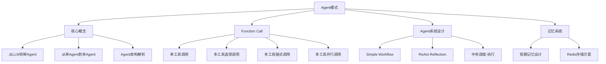

# Agent模式学习笔记

> 📅 创建时间：2026-03-26
> 🎯 学习目标：理解Agent架构、掌握Function Call机制、学会设计Agent系统

---

## 📊 思维导图



---

## 1️⃣ 什么是Agent？

### 1.1 核心定义

**Agent = LLM + 工具调用能力 + 自主决策能力**

- **传统LLM**：只能进行问答对话
- **Agent**：能够端到端地帮助人完成复杂任务

### 1.2 演进路径

```
LLM问答 → 单Agent → 多Agent协作
```

**关键特征：**
- 🎯 目标导向：有明确的任务目标
- 🔧 工具使用：能调用外部工具/API
- 🧠 自主决策：根据情况选择下一步行动
- 🔄 迭代执行：持续执行直到完成任务

### 1.3 Agent架构组成

```
┌─────────────────────────────────┐
│         Agent 核心架构           │
├─────────────────────────────────┤
│  Planning (规划层)               │
│  ├─ 任务分解                     │
│  └─ 策略制定                     │
├─────────────────────────────────┤
│  Memory (记忆层)                 │
│  ├─ 短期记忆 (对话上下文)        │
│  └─ 长期记忆 (知识库)            │
├─────────────────────────────────┤
│  Tools (工具层)                  │
│  ├─ 搜索工具                     │
│  ├─ 计算工具                     │
│  └─ API调用                      │
├─────────────────────────────────┤
│  Action (执行层)                 │
│  └─ 工具调用与结果处理           │
└─────────────────────────────────┘
```

---

## 2️⃣ Function Call深度理解

### 2.1 什么是Function Call？

Function Call是让LLM能够**结构化地调用外部函数**的机制。

**核心原理：**
1. 将工具列表（tools）注入到LLM的上下文中
2. LLM根据用户问题，决定是否需要调用工具
3. 如果需要，LLM返回结构化的工具调用请求
4. 系统执行工具，将结果返回给LLM
5. LLM基于结果生成最终回复

### 2.2 无工具 vs 有工具对比

**示例：查询"北京今天天气"**

❌ **无工具时：**
```
用户：北京今天天气如何？
LLM：我无法提供实时信息，建议你通过天气网站查询...
```

✅ **有工具时：**
```
用户：北京今天天气如何？
LLM：[调用 get_current_weather(location="北京")]
工具返回：北京今天是雨天
LLM：今天北京是雨天，请记得带伞！
```

### 2.3 Function Call实现原理

**为什么加个tools列表就能实现工具调用？**

实际上，tools列表会被转换成特殊的prompt注入到系统消息中：

```python
# 简化示例
system_prompt = f"""
你是智能助手。当需要查询天气时，请使用以下格式：
<tool_call>
{{"name": "get_current_weather", "arguments": {{"location": "城市名"}}}}
</tool_call>

可用工具：
{json.dumps(tools)}
"""
```

LLM经过训练，能够识别这种格式并输出结构化的工具调用请求。

### 2.4 四种调用模式

#### 模式1：单工具调用
```python
# 用户问题 → 调用1个工具 → 返回结果
用户："北京天气怎么样？"
→ get_current_weather(location="北京")
→ "北京今天是晴天"
```

#### 模式2：多工具选择调用
```python
# 从多个工具中选择合适的
工具列表：[天气查询, 数学计算, 翻译, 搜索]
用户："帮我算一下 15452 * 88"
→ LLM选择 calculate_math(expression="15452 * 88")
```

#### 模式3：多工具链式调用
```python
# 工具调用形成链条，前一个结果影响后一个
用户："查询阿里巴巴财报并发邮件给老板"
→ Step1: web_search(query="阿里巴巴2025财报")
→ Step2: send_email(recipient="boss@...", body="财报摘要...")
```

#### 模式4：多工具并行调用
```python
# 同时调用多个工具，提高效率
用户："查询北京和巴黎的天气和新闻"
→ 并行执行：
   - get_weather(location="北京")
   - get_weather(location="巴黎")
   - get_news(location="北京")
   - get_news(location="巴黎")
```

---

## 3️⃣ Agent系统设计模式

### 3.1 Simple Workflow (简单工作流)

**适用场景：** 任务步骤固定、流程清晰

**架构特点：**
```
Step 1 → Step 2 → Step 3 → Step 4
(分析)   (大纲)   (写作)   (优化)
```

**典型应用：** 博客文章生成

```python
# 伪代码示例
def blog_workflow(topic):
    # Step 1: 主题分析
    analysis = llm_call("分析主题", topic)

    # Step 2: 生成大纲
    outline = llm_call("生成大纲", analysis)

    # Step 3: 撰写内容
    draft = llm_call("撰写文章", outline)

    # Step 4: SEO优化
    final = llm_call("优化发布", draft)

    return final
```

**优点：**
- ✅ 逻辑清晰，易于调试
- ✅ 每步可单独优化
- ✅ 降低幻觉（每步任务明确）

**缺点：**
- ❌ 缺乏灵活性
- ❌ 无法处理动态任务

### 3.2 ReAct-Reflection (反思循环)

**适用场景：** 需要动态决策、多步推理的复杂任务

**核心思想：** Reasoning (推理) + Acting (行动) + Reflecting (反思)

**执行流程：**
```
┌─────────────────────────────────┐
│  1. Planning (规划下一步)        │
│     ↓                            │
│  2. Acting (执行工具)            │
│     ↓                            │
│  3. Reflecting (反思结果)        │
│     ↓                            │
│  4. 判断是否完成？               │
│     ├─ 是 → 输出最终答案         │
│     └─ 否 → 回到步骤1            │
└─────────────────────────────────┘
```

**代码示例：**
```python
class ReActAgent:
    def run(self, user_query):
        while not task_completed:
            # 1. Planning
            plan = planner_llm(history, user_query)

            # 2. Acting
            result = execute_tool(plan.tool_name, plan.args)

            # 3. Reflecting
            reflection = reflector_llm(plan, result)

            # 4. 更新历史
            history.append({
                "thought": plan.thought,
                "action": plan.tool_name,
                "observation": result,
                "reflection": reflection
            })

            # 5. 判断是否完成
            if plan.decision == "finish":
                return plan.final_answer
```

**优点：**
- ✅ 自主决策能力强
- ✅ 能处理复杂多步任务
- ✅ 具备错误修正能力

**缺点：**
- ❌ Token消耗大
- ❌ 可能陷入循环

### 3.3 中央调度-执行模式

**适用场景：** 多Agent协作、任务分发

**架构：**
```
        ┌─────────────┐
        │ 中央调度器   │
        └──────┬──────┘
               │
    ┌──────────┼──────────┐
    ↓          ↓          ↓
┌───────┐ ┌───────┐ ┌───────┐
│Agent1 │ │Agent2 │ │Agent3 │
│(搜索) │ │(分析) │ │(写作) │
└───────┘ └───────┘ └───────┘
```

**特点：**
- 中央调度器负责任务分解和分配
- 各个Agent专注于特定领域
- 适合大型复杂系统

---

## 4️⃣ 记忆系统设计

### 4.1 为什么需要记忆？

Agent需要记住：
- 📝 对话历史（上下文）
- 🎯 当前任务状态
- 📊 已执行的操作
- 💡 中间结果

### 4.2 短期记忆架构

**存储方案：Redis + 数据库**

```
┌──────────────┐      ┌──────────────┐
│   Redis      │      │   MySQL      │
│  (工作区)    │ ←──→ │  (持久化)    │
├──────────────┤      ├──────────────┤
│ 活跃会话     │      │ 历史记录     │
│ 快速读写     │      │ 长期保存     │
│ 自动过期     │      │ 可查询       │
└──────────────┘      └──────────────┘
```

**工作流程：**
1. 新对话 → 创建session → 存入Redis
2. 持续对话 → 从Redis读取上下文
3. 对话结束 → 持久化到数据库
4. 恢复历史 → 从数据库加载到Redis

### 4.3 Messages列表结构

```python
messages = [
    {"role": "system", "content": "你是助手..."},
    {"role": "user", "content": "用户问题"},
    {"role": "assistant", "content": "AI回复"},
    {"role": "tool", "tool_call_id": "xxx", "content": "工具结果"}
]
```

**关键点：**
- System消息定义Agent人设
- 对话历史按时间顺序排列
- Tool消息必须与tool_call_id对应

---

## 📝 实战示例

### 示例1：天气查询Agent

```python
# 工具定义
def get_weather(location):
    return f"{location}今天是晴天，22℃"

# 工具Schema
tools = [{
    "type": "function",
    "function": {
        "name": "get_weather",
        "description": "查询城市天气",
        "parameters": {
            "type": "object",
            "properties": {
                "location": {"type": "string"}
            },
            "required": ["location"]
        }
    }
}]

# 调用流程
messages = [{"role": "user", "content": "北京天气？"}]
response = client.chat.completions.create(
    model="qwen-plus",
    messages=messages,
    tools=tools
)

# 处理工具调用
if response.choices[0].message.tool_calls:
    tool_call = response.choices[0].message.tool_calls[0]
    result = get_weather(**json.loads(tool_call.function.arguments))
    # 将结果返回给LLM...
```

### 示例2：链式任务Agent

```python
# 任务：搜索信息 → 生成报告 → 发送邮件
def chain_agent(query):
    # Step 1: 搜索
    search_result = web_search(query)

    # Step 2: 生成报告（LLM自动总结）
    # LLM会将search_result作为上下文，生成报告内容

    # Step 3: 发送邮件
    # LLM会调用send_email工具，参数中包含生成的报告
```

---

## 🎯 核心要点总结

### Agent设计原则

1. **工具不是越多越好** - 从业务场景出发设计
2. **明确任务边界** - 每个Agent职责清晰
3. **合理的记忆管理** - 避免上下文过长
4. **错误处理机制** - 工具调用失败时的降级方案
5. **可观测性** - 记录每步决策和执行结果

### 常见问题

**Q1: 如何防止Agent陷入死循环？**
- 设置最大步数限制
- 检测重复操作
- 添加超时机制

**Q2: 如何提高工具调用准确率？**
- 优化工具描述（description）
- 提供清晰的参数说明
- 使用Few-shot示例

**Q3: 如何优化上下文长度？**
- 使用滑动窗口保留最近N轮对话
- 总结历史对话压缩信息
- 使用向量数据库存储长期记忆

---

## 🔗 相关资源

- [[Function Call详解]]
- [[Prompt Engineering最佳实践]]
- [[Redis使用指南]]
- [[Agent评估方法]]

---

## 📌 下一步学习

- [ ] 实现一个简单的天气查询Agent
- [ ] 尝试设计多工具协作场景
- [ ] 学习Agent性能优化技巧
- [ ] 了解多Agent协作框架

