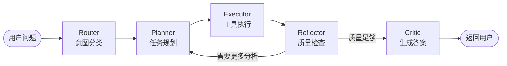

---
tags:
  - LangGraph
  - MultiAgent
  - FastAPI
  - FinTech
  - AI
  - Python
created: 2026-03-26
---

# Agent3：金融研报智能分析系统 学习笔记

> [!abstract] 一句话总结
> Agent3 是一个基于 **LangGraph** 的**多智能体**金融分析系统，能将自然语言问题转化为 SQL 查询、Python 代码分析、PDF 解析等操作，自动完成金融数据的查询与分析。

---

## 一、思维导图

```
Agent3 金融研报智能分析系统
│
├── 核心框架
│   ├── FastAPI（REST API 服务）
│   ├── LangGraph（多智能体编排）
│   └── SQLAlchemy（数据库 ORM）
│
├── AI 服务
│   ├── qwen-max（LLM，阿里 DashScope）
│   └── text-embedding-v4（向量嵌入）
│
├── 五大工具
│   ├── Text2SQL（自然语言→SQL）
│   ├── Code Executor（沙盒 Python 执行）
│   ├── PDF Parser（研报解析）
│   ├── Web Search（BochaAI 网络搜索）
│   └── RAG Search（向量语义检索）
│
├── 五节点 Agent 流水线
│   ├── Router（意图分类）
│   ├── Planner（任务规划）
│   ├── Executor（工具执行）
│   ├── Reflector（ReAct 反思）
│   └── Critic（答案生成）
│
├── 数据库（SQLite）
│   ├── stocks（15 只股票）
│   ├── financials（75 条财务记录）
│   ├── market_data（300 条行情）
│   ├── research_reports（51 条研报）
│   └── analysis_history（历史记录）
│
└── API 层（FastAPI）
    ├── /api/chat（对话接口）
    ├── /api/sql/query
    ├── /api/code/execute
    └── /api/stocks, /api/financials 等
```

---

## 二、项目结构解析

```
Agent3/
├── main.py              ← FastAPI 启动入口
├── config.py            ← 配置管理（Pydantic Settings）
├── requirements.txt     ← 依赖列表
├── .env.example         ← 环境变量模板
│
├── agents/              ← LangGraph 编排层
│   ├── nodes.py         ← 5 个 Agent 节点实现
│   └── graph.py         ← 图结构与条件边定义
│
├── tools/               ← 工具层
│   ├── text2sql.py
│   ├── code_executor.py
│   ├── pdf_parser.py
│   ├── web_search.py
│   └── rag_search.py
│
├── services/            ← 外部服务封装
│   ├── llm.py           ← qwen-max 单例
│   └── embedding.py     ← 向量嵌入单例
│
├── database/            ← 数据层
│   ├── models.py        ← SQLAlchemy ORM 模型
│   └── init_db.py       ← Mock 数据初始化
│
├── api/
│   └── routes.py        ← API 路由定义
│
└── data/                ← 示例 PDF 研报
```

> [!tip] 层次结构记忆口诀
> **API → Agents → Tools → Services → Database**
> 请求从外到内流动，数据从内到外返回。

---

## 三、核心概念详解

### 3.1 LangGraph 与多智能体

LangGraph 是 LangChain 的图编排框架，把 Agent 的推理过程建模为**有向图（DAG）**，每个节点是一个处理步骤，边决定流向。

**类比：** 把 Agent 想象成一家餐厅的**厨房流水线**：
- 服务员（Router）→ 理解客人点的菜（意图分类）
- 大厨（Planner）→ 制定烹饪计划（任务规划）
- 厨师（Executor）→ 实际烹饪（工具调用）
- 品控（Reflector）→ 检查菜品质量（反思）
- 传菜员（Critic）→ 上菜给客人（最终回答）



### 3.2 ReAct 模式（Reasoning + Acting）

ReAct 是让 LLM 交替进行**推理（Reasoning）**和**行动（Acting）**的设计模式。

**例子：** 用户问"茅台的 ROE 是多少？"

```
推理: 需要查询财务数据中的 ROE 字段
行动: 调用 Text2SQL 工具
  → SQL: SELECT roe FROM financials WHERE stock_code='600519'
  → 结果: ROE = 28.5%

推理: 得到了数据，检查是否需要更多分析
反思: 数据完整，可以回答
行动: 生成最终答案
```

### 3.3 State Management（状态管理）

LangGraph 通过 `TypedDict` 定义贯穿整个流水线的**共享状态**。

```python
# agents/nodes.py 中的 AgentState
class AgentState(TypedDict):
    messages: List[dict]      # 对话历史
    intent: str               # 意图类型（data_query / analysis / research / general）
    plan: List[dict]          # 规划步骤列表
    tool_results: List[dict]  # 工具执行结果
    reflections: List[str]    # 反思记录
    final_answer: str         # 最终答案
    iteration: int            # 当前迭代次数（最多3次）
    # ... 其他15+个字段
```

**类比：** 就像一份在流水线上传递的**工单**，每个工人（节点）都能读取工单内容，并在处理后更新相应字段。

---

## 四、五大工具详解

### 4.1 Text2SQL 工具

**作用：** 将自然语言转换为 SQL 查询并执行。

**流程：**
```
自然语言问题 → LLM 生成 SQL → SQLite 执行 → 返回结果
```

**例子：**
```python
# 用户输入
query = "市值最大的5只股票是哪些？"

# LLM 生成的 SQL
sql = """
SELECT stock_name, market_cap
FROM stocks
ORDER BY market_cap DESC
LIMIT 5
"""

# 执行结果
result = [
    {"stock_name": "宁德时代", "market_cap": 1200000000000},
    {"stock_name": "茅台",    "market_cap": 2100000000000},
    ...
]
```

### 4.2 Code Executor（沙盒代码执行器）

**作用：** 在安全沙盒中执行 Python 分析代码，支持 pandas/numpy/matplotlib。

**安全机制：**
- 禁止导入 `os`、`subprocess`、`socket` 等危险模块
- 超时限制：30 秒
- 输出限制：10,000 字符

**例子：**
```python
# Executor 节点生成并执行以下代码
code = """
import pandas as pd
import matplotlib.pyplot as plt

# data 变量由上一步 Text2SQL 结果自动注入
df = pd.DataFrame(data)
df.plot(kind='bar', x='stock_name', y='market_cap')
plt.title('市值对比')
plt.savefig('chart.png')  # 自动捕获为 base64 图片
"""
```

> [!warning] 沙盒限制
> 代码执行器**禁止**文件系统写入（除 output/charts/）、网络访问、进程创建。这是为了防止恶意代码。

### 4.3 RAG Search（向量语义检索）

**作用：** 将文档分块→向量化→存入向量库，查询时找最相似的段落。

**流程：**
```
文档 → 分块 → text-embedding-v4 编码 → 向量存储
查询 → 编码 → 余弦相似度计算 → Top-K 结果
```

**例子：**
```python
# 用户问："半导体行业前景如何？"
# 系统将问题向量化，然后与研报内容向量做余弦相似度
similarity("半导体行业前景", "芯片发展.pdf 第3段") = 0.92  # 高相关
similarity("半导体行业前景", "银行财报.pdf 第7段") = 0.31  # 低相关
# 返回相似度最高的段落
```

---

## 五、数据流完整示例

**用户问题：** "帮我分析茅台近3年的净利润趋势，并画图"

```
Step 1 [Router]
  意图分类 → "analysis"（需要数据查询+代码分析）

Step 2 [Planner]
  规划步骤：
  1. 用 text2sql 查询茅台财务数据
  2. 用 code_executor 分析趋势并画图

Step 3 [Executor - 第1步]
  调用 text2sql:
  SQL: SELECT year, net_profit FROM financials
       WHERE stock_code='600519' ORDER BY year
  结果: [{year:2022, net_profit:627亿}, {year:2023, net_profit:747亿}, ...]

Step 4 [Executor - 第2步]
  调用 code_executor:
  代码: 用 matplotlib 绘制折线图
  结果: base64 编码的 PNG 图片 + 文字分析

Step 5 [Reflector]
  检查: 数据完整，图表已生成，质量足够
  决策: 直接进入 Critic

Step 6 [Critic]
  生成最终回答: "茅台近3年净利润持续增长..."
  附带图片
```

---

## 六、配置与启动

### 6.1 环境变量

```bash
# .env 文件
DASHSCOPE_API_KEY=sk-xxx   # 必须配置，用于 LLM 和 Embedding
BOCHAAI_API_KEY=xxx        # 可选，用于网络搜索
LLM_MODEL=qwen-max
EMBEDDING_MODEL=text-embedding-v4
```

### 6.2 启动项目

```bash
pip install -r requirements.txt
python main.py
# 访问 http://localhost:8000/docs 查看 API 文档
```

### 6.3 关键 API 端点

| 端点 | 方法 | 用途 |
|------|------|------|
| `/api/chat` | POST | 主对话接口 |
| `/api/chat/stream` | POST | 流式对话 |
| `/api/sql/query` | POST | 直接执行 Text2SQL |
| `/api/code/execute` | POST | 执行 Python 代码 |
| `/api/stocks` | GET | 获取股票列表 |
| `/health` | GET | 健康检查 |

---

## 七、设计模式总结

| 模式 | 应用位置 | 说明 |
|------|---------|------|
| **状态机** | LangGraph 图 | 节点间通过状态转移 |
| **单例模式** | LLM/Embedding 服务 | 全局共享一个实例 |
| **策略模式** | 工具选择 | 根据意图选不同工具 |
| **责任链** | 工具执行序列 | 步骤串联，前者结果传后者 |
| **沙盒** | Code Executor | 隔离执行环境保证安全 |

---

## 八、优化方案

> [!tip] 可以改进的地方

1. **向量数据库升级**
   - 现状：RAG 用内存向量（余弦相似度）
   - 优化：接入 Milvus / Chroma，支持百万级文档检索

2. **并行工具执行**
   - 现状：工具按步骤串行执行
   - 优化：LangGraph 支持并行节点，无依赖的工具可同时执行

3. **流式输出优化**
   - 现状：`/api/chat/stream` 已支持流式
   - 优化：Executor 节点内部进度也可流式推送，提升体验

4. **缓存机制**
   - 现状：相同查询每次都调用 LLM
   - 优化：对 Text2SQL 结果做语义缓存（相似问题复用 SQL）

5. **多模态支持**
   - 现状：只能生成图表，不能理解图片输入
   - 优化：接入 qwen-vl 支持图片输入分析

---

## 九、关键代码位置速查

| 功能 | 文件 | 行号参考 |
|------|------|---------|
| Agent 状态定义 | `agents/nodes.py` | `AgentState` TypedDict |
| 图结构与条件边 | `agents/graph.py` | `build_graph()` 函数 |
| 工具注册 | `agents/nodes.py` | `ExecutorNode.__init__` |
| SQL 生成提示词 | `tools/text2sql.py` | `_generate_sql()` |
| 沙盒安全限制 | `tools/code_executor.py` | `FORBIDDEN_MODULES` |
| LLM 单例 | `services/llm.py` | `LLMService` 类 |
| 数据库模型 | `database/models.py` | 5 个 ORM 类 |

---

## 十、测试题

> 答案见 [[Agent3_测试答案]]

**基础概念（1-5题）**

1. Agent3 使用哪个框架进行多智能体编排？它与普通 LangChain 链有什么区别？

2. ReAct 模式中的 "Re" 和 "Act" 分别代表什么？在 Agent3 中哪个节点体现了"Re"？

3. Agent3 的五个 Agent 节点按顺序是什么？各自的职责是什么？

4. `AgentState` 中的 `iteration` 字段有什么作用？默认最大值是多少？

5. Text2SQL 工具的工作流程是什么？

**工具与代码（6-10题）**

6. Code Executor 为什么需要"沙盒"机制？列举至少3个被禁止的模块。

7. RAG Search 的完整流程是什么？它与普通关键词搜索有什么本质区别？

8. 为什么 LLM 服务（`services/llm.py`）使用单例模式？

9. 数据链路：当用户问"帮我画茅台的净利润图"时，哪两个工具会被串联使用？数据是如何从第一个工具传递给第二个的？

10. `use_previous_data` 标志位在哪个工具中使用，它的作用是什么？

**架构设计（11-15题）**

11. LangGraph 中的"条件边"（conditional edge）有什么作用？在 Agent3 中哪里用到了条件边？

12. Agent3 的 API 层使用的是什么框架？`/api/chat/stream` 端点实现了什么功能？

13. 数据库中有哪5张表？各自存储什么数据？

14. 如果你要给 Agent3 新增一个"情感分析工具"，需要修改哪些文件？

15. Agent3 的架构分为几层？从用户请求到数据库查询，请描述完整的调用链。
