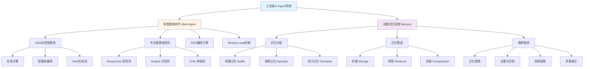
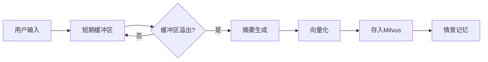
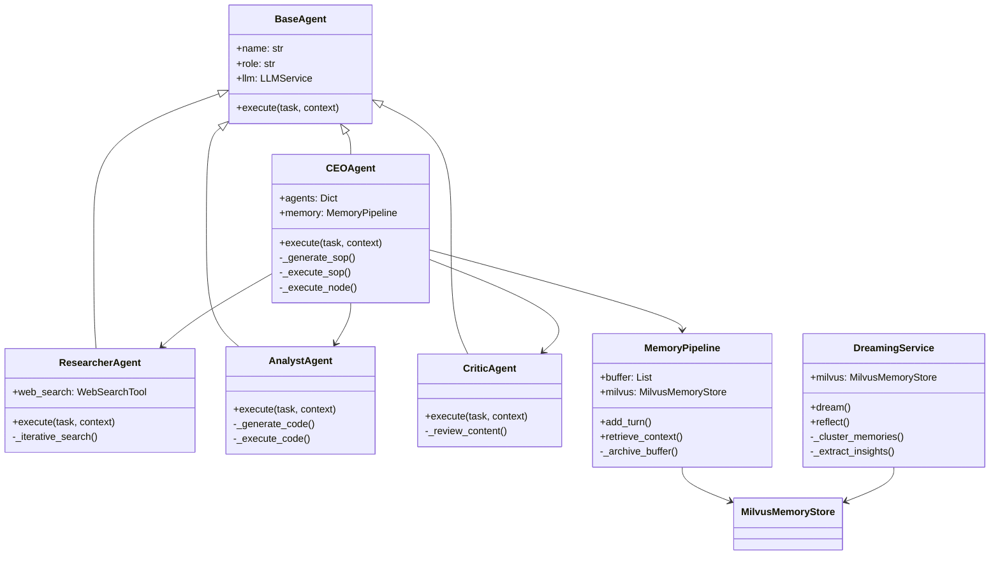

# 工业级AI Agent - 多智能体协作与长期记忆

> 📚 第四周学习笔记 | 从单体Agent进化到分布式多智能体系统

---

## 📋 目录

```toc
```

---

## 🗺️ 思维导图



---

## 🎯 核心概念

### 1. 多智能体协作系统 (Multi-Agent System)

#### 1.1 什么是多智能体系统？

**定义**：多个具有专业能力的智能体通过协作完成复杂任务的分布式系统。

**为什么需要多智能体？**
- ❌ **单体Agent的问题**：
  - Context爆炸（上下文过长）
  - 注意力分散（一个Agent做所有事）
  - 幻觉频发（缺乏专业性）
  - 质量难控（没有审核机制）

- ✅ **多智能体的优势**：
  - 专业分工（每个Agent专注一件事）
  - 并行执行（提高效率）
  - 质量把控（Review Loop机制）
  - 可扩展性（易于添加新Agent）

#### 1.2 核心组件

##### 🎩 CEO Agent（总控智能体）

**角色**：项目经理 / 指挥官

**职责**：
1. **任务分解**：将复杂任务拆分为子任务
2. **SOP定义**：定义标准作业流程
3. **智能体编排**：分配任务给合适的Agent
4. **流程控制**：管理执行顺序和依赖关系

**关键技术**：
- **DAG（有向无环图）**：确保任务依赖关系无环
- **动态编排**：根据任务自动生成执行流程
- **Review Loop**：执行-评估-修正闭环

##### 🔍 Researcher Agent（研究员）

**角色**：信息搜集专家

**职责**：
- 深度搜索（Deep Research）
- 迭代搜索（根据初步结果生成新搜索词）
- 信源引用（标注URL来源）

**核心能力**：
```python
# 迭代搜索示例
iteration 1: 搜索 "低空经济"
  → 发现关键词：无人机、eVTOL、空中交通
iteration 2: 搜索 "无人机物流市场规模"
  → 发现数据：2024年市场规模120亿
iteration 3: 搜索 "eVTOL商业化进展"
  → 收集到足够信息，停止迭代
```

##### 📊 Analyst Agent（分析师）

**角色**：数据科学家

**职责**：
- 代码生成与执行
- 数据可视化
- 沙箱环境运行（安全隔离）

**核心能力**：
- Stateful Jupyter Kernel（持久化Python会话）
- Error Self-Correction（自动修正代码错误）

##### ✅ Critic Agent（审核员）

**角色**：质量把关人

**职责**：
- 内容真实性检查
- 代码质量评估
- 打分与反馈

**审核标准**：
- 研究内容：信源可靠性、信息完整性
- 分析代码：语法正确性、逻辑合理性

---

### 2. SOP编排引擎

#### 2.1 什么是SOP？

**SOP (Standard Operating Procedure)**：标准作业程序

**示例**：市场研究SOP
```
Research → Analyze → Review → (Pass? Publish : Rewrite)
```

#### 2.2 SOP定义结构

```python
SOPDefinition:
  - name: "市场研究SOP"
  - description: "全面的市场研究流程"
  - nodes: [
      {
        id: "research",
        agent_type: "researcher",
        task_template: "研究低空经济市场",
        dependencies: [],
        review_required: true
      },
      {
        id: "analysis",
        agent_type: "analyst",
        task_template: "创建市场分析图表",
        dependencies: ["research"],
        review_required: true
      }
    ]
  - final_output_node: "analysis"
```

#### 2.3 DAG任务流

**DAG特性**：
- 有向（Directed）：任务有明确的执行顺序
- 无环（Acyclic）：不会出现循环依赖
- 图（Graph）：节点间可以有多种依赖关系

**执行策略**：
```python
# 拓扑排序执行
while pending_nodes:
    # 找到所有依赖已满足的节点
    ready_nodes = [node for node in pending
                   if all(dep in executed for dep in node.dependencies)]

    # 并行执行（asyncio.gather）
    results = await asyncio.gather(*[execute(node) for node in ready_nodes])

    # 标记为已执行
    executed.update(ready_nodes)
```

---

### 3. 长期记忆系统

#### 3.1 记忆分层架构

模拟人脑的记忆系统：

##### 🔴 短期记忆（Sensory Memory）

**存储**：Redis / 内存Buffer
**特点**：
- 容量有限（保留最近N轮对话）
- 访问快速
- 包含完整细节

**实现**：Sliding Window
```python
buffer = [turn1, turn2, turn3, ..., turnN]  # 最多N轮
# 新对话加入时，最旧的自动移除
```

##### 🟡 情景记忆（Episodic Memory）

**存储**：Milvus向量数据库
**特点**：
- 存储具体事件（Who, When, What）
- 向量化检索
- 长期保存

**示例**：
```
"用户在2024-03-26询问了低空经济的发展情况，
 助手提供了市场规模和应用场景的信息"
```

##### 🟢 语义记忆（Semantic Memory）

**存储**：Milvus向量数据库
**特点**：
- 抽象知识和经验法则
- 从情景记忆中提取
- 高重要性评分

**示例**：
```
"用户对低空经济和无人机技术特别感兴趣，
 偏好使用红色系图表进行数据可视化"
```

#### 3.2 记忆管道（Memory Pipeline）

**核心流程**：



**关键功能**：

1. **存储（Storage）**
```python
# 添加对话轮次
await memory.add_turn(
    role="user",
    content="我想了解低空经济",
    metadata={"type": "query"}
)

# 触发归档（当buffer >= threshold）
# 自动生成摘要并存入Milvus
```

2. **检索（Retrieval）**
```python
# 混合检索：向量相似度 + 关键词匹配
context = await memory.retrieve_context(
    query="无人机配送",
    top_k=5
)
# 返回：短期记忆 + 相关长期记忆 + 用户画像
```

3. **压缩（Compression）**
```python
# 上下文压缩：减少token消耗
# 原始上下文：2000字符
# 压缩后：500字符（保留关键信息）
```

---

## 💡 实战示例

### 示例1：多智能体协作执行复杂任务

**任务**：分析2024年低空经济的市场发展情况

**执行流程**：

```python
# 1. CEO接收任务
ceo = CEOAgent()
result = await ceo.execute(
    task="分析2024年低空经济的市场发展情况",
    context={"use_default_sop": True}
)

# 2. CEO生成SOP
# SOP: Research → Analyze → Review

# 3. 执行Research节点
researcher = ResearcherAgent()
research_result = await researcher.execute(
    task="研究低空经济市场",
    context={}
)
# 输出：ResearchReport(
#   summary="低空经济是指...",
#   sources=["url1", "url2"],
#   key_findings=[...]
# )

# 4. 执行Analyze节点（依赖Research）
analyst = AnalystAgent()
analysis_result = await analyst.execute(
    task="创建市场规模图表",
    context={"data": research_result.data}
)
# 输出：生成matplotlib图表

# 5. Critic审核
critic = CriticAgent()
review = await critic.execute(
    task="审核研究报告",
    context={"content": research_result.summary}
)
# 输出：ReviewDecision.PASS / REJECT
```

**并行执行优化**：
```python
# 如果有多个独立节点，使用asyncio.gather并行执行
results = await asyncio.gather(
    researcher.execute(task1),
    analyst.execute(task2),  # 不依赖task1
    return_exceptions=False
)
```

---

### 示例2：记忆系统的完整生命周期

**场景**：用户多次询问低空经济相关问题

```python
# 初始化记忆管道
memory = MemoryPipeline(
    short_term_window=10,      # 保留10轮对话
    buffer_overflow_threshold=8  # 8轮触发归档
)
memory.initialize()

# === 第1轮对话 ===
await memory.add_turn("user", "什么是低空经济？")
await memory.add_turn("assistant", "低空经济是指...")
# Buffer: [turn1, turn2]

# === 第2轮对话 ===
await memory.add_turn("user", "有哪些应用场景？")
await memory.add_turn("assistant", "主要包括无人机物流...")
# Buffer: [turn1, turn2, turn3, turn4]

# === 第3-4轮对话 ===
# ... 继续添加对话 ...
# Buffer: [turn1, ..., turn8]

# === 第5轮对话（触发归档）===
await memory.add_turn("user", "能创建一个图表吗？")
# 触发归档：
# 1. 生成摘要："用户询问了低空经济的定义、应用场景..."
# 2. 向量化摘要
# 3. 存入Milvus（情景记忆）
# 4. 清空Buffer前6轮，保留最近2轮
# Buffer: [turn7, turn8, turn9]

# === 检索相关记忆 ===
context = await memory.retrieve_context(
    query="无人机配送的市场规模",
    top_k=5
)
# 返回：
# - short_term: [turn7, turn8, turn9]
# - relevant_memories: [
#     "用户询问了低空经济的定义...",
#     "用户对无人机物流感兴趣..."
#   ]
# - user_profile: {"interests": ["低空经济", "无人机"]}
# - compressed_context: "用户关注低空经济，特别是无人机配送..."
```

---

### 示例3：做梦服务（Memory Consolidation）

**场景**：系统空闲时整理记忆

```python
# 初始化做梦服务
dreaming = DreamingService(
    similarity_threshold=0.85,  # 相似度阈值
    archive_days=30,            # 30天后归档
    min_cluster_size=3          # 最小聚类大小
)
dreaming.initialize()

# 执行做梦
report = await dreaming.dream(time_range_hours=24)

# 做梦报告：
# {
#   "memories_processed": 50,
#   "clusters_found": 5,
#   "duplicates_removed": 3,
#   "insights_generated": 2,
#   "contradictions_resolved": 1,
#   "memories_archived": 10,
#   "new_semantic_memories": [
#     "用户对低空经济和无人机技术特别感兴趣",
#     "用户偏好使用红色系图表"
#   ]
# }
```

**做梦的五大功能**：

1. **记忆聚类**
```python
# 将相似记忆分组
cluster_1: [
  "用户询问低空经济",
  "用户询问无人机配送",
  "用户询问eVTOL"
]
# → 提取洞察："用户对低空经济领域感兴趣"
```

2. **去重**
```python
# 删除重复内容
memory_1: "用户偏好红色图表"
memory_2: "用户喜欢红色系的可视化"
# → 保留较新的，删除旧的
```

3. **提取洞察**
```python
# 情景记忆 → 语义记忆
episodic_memories: [
  "用户询问了低空经济",
  "用户询问了无人机配送",
  "用户询问了市场规模"
]
# → LLM总结 → semantic_memory:
#    "用户对低空经济市场分析感兴趣"
```

4. **矛盾修正**
```python
# 检测矛盾的偏好
memory_1: "用户偏好红色图表"
memory_2: "用户偏好蓝色图表"
# → 保留较新的，删除旧的
```

5. **归档低频记忆**
```python
# 条件：创建时间>30天 AND 访问次数<3 AND 重要性<0.5
# 操作：降低重要性评分或移到归档存储
```

---

## 🏗️ 项目结构详解

```
week4_project/
├── api/
│   └── main.py              # FastAPI服务（所有API接口）
├── core/
│   ├── agents/              # 智能体模块
│   │   ├── base.py          # BaseAgent基类
│   │   ├── ceo.py           # CEO总控智能体
│   │   ├── researcher.py    # 研究员智能体
│   │   ├── analyst.py       # 分析师智能体
│   │   └── critic.py        # 审核员智能体
│   ├── memory/              # 记忆系统
│   │   ├── memory_pipeline.py  # 记忆管道
│   │   ├── milvus_store.py     # Milvus存储
│   │   └── dreaming.py         # 做梦服务
│   └── tools/               # 工具模块
│       ├── embedding.py     # 向量化服务
│       ├── llm.py           # LLM服务
│       └── web_search.py    # Web搜索
├── infrastructure/
│   └── observability.py     # 可观测性（LangFuse）
├── tests/
│   └── test_all.py          # 测试脚本
├── config.py                # 配置管理
├── requirements.txt         # 依赖列表
└── run.py                   # 启动脚本
```

### 核心类关系图



---

## 🔧 技术栈

| 组件 | 技术选型 | 用途 |
|------|---------|------|
| **后端框架** | FastAPI | API服务 |
| **LLM** | DeepSeek-v3 | 大语言模型 |
| **Embedding** | 阿里云 text-embedding-v4 | 文本向量化 |
| **向量数据库** | Milvus | 长期记忆存储 |
| **缓存** | Redis | 短期记忆（可选） |
| **Web搜索** | Bocha API | 信息检索 |
| **可观测性** | LangFuse | 链路追踪 |

---

## 🚀 快速开始

### 1. 环境配置

```bash
# 创建虚拟环境
conda create -n agent python=3.10 -y
conda activate agent

# 安装依赖
pip install -r requirements.txt

# 配置环境变量
cp .env.example .env
# 编辑.env，填入API Key
```

### 2. 启动服务

```bash
# 启动API服务器
python run.py server

# 运行测试
python run.py test

# 运行演示
python run.py demo
```

### 3. API调用示例

```bash
# 复杂任务（多智能体协作）
curl -X POST http://localhost:8000/api/complex-task \
  -H "Content-Type: application/json" \
  -d '{
    "task": "分析2024年低空经济的市场发展情况",
    "use_default_sop": true
  }'

# 添加记忆
curl -X POST http://localhost:8000/api/memory/add \
  -H "Content-Type: application/json" \
  -d '{
    "role": "user",
    "content": "我想了解低空经济"
  }'

# 查询记忆
curl -X POST http://localhost:8000/api/memory/query \
  -H "Content-Type: application/json" \
  -d '{
    "query": "低空经济",
    "top_k": 5
  }'

# 触发做梦
curl -X POST http://localhost:8000/api/memory/dream
```

---

## 🎨 优化方案

### 1. 性能优化

#### 1.1 并行执行优化

**问题**：串行执行导致效率低下

**解决方案**：使用 `asyncio.gather` 实现真正的并行

```python
# ❌ 串行执行（慢）
result1 = await agent1.execute(task1)
result2 = await agent2.execute(task2)
result3 = await agent3.execute(task3)
# 总耗时 = t1 + t2 + t3

# ✅ 并行执行（快）
results = await asyncio.gather(
    agent1.execute(task1),
    agent2.execute(task2),
    agent3.execute(task3)
)
# 总耗时 = max(t1, t2, t3)
```

#### 1.2 上下文压缩

**问题**：长上下文导致token消耗大、响应慢

**解决方案**：摘要压缩

```python
# 压缩前：2000字符
# 压缩后：500字符（保留关键信息）
compressed = await memory._compress_context(short_term, long_term, query)
```

#### 1.3 缓存策略

**问题**：重复查询浪费资源

**解决方案**：多层缓存（内存 → Redis → Milvus）

---

### 2. 可靠性优化

#### 2.1 错误重试机制

```python
from tenacity import retry, stop_after_attempt, wait_exponential

@retry(stop=stop_after_attempt(3), wait=wait_exponential(multiplier=1, min=2, max=10))
async def call_llm_with_retry(prompt):
    return await llm.achat(prompt)
```

#### 2.2 降级策略

```python
try:
    return await milvus.search(query)
except MilvusConnectionError:
    logger.warning("Milvus不可用，降级到关键词匹配")
    return keyword_search(query)
```

#### 2.3 超时控制

```python
return await asyncio.wait_for(agent.execute(task), timeout=30)
```

---

### 3. 质量优化

#### 3.1 Review Loop增强

多维度评分：准确性、完整性、清晰度

#### 3.2 信源可靠性评估

```python
def evaluate_source_reliability(url: str) -> float:
    score = 0.5
    if "gov.cn" in url or "edu.cn" in url:
        score += 0.3
    if url.startswith("https"):
        score += 0.1
    return min(score, 1.0)
```

---

## 📚 最佳实践

### 1. Agent设计原则

- **单一职责**：每个Agent只做一件事
- **明确接口**：清晰的输入输出
- **可测试性**：独立测试每个Agent

### 2. 记忆管理原则

- **分层存储**：短期（10轮）→ 中期（7天）→ 长期（永久）
- **定期清理**：每天凌晨执行做梦
- **重要性评分**：根据重要性决定保留策略

### 3. SOP设计原则

- **合理粒度**：不要过细或过粗
- **清晰依赖**：确保DAG无环
- **可复用性**：SOP模板化

---

## 🔍 常见问题

### Q1: 多智能体系统比单体Agent慢怎么办？
**A**: 使用并行执行（asyncio.gather）

### Q2: Milvus连接失败怎么办？
**A**: 实现降级策略，使用内存存储

### Q3: 记忆越来越多，检索变慢怎么办？
**A**: 定期执行做梦服务（归档、去重、压缩）

### Q4: 如何避免Agent之间的死锁？
**A**: 使用DAG确保无环，拓扑排序验证

### Q5: 如何控制成本（API调用次数）？
**A**: 缓存 + 批处理 + 压缩 + 采样

---

## 🎓 学习路径建议

### 初级（1-2周）
- 理解多智能体基本概念
- 掌握单个Agent实现
- 了解记忆分层架构

### 中级（3-4周）
- 实现自定义Agent
- 设计复杂SOP流程
- 优化记忆检索性能

### 高级（5-6周）
- 实现动态Agent注册
- 优化并行执行策略
- 部署到生产环境

---

## 📖 扩展阅读

### 论文
- **ReAct**: Reasoning and Acting in Language Models
- **Reflexion**: Language Agents with Verbal Reinforcement Learning
- **MemGPT**: Towards LLMs as Operating Systems

### 开源项目
- **LangChain**: 多智能体框架
- **AutoGPT**: 自主Agent系统
- **MetaGPT**: 软件公司模拟

---

## 🎯 总结

### 核心要点

1. **多智能体协作**
   - 专业分工提高效率
   - DAG编排确保顺序
   - Review Loop保证质量

2. **长期记忆系统**
   - 分层存储（短期/情景/语义）
   - 混合检索（向量+关键词）
   - 做梦整理（聚类/去重/升维）

3. **工程实践**
   - 并行执行提升性能
   - 降级策略保证可靠性
   - 插件化设计提高扩展性

---

> 💡 **提示**：这个项目是工业级AI Agent的完整实现，建议结合代码深入学习每个模块的实现细节。

> 📝 **笔记日期**：2026-03-26
