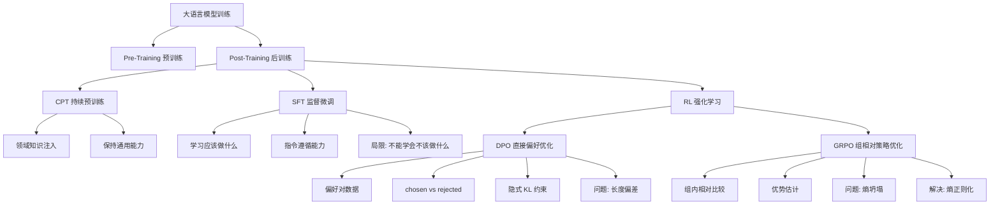
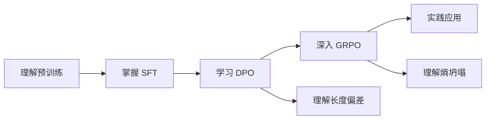

# Agent 工程第五周：大语言模型训练

## 📊 思维导图



---

## 🎯 核心概念

### 1. Post-Training 后训练概览

**定义**：在预训练（Pre-Training）完成后，对大语言模型进行的进一步训练，使其更符合人类需求和特定任务要求。

**三大阶段**：
1. **CPT** (Continual Pre-Training) - 持续预训练
2. **SFT** (Supervised Fine-Tuning) - 监督微调
3. **RL** (Reinforcement Learning) - 强化学习

---

### 2. CPT - 持续预训练

**目标**：在特定领域注入知识，同时保持模型的通用能力。

**应用场景**：
- 医疗领域模型：注入医学知识
- 法律领域模型：注入法律条文和案例
- 金融领域模型：注入金融术语和分析方法

**训练方式**：
- 使用领域相关的大规模文本数据
- 继续使用预训练的目标函数（next token prediction）
- 学习率通常比预训练阶段更小

---

### 3. SFT - 监督微调

**目标**：教会模型遵循指令，学习"应该做什么"。

**数据格式**：
```
输入 (Prompt): "如何制作一道健康的早餐？"
输出 (Response): "推荐燕麦粥配新鲜水果。首先将燕麦用水煮5分钟..."
```

**核心特点**：
- ✅ 学会指令遵循
- ✅ 学会任务格式
- ✅ 提升回答质量
- ❌ **局限**：只能学会"应该做什么"，不能学会"不应该做什么"

**为什么有局限**：
SFT 只优化正例（好的回答），没有负例（坏的回答）的对比信号。

---

### 4. DPO - 直接偏好优化

**全称**：Direct Preference Optimization

**目标**：通过偏好对比数据，让模型学会"什么是好的，什么是不好的"。

#### 4.1 数据格式

DPO 使用偏好对（Preference Pairs）：

```
Prompt: "如何制作一道健康的早餐？"

✅ Chosen (优选回答):
"推荐燕麦粥配新鲜水果。首先将燕麦用水煮5分钟，
加入香蕉片和蓝莓，营养均衡且低热量。"

❌ Rejected (拒绝回答):
"建议吃点面包就行了，不重要。"
```

**关键特点**：
- Chosen 和 Rejected 是**完整独立的序列**
- 可以从第一个 token 就完全不同
- 长度可以不同
- 不要求有共同前缀（但可能有）

#### 4.2 损失函数

$$\mathcal{L}_{DPO} = -\mathbb{E}\left[\log \sigma\left(\beta \log \frac{\pi(y_w|x)}{\pi_{ref}(y_w|x)} - \beta \log \frac{\pi(y_l|x)}{\pi_{ref}(y_l|x)}\right)\right]$$

其中：
- $y_w$：chosen（优选回答）
- $y_l$：rejected（拒绝回答）
- $\pi$：当前策略模型
- $\pi_{ref}$：参考模型（通常是 SFT 后的模型）
- $\beta$：温度参数，控制 KL 散度约束强度

#### 4.3 DPO 的本质：隐式强化学习

**DPO 是 SFT 还是 RL？**

答案：**DPO 本质上是强化学习**，但通过数学推导消除了显式的 reward model。

**隐式 KL 约束**：
- DPO 损失函数中的 $\log \frac{\pi}{\pi_{ref}}$ 项隐式约束模型不偏离参考模型太远
- 等价于 RLHF 中的 KL 散度惩罚：$\beta \cdot KL(\pi || \pi_{ref})$

#### 4.4 长度偏差问题

**问题本质**：

序列概率计算：$\log \pi(y|x) = \sum_{t=1}^{T} \log P(y_t|x, y_{<t})$

每个 token 的 $\log P < 0$，因此：
- 长序列（100 tokens）：累加 100 个负数 → 很负
- 短序列（10 tokens）：累加 10 个负数 → 稍负

**为什么实际中还能工作？**

因为使用了 log ratio：$\log \frac{\pi(y|x)}{\pi_{ref}(y|x)}$

两个模型对同一序列的概率变化趋势相似，相减后长度影响被部分抵消。

**解决方案**：
1. **长度归一化**：$\frac{1}{T}\sum_{t=1}^{T} \log P(y_t|x, y_{<t})$
2. **数据层面控制**：保证 chosen 和 rejected 长度相近
3. **算法改进**：SimPO、IPO、R-DPO 等变体

---

### 5. GRPO - 组相对策略优化

**全称**：Group Relative Policy Optimization

**核心思想**：对同一 prompt 采样多个回答，通过组内相对比较来优化策略。

#### 5.1 工作流程

```
1. 对同一 prompt 采样 G 个回答：[y₁, y₂, ..., yG]
2. 计算每个回答的 reward：[r₁, r₂, ..., rG]
3. 计算组内相对优势：
   Â_i = (r_i - mean(r)) / std(r)
4. 使用 PPO 风格的损失函数优化
```

#### 5.2 优势估计

**相对优势公式**：

$$\hat{A}_i = \frac{r_i - \text{mean}(\{r_j\})}{\text{std}(\{r_j\})}$$

**示例**：

| 回答 | Reward | 相对优势 | 梯度方向 |
|------|--------|----------|----------|
| A | 0.9 | +1.2 | 概率 ↑↑ |
| B | 0.7 | +0.3 | 概率 ↑ |
| C | 0.5 | -0.5 | 概率 ↓ |
| D | 0.3 | -1.0 | 概率 ↓↓ |

**关键特点**：即使所有回答都不错，也必须有"输家"！

---

#### 5.3 熵坍塌问题

**什么是熵坍塌**：

```
训练初期: π(y|x) = [0.2, 0.2, 0.2, 0.2, 0.2]  熵 = 1.61 ✅ 多样
    ↓
训练中期: π(y|x) = [0.6, 0.2, 0.1, 0.05, 0.05] 熵 = 1.19
    ↓
训练后期: π(y|x) = [0.98, 0.01, 0.01, ...]     熵 → 0 ❌ 坍塌
```

模型变得过度自信，只会生成几乎相同的输出。

**为什么 GRPO 容易熵坍塌**：

1. **马太效应**：
   - A 的概率高 → 采样时 A 更常出现
   - 组内比较时 A 经常获胜
   - A 的优势被进一步强化
   - A 的概率更高 → 循环加剧

2. **采样多样性下降**：
   - 初期：[A, B, C, D] - 多样，比较有意义
   - 中期：[A, A, B, A] - A 占主导
   - 后期：[A, A, A, A] - 全是 A，无法学习

3. **KL 约束不足**：
   - KL 只约束与参考模型的距离
   - 不直接约束熵本身

**解决方案**：
- 熵正则化：显式添加熵奖励项
- 增加采样温度
- 使用更大的采样组 G

---

## 📚 实战教程

### 教程 1：理解 SFT 到 DPO 的演进

**场景**：训练一个客服助手

**SFT 阶段**：
```python
# 训练数据
data = {
    "prompt": "用户投诉产品质量问题",
    "response": "非常抱歉给您带来不便。请提供订单号，我们会立即处理。"
}

# SFT 只学习这个正例
# 问题：模型不知道什么是不好的回答
```

**DPO 阶段**：
```python
# 偏好对数据
data = {
    "prompt": "用户投诉产品质量问题",
    "chosen": "非常抱歉给您带来不便。请提供订单号，我们会立即处理并安排退换货。",
    "rejected": "这不是我们的问题，你自己使用不当。"
}

# DPO 通过对比学习：
# ✅ 提升 chosen 的概率
# ❌ 降低 rejected 的概率
```

**关键区别**：
- SFT：只知道"好的样子"
- DPO：知道"好的 vs 坏的"，学会判断和选择

---

### 教程 2：GRPO 的组内竞争机制

**场景**：优化数学推理能力

**步骤演示**：

```python
# 1. 对同一问题采样 4 个回答
prompt = "计算 15% 的 80 是多少？"

responses = [
    "15% × 80 = 0.15 × 80 = 12",           # 回答 A
    "80 ÷ 100 × 15 = 12",                  # 回答 B
    "80 的 15% 就是 12",                    # 回答 C
    "大概是 10 到 15 之间吧"                # 回答 D
]

# 2. 计算 reward（假设基于正确性和解释质量）
rewards = [0.95, 0.90, 0.70, 0.20]

# 3. 计算相对优势
mean_r = 0.6875
std_r = 0.32
advantages = [
    (0.95 - 0.6875) / 0.32 = +0.82,  # A: 强化
    (0.90 - 0.6875) / 0.32 = +0.66,  # B: 强化
    (0.70 - 0.6875) / 0.32 = +0.04,  # C: 微弱强化
    (0.20 - 0.6875) / 0.32 = -1.52   # D: 抑制
]

# 4. 更新策略
# P(A|prompt) ↑↑  详细推理步骤被强化
# P(B|prompt) ↑   简洁方法也被强化
# P(C|prompt) →   模糊回答略微强化
# P(D|prompt) ↓↓  错误回答被抑制
```

**关键洞察**：
- 组内竞争：即使 C 的 reward 是 0.70（还不错），但相对于 A 和 B 仍然是"输家"
- 多样性保持：A 和 B 都被强化，保留了多种解题方法

---

### 教程 3：理解 DPO 的长度偏差

**问题演示**：

```python
# 偏好对数据
prompt = "介绍一下机器学习"

chosen = """机器学习是人工智能的一个分支，通过算法让计算机
从数据中学习模式。主要分为监督学习、无监督学习和强化学习三类。
监督学习使用标注数据训练模型..."""  # 150 tokens

rejected = "机器学习就是让电脑自己学习。"  # 10 tokens

# 序列概率计算
log_prob_chosen = sum([-0.5] * 150) = -75    # 长序列
log_prob_rejected = sum([-0.5] * 10) = -5    # 短序列

# 问题：长序列天然概率更低！
```

**DPO 如何缓解**：

```python
# 使用 log ratio
log_ratio_chosen = log_prob_chosen - log_prob_ref_chosen
                 = -75 - (-73) = -2

log_ratio_rejected = log_prob_rejected - log_prob_ref_rejected
                   = -5 - (-4.8) = -0.2

# 相对变化被部分抵消，但问题仍存在
```

**解决方案**：
```python
# 长度归一化
normalized_log_prob = log_prob / length
chosen_norm = -75 / 150 = -0.5
rejected_norm = -5 / 10 = -0.5
# 现在公平了！
```

---

### 对比总结

| 方法 | 数据需求 | 优点 | 缺点 | 适用场景 |
|------|---------|------|------|---------|
| **SFT** | 指令-回答对 | 简单高效 | 不能学习"不该做什么" | 基础指令遵循 |
| **DPO** | 偏好对 | 无需 reward model | 长度偏差问题 | 对齐人类偏好 |
| **GRPO** | 只需 prompt + reward | 灵活，可用任意 reward | 熵坍塌风险 | 复杂推理任务 |

---

## 🧪 测试题

### 选择题

**1. SFT 的主要局限是什么？**
A. 训练速度太慢
B. 只能学会"应该做什么"，不能学会"不应该做什么"
C. 需要大量标注数据
D. 容易过拟合

**2. DPO 损失函数中的 $\pi_{ref}$ 的作用是什么？**
A. 提供初始化参数
B. 作为 reward model
C. 隐式约束模型不偏离太远（KL 散度约束）
D. 加速训练收敛

**3. GRPO 中的"组内相对优势"是指什么？**
A. 与其他 prompt 的回答比较
B. 与参考模型比较
C. 与同一 prompt 的其他采样回答比较
D. 与人类标注比较

**4. DPO 的长度偏差问题主要是因为？**
A. 长序列的 log 概率累加更多负数
B. 短序列更容易训练
C. 数据集不平衡
D. 模型容量不足

**5. GRPO 的熵坍塌问题可以通过什么方法缓解？**
A. 增加学习率
B. 减少训练轮数
C. 添加熵正则化项
D. 使用更小的模型

---

### 简答题

**6. 解释为什么 DPO 被认为是"隐式强化学习"？它与传统 RLHF 的主要区别是什么？**

**7. 在 GRPO 中，如果对同一 prompt 采样的 4 个回答的 reward 分别是 [0.8, 0.75, 0.72, 0.70]，请计算每个回答的相对优势（假设已标准化）。这说明了什么问题？**

**8. 为什么说 SFT 只能学会"应该做什么"而不能学会"不应该做什么"？请举例说明。**

---

### 应用题

**9. 设计偏好对数据**

假设你正在训练一个编程助手，用户问题是："如何在 Python 中读取 CSV 文件？"

请设计一对 DPO 训练数据，包括：
- Prompt（用户问题）
- Chosen（优选回答）
- Rejected（拒绝回答）

并说明为什么 chosen 比 rejected 更好。

**10. 分析熵坍塌场景**

假设在 GRPO 训练过程中，你观察到模型对问题"什么是机器学习？"的回答变化如下：

- 训练初期：生成 5 种不同风格的回答
- 训练中期：80% 的采样都是同一种回答
- 训练后期：几乎 100% 生成相同回答

请分析：
a) 这是熵坍塌的表现吗？为什么？
b) 可能的原因是什么？
c) 提出 2-3 种解决方案

---

## 💡 学习建议

### 关键概念记忆口诀

1. **SFT**：只学好，不学坏
2. **DPO**：好坏对比，隐式 RL
3. **GRPO**：组内竞争，小心坍塌

### 学习路径



### 实践建议

1. **从 SFT 开始**：先用 SFT 建立基础能力
2. **DPO 对齐偏好**：用偏好数据进行对齐
3. **GRPO 优化推理**：针对复杂推理任务使用 GRPO
4. **监控指标**：
   - SFT：loss、准确率
   - DPO：偏好准确率、长度分布
   - GRPO：reward、熵值、采样多样性

---

## 📖 延伸阅读

- [[DPO 论文]]：Direct Preference Optimization
- [[GRPO 论文]]：Group Relative Policy Optimization
- [[RLHF 综述]]：Reinforcement Learning from Human Feedback
- [[SimPO]]：解决 DPO 长度偏差的改进方法

---

## 🔗 相关概念

- #机器学习 #强化学习 #大语言模型
- #Post-Training #对齐 #RLHF
- #偏好学习 #策略优化

---

> 💡 **提示**：测试题答案请查看 [[Agent工程训练-测试题答案.md]]

