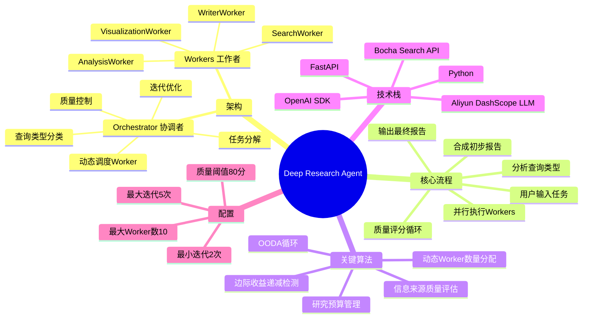
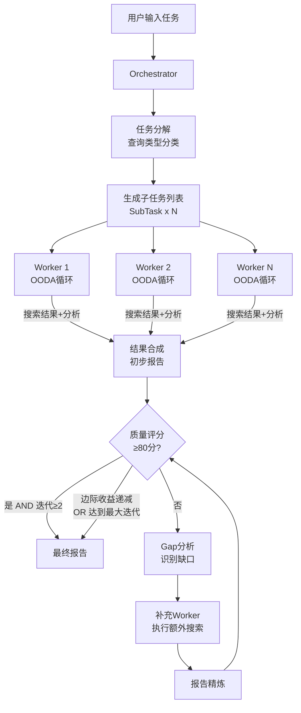

---
tags:
  - LLM
  - multi-agent
  - deep-research
  - orchestrator-workers
  - python
created: 2026-03-26
aliases:
  - Deep Research 教程
---

# Deep Research Agent 深度研究智能体

> [!abstract] 项目简介
> Deep Research Agent 是一个**多智能体协作系统**，基于 **Orchestrator-Workers（协调者-工作者）架构**，能自动完成复杂的深度研究任务，输出高质量研究报告。类比：就像一个研究团队，有一个项目主管（Orchestrator）负责拆分任务、调度员工、审核质量；多个专家员工（Workers）并行执行具体搜索与分析。

---

## 思维导图



---

## 项目结构

```
deep_research/
├── main.py          # 主入口，DeepResearchAgent 高层API + CLI
├── orchestrator.py  # 协调者（Lead Agent），核心调度逻辑
├── workers.py       # 工作者（Sub-Agents），执行搜索与分析
├── tools.py         # LLM客户端 + 搜索API客户端 + 工具函数
├── prompts.py       # 所有Prompt模板（7大类，30+个模板）
├── config.py        # 全局配置（API、迭代参数、质量阈值等）
├── api.py           # FastAPI REST服务接口
├── __init__.py      # 包初始化
├── __main__.py      # CLI入口
└── requirements.txt # 依赖包
```

> [!tip] 文件关系
> `main.py` → 调用 `orchestrator.py` → 调用 `workers.py` → 调用 `tools.py`
> 所有模块都从 `prompts.py` 读取提示词，从 `config.py` 读取配置。

---

## 核心概念一：Orchestrator-Workers 架构

### 概念解释

这是一种**主从式多智能体模式**：
- **Orchestrator（协调者）**：像项目经理，负责理解目标、分解任务、调配资源、检验成果
- **Workers（工作者）**：像专家员工，各自独立执行分配的子任务，并发运行

### 类比示例

> 想象你让一个研究团队调查"中国AI产业发展现状"：
> - 项目经理（Orchestrator）：拆分为"政策环境"、"代表企业"、"技术能力"、"国际比较"4个子课题
> - 4位研究员（Workers）**同时**各查一个子课题
> - 项目经理汇总报告，发现"国际比较"部分太薄，再补充调研
> - 重复直到质量达标

### 代码示意

```python
# orchestrator.py - 核心调度流程（简化版）
def run(self, task: str) -> str:
    # 1. 分解任务，确定子任务列表
    task_plan = self._decompose_task(task)

    # 2. 并行派发Worker（使用线程池）
    with ThreadPoolExecutor(max_workers=task_plan.worker_count) as executor:
        futures = [executor.submit(worker.execute, subtask)
                   for subtask in task_plan.subtasks]
        results = [f.result() for f in futures]

    # 3. 合成初步报告
    report = self._synthesize_results(task, results)

    # 4. 迭代质量控制（最少2次，最多5次）
    for iteration in range(self.config.max_iterations):
        score = self._quality_check(report)
        if score >= 80 and iteration >= 2:
            break
        if self._diminishing_returns_detected():
            break
        gaps = self._gap_analysis(report)
        new_results = self._dispatch_supplementary_workers(gaps)
        report = self._refine_report(report, new_results)

    return report
```

---

## 核心概念二：查询类型分类

Orchestrator 会先**判断研究任务的类型**，再决定如何分配Worker：

| 查询类型 | 特征 | 策略 | Worker数量 |
|---------|------|------|-----------|
| `depth_first` | 对单一主题深挖多个维度 | 多角度并行深入 | 3-10个 |
| `breadth_first` | 多个独立子话题横向覆盖 | 并行横向铺开 | 3-10个 |
| `simple` | 单一聚焦、简单查询 | 单一或少量Worker | 1-2个 |

### 示例

```
查询："GPT-4的工作原理是什么？"
→ simple（单一问题，1-2个Worker即可）

查询："分析特斯拉的商业模式、竞争优势、财务状况和未来风险"
→ breadth_first（4个独立子话题，各派1个Worker）

查询："深度分析气候变化对农业的影响"
→ depth_first（同一主题，从经济/生态/政策/技术等多维度深挖）
```

---

## 核心概念三：OODA 循环

### 什么是 OODA？

**OODA** 源自军事决策理论，全称：
- **O**bserve（观察）→ **O**rient（定向）→ **D**ecide（决策）→ **A**ct（行动）

在 SearchWorker 中，OODA 用于**智能化的迭代搜索**：

```
┌─────────────────────────────────────────────────────┐
│                   OODA 一个循环                      │
│                                                     │
│  Observe  →  执行搜索查询，收集原始信息               │
│     ↓                                               │
│  Orient   →  分析结果，识别关键发现和信息缺口          │
│     ↓                                               │
│  Decide   →  判断是否需要补充搜索，选择下一步策略       │
│     ↓                                               │
│  Act      →  执行补充搜索 OR 结束本轮，提交结果        │
│     ↓                                               │
│  （若预算未耗尽且有缺口，进入下一个OODA循环）          │
└─────────────────────────────────────────────────────┘
```

### 研究预算

不同复杂度的任务分配不同的搜索预算：

| 复杂度 | 最大查询数 | 最大循环数 |
|--------|-----------|-----------|
| simple | 3次 | 1次 |
| medium | 5次 | 2次 |
| complex | 8次 | 3次 |

### 代码示意

```python
# workers.py - OODA循环（简化版）
def _execute_ooda_cycle(self, subtask, budget):
    cycle = OODACycle()

    # Observe: 执行初始搜索
    results = self.search_client.multi_search(subtask.search_queries)
    cycle.observations = results

    # Orient: 分析结果，识别缺口
    analysis = self.llm.chat(ORIENT_PROMPT.format(results=results))
    gaps = self._extract_gaps(analysis)
    cycle.orientation = analysis

    # Decide: 是否需要补充搜索？
    if gaps and budget.remaining_queries > 0:
        decision = "search_more"
    else:
        decision = "complete"
    cycle.decision = decision

    # Act: 执行决策
    if decision == "search_more":
        extra_results = self.search_client.multi_search(gaps)
        results.extend(extra_results)
        budget.consume(len(gaps))

    return cycle, results
```

---

## 核心概念四：质量控制与迭代

### 质量评分维度（满分100分）

Orchestrator 从6个维度评估报告质量：

| 维度 | 说明 |
|------|------|
| 完整性 | 是否覆盖了任务要求的所有方面 |
| 准确性 | 信息是否有可靠来源支撑 |
| 深度 | 分析是否深入，有洞见 |
| 结构性 | 报告逻辑是否清晰、有条理 |
| 可读性 | 语言表达是否清晰流畅 |
| 来源质量 | 引用来源是否权威可靠 |

### 迭代终止条件

```
达到质量阈值（≥80分）AND 已完成最少迭代（≥2次）
    OR
检测到边际收益递减（连续3次迭代质量提升 < 5分）
    OR
达到最大迭代次数（5次）
```

### 边际收益递减检测

> [!example] 示例
> 假设迭代质量得分为：72 → 78 → 81 → 82 → 83
> - 第3次：+3分，第4次：+1分，第5次：+1分
> - 连续3次提升 < 5分 → **触发终止，停止迭代**

---

## 核心概念五：信息来源质量评估

SearchWorker 会自动评估每个搜索结果来源的可靠性：

| 质量级别 | 典型来源 |
|---------|---------|
| 高可靠 | `.gov`, `.edu`, `.org`, reuters, bloomberg, nature, arxiv |
| 中等可靠 | 一般新闻网站、专业博客 |
| 低可靠 | reddit, quora, medium.com, 一般论坛 |

Worker 在 Orient 阶段会标注哪些结论有高质量来源支撑，哪些属于推测内容。

---

## 数据流全景图



---

## 项目优化方案

> [!tip] 优化建议

### 1. 异步化改造（性能优化）

当前使用 `ThreadPoolExecutor` 线程并行，可改为 `asyncio` + `aiohttp` 异步并发，降低线程开销：

```python
# 当前方案（同步线程）
with ThreadPoolExecutor(max_workers=n) as executor:
    futures = [executor.submit(worker.execute, task) for task in subtasks]

# 优化方案（异步）
async def run_workers_async(subtasks):
    tasks = [worker.execute_async(task) for task in subtasks]
    return await asyncio.gather(*tasks)
```

### 2. 缓存层（成本优化）

相同或相似查询避免重复调用 LLM/搜索 API：

```python
# 在 tools.py 中添加 Redis 缓存
import hashlib, redis

cache = redis.Redis()

def search_with_cache(query: str):
    key = hashlib.md5(query.encode()).hexdigest()
    cached = cache.get(key)
    if cached:
        return json.loads(cached)
    result = search_client.search(query)
    cache.setex(key, 3600, json.dumps(result))  # 缓存1小时
    return result
```

### 3. 流式输出优化（用户体验）

在 `api.py` 的 SSE 流中增加更细粒度的进度反馈（当前仅阶段级别，可改为 Worker 级别实时更新）。

### 4. 动态模型选择（质量/成本平衡）

目前 Worker 用 `qwen-plus`，可根据子任务复杂度动态选择：
- 复杂任务 → `qwen-max`（更强，更贵）
- 简单任务 → `qwen-turbo`（更快，更便宜）

### 5. 向量数据库去重

当前结果去重基于简单文本匹配，可引入向量数据库（如 Chroma）做语义去重，避免保留语义相似的冗余信息。

---

## 快速上手

### 环境配置

```bash
pip install -r requirements.txt

# 创建 .env 文件
DASHSCOPE_API_KEY=your_dashscope_key
BOCHA_API_KEY=your_bocha_key
```

### 三种使用方式

**方式1：Python库调用**
```python
from deep_research import DeepResearchAgent

agent = DeepResearchAgent()
report = agent.research("分析2024年中国新能源汽车市场格局")
print(report)
```

**方式2：命令行**
```bash
python -m deep_research "分析2024年中国新能源汽车市场格局" --workers 6 --output ./reports
```

**方式3：API服务**
```bash
# 启动服务
uvicorn deep_research.api:app --port 8000

# 提交任务
curl -X POST http://localhost:8000/research \
  -H "Content-Type: application/json" \
  -d '{"task": "分析2024年中国新能源汽车市场格局"}'

# 查询结果
curl http://localhost:8000/research/{task_id}/result
```

---

## 关键配置参数速查

| 参数 | 位置 | 默认值 | 说明 |
|------|------|--------|------|
| `min_iterations` | config.py | 2 | 最少迭代次数 |
| `max_iterations` | config.py | 5 | 最多迭代次数 |
| `quality_threshold` | config.py | 80 | 质量达标分数 |
| `max_workers` | config.py | 10 | 最大并行Worker数 |
| `diminishing_returns_threshold` | config.py | 5 | 边际收益阈值（分） |
| `default_model` | config.py | qwen-plus | 默认LLM模型 |
| `report_language` | config.py | zh-CN | 报告语言 |

---

## 测试题

> [!question] 练习题
> 测试题在 [[Deep_Research_Agent_Answers]] 文件中有对应答案。

**基础题**

1. Orchestrator-Workers 架构中，Orchestrator 和 Workers 各自负责什么职责？
2. 项目支持哪三种查询类型分类？各自适用什么场景？
3. OODA 循环的四个步骤分别是什么？每步做了什么事？
4. `tools.py` 中 `LLMClient` 和 `SearchClient` 分别封装了什么功能？
5. 质量控制的最小迭代次数和质量阈值分别是多少？

**中级题**

6. 解释"边际收益递减检测"的触发条件，并举一个数值例子。
7. SearchWorker 的研究预算是如何根据任务复杂度分配的？
8. 信息来源质量评估中，哪类域名会被评为高可靠？低可靠？
9. 项目提供了哪三种使用方式？分别适用什么场景？
10. `orchestrator.py` 中的 `TaskPlan` 数据结构包含哪些字段？

**高级题**

11. 如果要将项目的 `ThreadPoolExecutor` 改为异步方案，需要修改哪些文件的哪些部分？请描述改造思路。
12. 为什么要设置最少迭代次数（`min_iterations=2`）？如果去掉这个限制会有什么问题？
13. 当前的结果去重方案有什么局限性？如何用向量数据库改进？
14. 项目的 Prompt 分为7大类，分别对应流程中的哪个阶段？请列出并说明。
15. 如果你要为这个项目增加"用户偏好记忆"功能（让Agent记住用户的研究风格偏好），你会在哪个层面添加？修改哪个文件？
