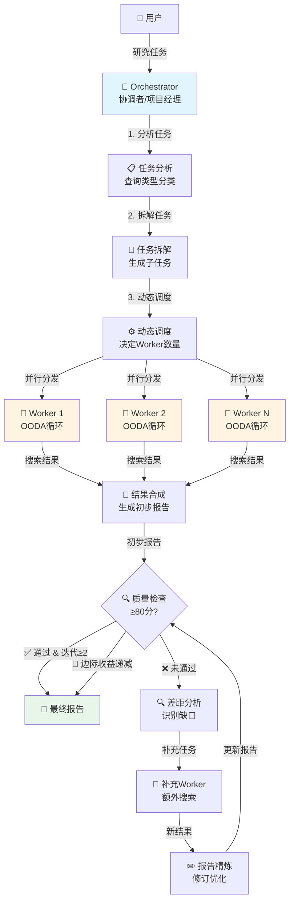
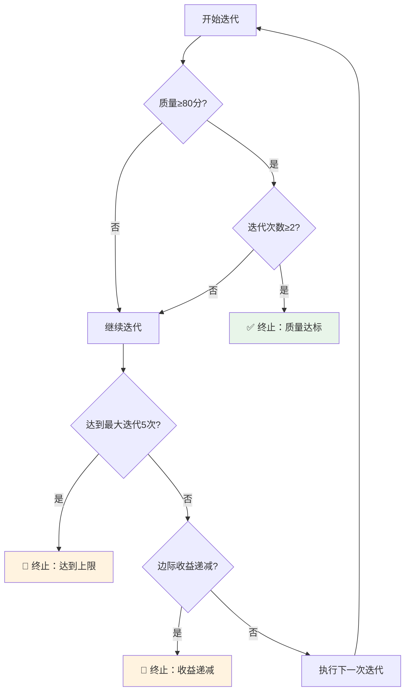
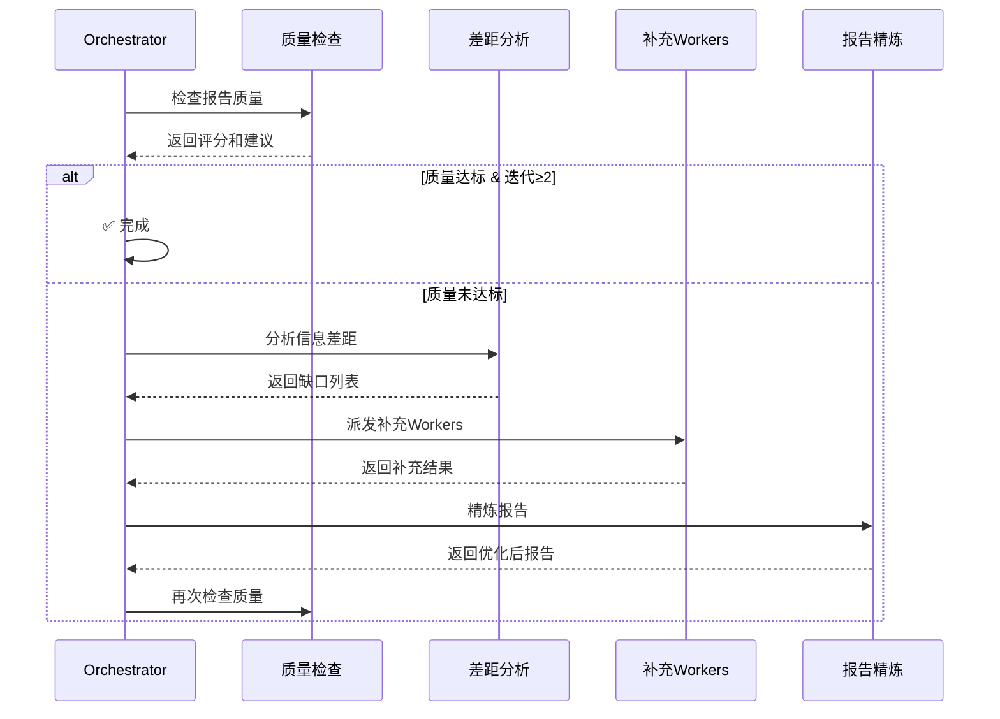

---
tags:
  - LLM
  - multi-agent
  - deep-research
  - orchestrator-workers
  - python
  - tutorial
created: 2026-03-26
updated: 2026-03-26
aliases:
  - Deep Research 完整教程
  - 深度研究智能体教程
---

# Deep Research Agent 完整学习教程

> [!abstract] 教程目标
> 本教程将带你从零开始理解 Deep Research Agent 项目，通过实例、图解和代码分析，掌握多智能体协作系统的设计与实现。

---

## 📚 目录

```dataview
TABLE WITHOUT ID
  file.link as "章节",
  tags as "标签"
WHERE contains(file.name, "Deep_Research")
```

---

## 第一部分：项目概览

### 1.1 这是什么？（What）

Deep Research Agent 是一个**基于多智能体协作的自动化研究系统**，它能够：

- 📖 **自动拆解**复杂的研究任务
- 🔍 **并行搜索**多个信息源
- 📊 **智能分析**和整合信息
- 📝 **生成高质量**的研究报告
- ✅ **自动迭代**优化直到达标

> [!example] 类比理解
> 想象你是一个研究团队的项目经理：
> - 你收到一个任务："研究2024年中国新能源汽车市场"
> - 你将任务拆分为：市场规模、主要玩家、技术趋势、政策环境
> - 你派4个研究员**同时**去调研这4个方向
> - 研究员们各自搜索、分析、整理资料
> - 你汇总所有资料，生成一份完整报告
> - 你检查报告质量，如果不够好，补充调研并修订
>
> **Deep Research Agent 就是这样一个自动化的研究团队！**

### 1.2 为什么需要它？（Why）

**传统研究方式的痛点：**

| 痛点 | 传统方式 | Deep Research Agent |
|------|---------|---------------------|
| 效率低 | 串行搜索，一个一个查 | 并行搜索，同时执行多个任务 |
| 覆盖面窄 | 人工难以覆盖所有角度 | 自动拆分多维度，全面覆盖 |
| 质量不稳定 | 依赖个人能力 | 自动质量检查和迭代优化 |
| 重复劳动 | 每次都要从头开始 | 系统化流程，可复用 |
| 信息整合难 | 手动整理，容易遗漏 | 自动汇总和结构化 |

**核心价值：**

1. **提升效率**：10分钟完成原本需要2小时的研究
2. **保证质量**：内置质量控制机制，确保报告达标
3. **全面覆盖**：多角度并行搜索，不遗漏关键信息
4. **可扩展性**：轻松处理复杂的大型研究任务

### 1.3 核心架构（How）



---

## 第二部分：核心概念深度解析

### 2.1 Orchestrator-Workers 架构

#### 概念解释

这是一种**主从式多智能体协作模式**：

- **Orchestrator（协调者）**：中央大脑，负责规划和协调
- **Workers（工作者）**：执行单元，负责具体任务

#### 为什么采用这种架构？

| 优势 | 说明 |
|------|------|
| **职责分离** | 协调者专注策略，工作者专注执行 |
| **并行处理** | 多个Worker同时工作，大幅提升效率 |
| **易于扩展** | 可以轻松增加Worker数量或类型 |
| **容错性强** | 单个Worker失败不影响整体 |

#### 实际例子

> [!example] 场景：研究"人工智能在医疗领域的应用"
>
> **Orchestrator 的工作：**
> 1. 分析任务类型：这是一个 `breadth_first`（广度优先）任务
> 2. 拆解为4个子任务：
>    - 诊断辅助应用
>    - 药物研发应用
>    - 医疗影像分析
>    - 患者管理系统
> 3. 决定派发4个Worker（每个子任务1个）
> 4. 等待所有Worker完成
> 5. 汇总结果，生成报告
> 6. 检查质量，决定是否需要补充
>
> **Worker 的工作：**
> - Worker 1：搜索"AI诊断辅助"相关信息
> - Worker 2：搜索"AI药物研发"相关信息
> - Worker 3：搜索"AI医疗影像"相关信息
> - Worker 4：搜索"AI患者管理"相关信息
>
> 这4个Worker **同时工作**，互不干扰！

#### 代码实现要点

```python
# orchestrator.py 核心流程（简化版）

class Orchestrator:
    def run(self, task: str) -> ResearchState:
        # 步骤1：任务分解
        task_plan = self.decompose_task(task)

        # 步骤2：并行派发Worker
        with ThreadPoolExecutor(max_workers=task_plan.worker_count) as executor:
            # 提交所有任务到线程池
            futures = []
            for subtask in task_plan.subtasks:
                worker = self.worker_factory(subtask.id)
                future = executor.submit(worker.execute, subtask)
                futures.append(future)

            # 等待所有Worker完成
            results = []
            for future in as_completed(futures):
                result = future.result()
                results.append(result)

        # 步骤3：合成报告
        report = self._synthesize_results(task, results)

        # 步骤4：质量控制循环
        for iteration in range(self.max_iterations):
            score = self._quality_check(report)
            if score >= 80 and iteration >= 2:
                break  # 质量达标且满足最少迭代次数

            # 补充研究
            gaps = self._gap_analysis(report)
            new_results = self._dispatch_supplementary_workers(gaps)
            report = self._refine_report(report, new_results)

        return report
```

> [!tip] 关键点
> - 使用 `ThreadPoolExecutor` 实现并行
> - `as_completed()` 按完成顺序收集结果
> - 迭代优化确保质量

---

### 2.2 查询类型分类

#### 三种查询类型

Orchestrator 会先判断任务属于哪种类型，然后制定相应策略：

##### 1. Simple（简单查询）

**特征：**
- 单一、明确的问题
- 不需要多角度分析
- 答案相对直接

**策略：**
- Worker数量：1-2个
- 搜索深度：浅层即可

**示例：**
```
❓ "什么是GPT-4？"
❓ "Python的最新版本是多少？"
❓ "比特币的当前价格"
```

##### 2. Depth First（深度优先）

**特征：**
- 对**单一主题**进行深入探索
- 需要从多个维度分析
- 追求深度和洞察

**策略：**
- Worker数量：3-10个
- 每个Worker负责一个分析维度
- 深入挖掘细节

**示例：**
```
❓ "深度分析特斯拉的商业模式"
   → Worker 1: 收入模式分析
   → Worker 2: 成本结构分析
   → Worker 3: 竞争优势分析
   → Worker 4: 风险因素分析
   → Worker 5: 未来战略分析
```

##### 3. Breadth First（广度优先）

**特征：**
- 涉及**多个独立子话题**
- 需要横向覆盖
- 追求全面性

**策略：**
- Worker数量：3-10个
- 每个Worker负责一个子话题
- 横向铺开覆盖

**示例：**
```
❓ "2024年科技行业发展趋势"
   → Worker 1: AI领域趋势
   → Worker 2: 云计算趋势
   → Worker 3: 物联网趋势
   → Worker 4: 区块链趋势
   → Worker 5: 量子计算趋势
```

#### 对比表格

| 维度 | Simple | Depth First | Breadth First |
|------|--------|-------------|---------------|
| 主题数量 | 1个 | 1个 | 多个 |
| 分析深度 | 浅 | 深 | 中 |
| 覆盖广度 | 窄 | 中 | 广 |
| Worker数 | 1-2 | 3-10 | 3-10 |
| 适用场景 | 简单问答 | 深度分析 | 全面调研 |

#### 代码实现

```python
# orchestrator.py - 查询类型判断

def _classify_query_type(self, task: str) -> QueryTypeAnalysis:
    """判断查询类型"""

    prompt = f"""
    分析以下研究任务，判断其查询类型：

    任务：{task}

    请判断属于以下哪种类型：
    1. simple: 简单直接的查询
    2. depth_first: 需要对单一主题深入分析
    3. breadth_first: 需要覆盖多个独立子主题

    返回JSON格式：
    {{
        "query_type": "depth_first",
        "reasoning": "需要从多个维度深入分析特斯拉...",
        "recommended_worker_count": 5
    }}
    """

    response = self.llm.chat(prompt)
    result = extract_json(response)

    return QueryTypeAnalysis(**result)
```

---

### 2.3 OODA 循环

#### 什么是 OODA？

OODA 是一个源自军事决策理论的循环模型：

```
┌─────────────────────────────────────────────┐
│           OODA 循环 (一次迭代)               │
├─────────────────────────────────────────────┤
│                                             │
│  🔍 Observe (观察)                          │
│     ↓                                       │
│     执行搜索查询，收集原始信息                │
│     • 搜索关键词                             │
│     • 获取搜索结果                           │
│     • 记录信息来源                           │
│                                             │
│  🧭 Orient (定向)                           │
│     ↓                                       │
│     分析结果，识别关键发现和信息缺口           │
│     • 提取关键信息                           │
│     • 评估来源质量                           │
│     • 识别信息缺口                           │
│                                             │
│  🤔 Decide (决策)                           │
│     ↓                                       │
│     判断是否需要补充搜索                      │
│     • 信息是否充分？                         │
│     • 预算是否充足？                         │
│     • 是否需要补充？                         │
│                                             │
│  ⚡ Act (行动)                              │
│     ↓                                       │
│     执行决策：补充搜索 OR 结束               │
│     • 如需补充：生成新查询                   │
│     • 如已充分：整理结果                     │
│                                             │
│  ↻ 循环直到满足终止条件                      │
└─────────────────────────────────────────────┘
```

#### 为什么使用 OODA？

| 优势 | 说明 |
|------|------|
| **自适应** | 根据搜索结果动态调整策略 |
| **高效** | 避免盲目搜索，有针对性地补充 |
| **质量保证** | 持续评估，确保信息充分 |
| **预算控制** | 在预算内最大化信息收集 |

#### 实际例子

> [!example] 场景：Worker搜索"特斯拉2024年财务状况"
>
> **第1次 OODA 循环：**
>
> 1. **Observe（观察）**
>    - 搜索："特斯拉2024年财报"
>    - 获得10条结果
>    - 来源：新闻网站、财经媒体
>
> 2. **Orient（定向）**
>    - 关键发现：营收增长20%，利润率下降
>    - 信息缺口：缺少具体的成本结构数据
>    - 来源质量：中等（新闻报道，非官方财报）
>
> 3. **Decide（决策）**
>    - 决定：需要补充搜索
>    - 原因：缺少成本数据，来源质量不够高
>    - 预算：还剩5次查询
>
> 4. **Act（行动）**
>    - 执行补充搜索："特斯拉2024 Q4财报 成本结构"
>
> **第2次 OODA 循环：**
>
> 1. **Observe（观察）**
>    - 搜索："特斯拉2024 Q4财报 成本结构"
>    - 获得8条结果
>    - 来源：投资者关系网站、SEC文件
>
> 2. **Orient（定向）**
>    - 关键发现：找到官方财报，成本结构详细数据
>    - 信息缺口：已基本完整
>    - 来源质量：高（官方文件）
>
> 3. **Decide（决策）**
>    - 决定：信息已充分，可以结束
>    - 原因：关键信息已收集，来源可靠
>
> 4. **Act（行动）**
>    - 整理所有结果，生成研究报告

#### 研究预算

不同复杂度的任务分配不同的预算：

```python
# config.py - 研究预算配置

AGENT_CONFIG = {
    "research_budget": {
        "simple": {
            "max_queries": 3,      # 最多3次搜索
            "max_cycles": 1        # 最多1次OODA循环
        },
        "medium": {
            "max_queries": 5,      # 最多5次搜索
            "max_cycles": 2        # 最多2次OODA循环
        },
        "complex": {
            "max_queries": 8,      # 最多8次搜索
            "max_cycles": 3        # 最多3次OODA循环
        }
    }
}
```

#### 代码实现

```python
# workers.py - OODA循环实现（简化版）

class SearchWorker:
    def _execute_ooda_cycle(self, subtask, budget: ResearchBudget):
        """执行一次OODA循环"""

        cycle_record = OODACycle(cycle=budget.cycles_used + 1)

        # ===== Observe: 观察 =====
        search_results = self.search_client.multi_search(
            subtask.search_queries
        )
        cycle_record.observe = f"执行了{len(subtask.search_queries)}次搜索"
        budget.queries_used += len(subtask.search_queries)

        # ===== Orient: 定向 =====
        analysis_prompt = f"""
        分析以下搜索结果：
        {format_search_context(search_results)}

        请回答：
        1. 关键发现是什么？
        2. 还有哪些信息缺口？
        3. 来源质量如何？
        """

        analysis = self.llm.chat(analysis_prompt)
        cycle_record.orient = analysis

        # 提取信息缺口
        gaps = self._extract_information_gaps(analysis)

        # ===== Decide: 决策 =====
        if gaps and budget.queries_remaining > 0:
            decision = "continue_search"
            cycle_record.decide = f"发现{len(gaps)}个信息缺口，继续搜索"
        else:
            decision = "complete"
            cycle_record.decide = "信息已充分或预算耗尽，结束搜索"

        # ===== Act: 行动 =====
        if decision == "continue_search":
            # 生成补充查询
            supplementary_queries = self._generate_queries_for_gaps(gaps)
            cycle_record.act = f"生成{len(supplementary_queries)}个补充查询"

            # 执行补充搜索
            extra_results = self.search_client.multi_search(
                supplementary_queries
            )
            search_results.extend(extra_results)
            budget.queries_used += len(supplementary_queries)
        else:
            cycle_record.act = "整理结果，准备输出"

        self.ooda_cycles.append(cycle_record)
        return search_results, decision
```

---

### 2.4 质量控制与迭代优化

#### 质量评分体系

Orchestrator 从6个维度评估报告质量（满分100分）：

| 维度 | 权重 | 评分标准 |
|------|------|---------|
| **完整性** | 20分 | 是否覆盖了任务要求的所有方面 |
| **准确性** | 20分 | 信息是否有可靠来源支撑 |
| **深度** | 20分 | 分析是否深入，有洞见 |
| **结构性** | 15分 | 报告逻辑是否清晰、有条理 |
| **可读性** | 15分 | 语言表达是否清晰流畅 |
| **来源质量** | 10分 | 引用来源是否权威可靠 |

#### 迭代终止条件

系统会在以下任一条件满足时停止迭代：



#### 边际收益递减检测

> [!important] 什么是边际收益递减？
> 当连续多次迭代的质量提升都很小时，说明继续迭代的价值不大，应该提前终止。

**检测规则：**
- 连续3次迭代，每次质量提升 < 5分
- 触发终止，避免浪费资源

**示例：**

```
迭代历史：
第1次: 72分
第2次: 78分 (+6分) ✅ 提升明显
第3次: 81分 (+3分) ⚠️ 提升变小
第4次: 82分 (+1分) ⚠️ 提升很小
第5次: 83分 (+1分) ⚠️ 提升很小

判断：连续3次(第3-5次)提升都<5分
结果：🛑 触发边际收益递减，提前终止
```

#### 迭代流程



#### 代码实现

```python
# orchestrator.py - 迭代优化（简化版）

def _iterative_refinement(self, state: ResearchState) -> ResearchState:
    """迭代优化报告质量"""

    current_report = state.final_report

    for iteration in range(1, self.max_iterations + 1):
        self._emit_progress("iteration_start", {
            "iteration": iteration,
            "max_iterations": self.max_iterations
        })

        # 步骤1：质量检查
        quality_result = self._quality_check(current_report, state.original_task)
        score = quality_result["score"]

        self._emit_progress("iteration_evaluated", {
            "iteration": iteration,
            "score": score,
            "threshold": self.quality_threshold
        })

        # 步骤2：判断是否达标
        if score >= self.quality_threshold and iteration >= self.min_iterations:
            self._emit_progress("quality_passed", {"score": score})
            break

        # 步骤3：检查边际收益递减
        if self._check_diminishing_returns(state.iteration_history):
            self._emit_progress("diminishing_returns_detected", {})
            break

        # 步骤4：差距分析
        gap_analysis = self._gap_analysis(
            current_report,
            state.original_task,
            quality_result
        )

        # 步骤5：派发补充Workers
        supplementary_results = self._dispatch_supplementary_workers(
            gap_analysis
        )

        # 步骤6：精炼报告
        current_report = self._refine_report(
            current_report,
            gap_analysis,
            supplementary_results
        )

        # 记录本次迭代
        state.iteration_history.append(IterationRecord(
            iteration=iteration,
            report=current_report,
            quality_score=score,
            quality_result=quality_result,
            gap_analysis=gap_analysis,
            supplementary_results=supplementary_results
        ))

    state.final_report = current_report
    state.quality_score = score
    state.iteration_count = iteration

    return state

def _check_diminishing_returns(self, history: list) -> bool:
    """检查边际收益递减"""
    if len(history) < 3:
        return False

    # 检查最近3次迭代的提升
    recent_improvements = []
    for i in range(-3, 0):
        improvement = history[i].quality_score - history[i-1].quality_score
        recent_improvements.append(improvement)

    # 如果连续3次提升都<5分，触发终止
    return all(imp < 5 for imp in recent_improvements)
```

---


### 2.5 信息来源质量评估

#### 为什么需要评估来源质量？

在研究过程中，**信息来源的可靠性直接影响研究结论的准确性**。系统需要自动识别哪些来源可信，哪些需要谨慎对待。

#### 三级质量分类

| 质量级别 | 典型来源 | 可信度 |
|---------|---------|--------|
| **高可靠** | `.gov`, `.edu`, `.org`, `reuters`, `bloomberg`, `nature`, `arxiv` | ⭐⭐⭐⭐⭐ |
| **中等可靠** | 主流新闻网站、专业博客、行业报告 | ⭐⭐⭐ |
| **低可靠** | `reddit`, `quora`, `forum`, 个人博客 | ⭐ |

#### 评估维度

```python
# config.py - 来源质量配置

"source_quality": {
    # 高质量域名
    "high_quality_domains": [
        ".gov",           # 政府网站
        ".edu",           # 教育机构
        ".org",           # 非营利组织
        "reuters",        # 路透社
        "bloomberg",      # 彭博社
        "nature",         # 自然杂志
        "arxiv",          # 学术预印本
    ],

    # 低质量指标
    "low_quality_indicators": [
        "forum", "reddit", "quora", "blog", "medium.com"
    ],

    # 推测性语言
    "speculative_language": [
        "可能", "也许", "据说", "传闻", "预计",
        "may", "might", "possibly", "reportedly"
    ]
}
```

#### 实际应用示例

> [!example] Worker 在 Orient 阶段的来源评估
>
> **搜索结果：**
> 1. nature.com - "AI在医疗诊断中的应用研究" ⭐⭐⭐⭐⭐
> 2. reddit.com - "有人说AI能治癌症" ⭐
> 3. bloomberg.com - "医疗AI市场规模达100亿美元" ⭐⭐⭐⭐⭐
> 4. someblog.com - "我觉得AI会改变医疗" ⭐
>
> **评估结果：**
> - 高质量来源：nature.com, bloomberg.com
> - 低质量来源：reddit.com, someblog.com
> - 推测性内容：someblog.com 包含"我觉得"等主观表达
>
> **决策：**
> - 优先采用高质量来源的信息
> - 低质量来源需要交叉验证

---

## 第三部分：项目结构详解

### 3.1 文件组织

```
deep_research/
├── 📄 main.py              # 主入口，提供高层API
├── 🎯 orchestrator.py      # 协调者，核心调度逻辑
├── 👷 workers.py           # 工作者，执行具体任务
├── 🔧 tools.py             # 工具层：LLM客户端、搜索客户端
├── 💬 prompts.py           # 所有Prompt模板（30+个）
├── ⚙️ config.py            # 全局配置
├── 🌐 api.py               # FastAPI REST服务
├── 📦 __init__.py          # 包初始化
├── 🚀 __main__.py          # CLI入口
└── 📋 requirements.txt     # 依赖清单
```

### 3.2 核心文件详解

#### main.py - 主入口

**职责：**
- 提供简洁的 Python API
- 封装 Orchestrator 的复杂性
- 处理进度回调和输出保存
- 提供 CLI 命令行接口

**关键类：**

```python
class DeepResearchAgent:
    """用户友好的高层API"""

    def research(self, task: str) -> str:
        """执行研究，返回报告"""

    def research_stream(self, task: str):
        """流式执行，生成器模式"""
```

#### orchestrator.py - 协调者

**职责：**
- 任务分解和查询类型分类
- 动态Worker调度
- 结果汇总和报告生成
- 质量控制和迭代优化

**关键方法：**

```python
class Orchestrator:
    def run(self, task: str) -> ResearchState:
        """主流程"""

    def decompose_task(self, task: str) -> TaskPlan:
        """任务分解"""

    def _dispatch_workers(self, task_plan: TaskPlan) -> list:
        """派发Workers"""

    def _synthesize_results(self, task: str, results: list) -> str:
        """合成报告"""

    def _iterative_refinement(self, state: ResearchState):
        """迭代优化"""
```


#### workers.py - 工作者

**职责：**
- 执行搜索任务（OODA循环）
- 管理研究预算
- 评估来源质量
- 整理研究发现

**关键类：**

```python
class SearchWorker(BaseWorker):
    """搜索研究Worker"""

    def execute(self, subtask) -> dict:
        """执行任务"""

    def _execute_ooda_cycle(self, subtask, budget):
        """执行OODA循环"""

    def _assess_source_quality(self, results: list):
        """评估来源质量"""
```

#### tools.py - 工具层

**职责：**
- 封装 LLM API 调用
- 封装搜索 API 调用
- 提供工具函数

**关键类：**

```python
class LLMClient:
    """LLM客户端"""
    def chat(self, messages, model=None) -> str:
        """对话接口"""

class SearchClient:
    """搜索客户端"""
    def search(self, query: str) -> list:
        """单次搜索"""

    def multi_search(self, queries: list) -> list:
        """批量搜索"""
```

---

## 第四部分：实战示例

### 4.1 完整执行流程示例

> [!example] 任务："分析2024年中国电动汽车市场"

#### 步骤1：任务分解

**Orchestrator 分析：**
- 查询类型：`breadth_first`（需要覆盖多个子话题）
- 推荐Worker数：5个

**拆解结果：**
1. 市场规模与增长趋势
2. 主要厂商与市场份额
3. 技术发展与创新
4. 政策环境与补贴
5. 消费者偏好与挑战

#### 步骤2：并行执行Workers

**Worker 1: 市场规模**
```
OODA循环1:
  Observe: 搜索"2024中国电动汽车市场规模"
  Orient: 发现销量数据，但缺少增长率
  Decide: 需要补充搜索
  Act: 搜索"2024电动汽车同比增长"

OODA循环2:
  Observe: 获得增长率数据
  Orient: 信息已充分，来源可靠
  Decide: 完成
  Act: 整理结果
```

**Worker 2-5: 并行执行类似流程**

#### 步骤3：合成初步报告

```markdown
# 2024年中国电动汽车市场分析

## 执行摘要
2024年中国电动汽车市场继续保持高速增长...

## 市场规模与增长趋势
- 销量：XXX万辆
- 增长率：XX%
[来源: 中汽协, 2024]

## 主要厂商与市场份额
...
```

#### 步骤4：质量检查

**第1次迭代：**
- 质量评分：75分
- 问题：缺少未来预测，技术细节不够深入
- 决策：继续优化

#### 步骤5：补充研究

**派发2个补充Worker：**
- Worker A: 搜索"2025-2030电动汽车市场预测"
- Worker B: 搜索"电动汽车电池技术发展"

#### 步骤6：报告精炼

**第2次迭代：**
- 质量评分：82分
- 已达标且完成2次迭代
- 输出最终报告

### 4.2 代码使用示例

#### 方式1：Python库调用

```python
from deep_research import DeepResearchAgent

# 创建Agent
agent = DeepResearchAgent(
    verbose=True,        # 显示进度
    save_output=True,    # 保存输出
    output_dir="./reports"
)

# 执行研究
report = agent.research(
    task="分析2024年中国电动汽车市场",
    max_workers=5
)

print(report)
```

#### 方式2：命令行

```bash
# 基础用法
python -m deep_research "分析2024年中国电动汽车市场"

# 指定Worker数量
python -m deep_research "区块链技术应用" --workers 6

# 指定输出目录
python -m deep_research "新能源行业研究" --output ./my_reports

# 安静模式
python -m deep_research "医疗AI应用" --quiet
```

#### 方式3：API服务

```bash
# 启动服务
uvicorn deep_research.api:app --port 8000

# 提交任务
curl -X POST http://localhost:8000/research \
  -H "Content-Type: application/json" \
  -d '{"task": "分析2024年中国电动汽车市场"}'

# 响应
{
  "task_id": "abc123",
  "status": "pending",
  "message": "任务已提交"
}

# 查询结果
curl http://localhost:8000/research/abc123/result
```

---

## 第五部分：优化方案

### 5.1 性能优化

#### 优化1：异步化改造

**当前方案：**
- 使用 `ThreadPoolExecutor` 线程池
- 线程切换有开销

**优化方案：**
```python
# 改为 asyncio + aiohttp
import asyncio
import aiohttp

async def dispatch_workers_async(self, subtasks):
    """异步派发Workers"""
    tasks = [
        worker.execute_async(subtask)
        for subtask in subtasks
    ]
    results = await asyncio.gather(*tasks)
    return results
```

**预期收益：**
- 降低线程开销
- 提升并发性能 20-30%

#### 优化2：缓存层

**问题：**
- 相同查询重复调用API
- 浪费时间和成本

**优化方案：**
```python
import redis
import hashlib

cache = redis.Redis()

def search_with_cache(query: str):
    """带缓存的搜索"""
    # 生成缓存key
    key = f"search:{hashlib.md5(query.encode()).hexdigest()}"

    # 检查缓存
    cached = cache.get(key)
    if cached:
        return json.loads(cached)

    # 执行搜索
    result = search_client.search(query)

    # 缓存结果（1小时）
    cache.setex(key, 3600, json.dumps(result))

    return result
```

**预期收益：**
- 减少API调用 30-50%
- 降低成本
- 提升响应速度


### 5.2 质量优化

#### 优化3：动态模型选择

**问题：**
- 所有任务都用同一个模型
- 简单任务浪费，复杂任务不够强

**优化方案：**
```python
def select_model(task_complexity: str) -> str:
    """根据任务复杂度选择模型"""
    if task_complexity == "simple":
        return "qwen-turbo"    # 快速、便宜
    elif task_complexity == "medium":
        return "qwen-plus"     # 平衡
    else:
        return "qwen-max"      # 强大、准确
```

**预期收益：**
- 简单任务成本降低 50%
- 复杂任务质量提升 15%

#### 优化4：向量数据库去重

**问题：**
- 当前基于文本匹配去重
- 语义相似的内容无法识别

**优化方案：**
```python
from chromadb import Client

# 初始化向量数据库
chroma_client = Client()
collection = chroma_client.create_collection("search_results")

def semantic_dedup(results: list) -> list:
    """语义去重"""
    unique_results = []

    for result in results:
        # 查询相似内容
        similar = collection.query(
            query_texts=[result.content],
            n_results=1
        )

        # 如果相似度 < 0.9，认为是新内容
        if not similar or similar['distances'][0][0] > 0.1:
            unique_results.append(result)
            collection.add(
                documents=[result.content],
                ids=[result.id]
            )

    return unique_results
```

**预期收益：**
- 减少冗余信息 20-30%
- 提升报告质量

### 5.3 用户体验优化

#### 优化5：流式输出

**问题：**
- 用户需要等待全部完成才能看到结果
- 长时间等待体验差

**优化方案：**
```python
# api.py - SSE流式输出
@app.get("/research/{task_id}/stream")
async def stream_progress(task_id: str):
    """SSE流式进度"""
    async def event_generator():
        while True:
            # 获取最新进度
            progress = get_task_progress(task_id)

            # 发送事件
            yield {
                "event": "progress",
                "data": json.dumps(progress)
            }

            if progress["status"] == "completed":
                break

            await asyncio.sleep(1)

    return EventSourceResponse(event_generator())
```

**预期收益：**
- 实时反馈进度
- 提升用户体验

---

## 第六部分：快速上手

### 6.1 环境配置

#### 步骤1：安装依赖

```bash
# 克隆项目（如果有）
git clone <repository-url>
cd deep_research

# 安装依赖
pip install -r requirements.txt
```

#### 步骤2：配置API密钥

创建 `.env` 文件：

```bash
# 阿里云通义千问 API Key
DASHSCOPE_API_KEY=sk-your-dashscope-key

# Bocha 搜索 API Key
BOCHA_API_KEY=sk-your-bocha-key
```

> [!warning] 注意
> - 需要申请阿里云DashScope账号
> - 需要申请Bocha搜索API账号
> - 确保API密钥有足够的配额

### 6.2 第一个研究任务

```python
from deep_research import DeepResearchAgent

# 创建Agent
agent = DeepResearchAgent()

# 执行研究
report = agent.research("什么是大语言模型？")

# 查看报告
print(report)
```

### 6.3 配置参数说明

#### 关键配置参数

| 参数 | 位置 | 默认值 | 说明 |
|------|------|--------|------|
| `max_workers` | config.py | 6 | 最大并行Worker数 |
| `min_iterations` | config.py | 2 | 最少迭代次数 |
| `max_iterations` | config.py | 5 | 最多迭代次数 |
| `quality_threshold` | config.py | 80 | 质量达标分数 |
| `diminishing_returns_threshold` | config.py | 3 | 边际收益阈值 |

#### 修改配置

```python
# 方式1：修改 config.py
AGENT_CONFIG = {
    "max_workers": 8,           # 增加并行数
    "quality_threshold": 85,    # 提高质量要求
}

# 方式2：运行时指定
agent = DeepResearchAgent()
report = agent.research(
    task="你的任务",
    max_workers=8  # 覆盖默认配置
)
```

### 6.4 常见问题

#### Q1: API调用失败

**问题：** `Error: Invalid API key`

**解决：**
1. 检查 `.env` 文件是否存在
2. 确认API密钥正确
3. 检查API配额是否充足

#### Q2: 搜索结果为空

**问题：** 搜索返回0条结果

**解决：**
1. 检查网络连接
2. 确认搜索API密钥有效
3. 尝试更换搜索关键词

#### Q3: 质量一直不达标

**问题：** 迭代5次仍未达到80分

**解决：**
1. 降低 `quality_threshold` 到 75
2. 增加 `max_iterations` 到 7
3. 检查任务描述是否过于复杂

---


## 第七部分：测试题

> [!question] 练习说明
> 以下测试题分为基础题、中级题和高级题三个难度。答案请查看 [[Deep_Research_测试答案]] 文件。

### 基础题（每题10分，共50分）

**1. Orchestrator-Workers 架构**

请解释 Orchestrator 和 Workers 在系统中各自的职责是什么？并说明为什么要采用这种架构而不是单一智能体架构？

---

**2. 查询类型分类**

项目支持三种查询类型：`simple`、`depth_first`、`breadth_first`。请分别说明它们的特征和适用场景，并各举一个实际例子。

---

**3. OODA 循环**

OODA 循环的四个步骤分别是什么？每个步骤具体做了什么事情？请用一个具体的搜索场景来说明。

---

**4. 工具层职责**

`tools.py` 中的 `LLMClient` 和 `SearchClient` 分别封装了什么功能？为什么要将它们封装成独立的类？

---

**5. 质量控制参数**

质量控制的最小迭代次数（`min_iterations`）和质量阈值（`quality_threshold`）分别是多少？为什么要设置最小迭代次数？

---

### 中级题（每题15分，共75分）

**6. 边际收益递减检测**

解释"边际收益递减检测"的触发条件和判断逻辑。请举一个具体的数值例子，说明什么情况下会触发终止。

---

**7. 研究预算管理**

SearchWorker 的研究预算是如何根据任务复杂度分配的？请列出三种复杂度（simple/medium/complex）各自的预算配置，并解释为什么要这样设计。

---

**8. 信息来源质量评估**

在信息来源质量评估中，哪些类型的域名会被评为高可靠？哪些会被评为低可靠？这种评估对最终报告质量有什么影响？

---

**9. 使用方式对比**

项目提供了三种使用方式：Python库调用、命令行、API服务。请说明它们各自的优缺点和适用场景。

---

**10. 数据结构设计**

`orchestrator.py` 中的 `TaskPlan` 数据结构包含哪些关键字段？每个字段的作用是什么？

---

### 高级题（每题25分，共125分）

**11. 异步化改造方案**

如果要将项目的 `ThreadPoolExecutor` 改为异步方案（asyncio），需要修改哪些文件的哪些部分？请描述详细的改造思路和预期收益。

---

**12. 最小迭代次数的意义**

为什么要设置最少迭代次数（`min_iterations=2`）？如果去掉这个限制，只要质量达标就立即终止，会有什么问题？请从研究质量和系统设计角度分析。

---

**13. 向量数据库去重改进**

当前的结果去重方案基于简单文本匹配，有什么局限性？如果要用向量数据库（如Chroma）改进，应该如何设计？请给出具体的实现思路和代码框架。

---

**14. Prompt 分类与流程**

项目的 Prompt 分为多个类别，分别对应流程中的不同阶段。请列出主要的 Prompt 类别，并说明它们在整个研究流程中的作用和数据流转关系。

---

**15. 功能扩展设计**

如果你要为这个项目增加"用户偏好记忆"功能（让Agent记住用户的研究风格偏好，如报告长度、详细程度、引用格式等），你会在哪个层面添加？需要修改哪些文件？请给出详细的设计方案。

---

## 附录

### A. 相关链接

- [[Deep_Research_Agent_Answers]] - 测试题答案
- [[Deep_Research_Agent_Tutorial]] - 原始教程
- 项目GitHub: (如有)
- API文档: http://localhost:8000/docs

### B. 参考资料

- OODA循环理论：军事决策模型
- Orchestrator-Workers模式：分布式系统设计模式
- 多智能体系统：AI协作架构

### C. 术语表

| 术语 | 英文 | 解释 |
|------|------|------|
| 协调者 | Orchestrator | 负责任务分解和调度的中央智能体 |
| 工作者 | Worker | 执行具体任务的子智能体 |
| OODA循环 | OODA Loop | 观察-定向-决策-行动的迭代模型 |
| 边际收益递减 | Diminishing Returns | 持续投入但收益逐渐减少的现象 |
| 查询类型 | Query Type | 任务的分类：简单/深度优先/广度优先 |

---

> [!success] 学习完成
> 恭喜你完成了 Deep Research Agent 的学习！现在你应该能够：
> - ✅ 理解多智能体协作系统的设计原理
> - ✅ 掌握 Orchestrator-Workers 架构模式
> - ✅ 了解 OODA 循环在研究中的应用
> - ✅ 能够使用和扩展这个项目
>
> 建议接下来：
> 1. 完成所有测试题，检验学习效果
> 2. 实际运行项目，观察执行过程
> 3. 尝试修改配置，观察效果变化
> 4. 思考如何将这个架构应用到其他场景

---

**最后更新：** 2026-03-26
**版本：** v1.0
**作者：** Deep Research Agent 学习小组

