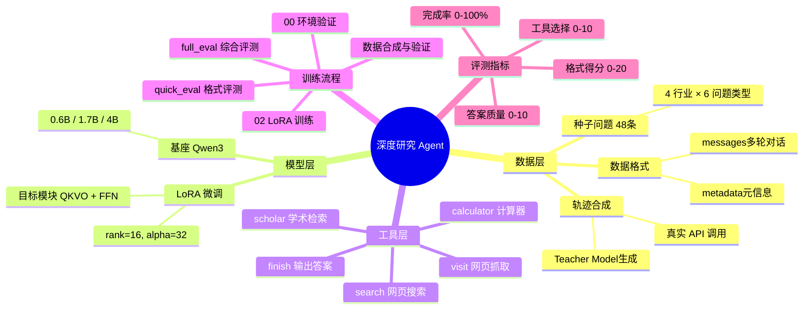
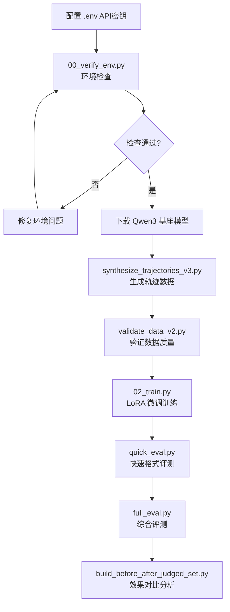

---
tags:
  - LLM
  - Agent
  - FineTuning
  - LoRA
  - 工具调用
  - 深度研究
created: 2026-03-26
aliases:
  - Deep Research Agent
  - 拓业智询
---

# 深度研究 Agent 训练项目

> [!abstract] 项目一句话总结
> 通过 LoRA 微调 Qwen3 小模型，使其学会"先搜索、再思考、最后给出带引用的答案"的多步骤推理能力，服务于中小企业咨询场景（金融/餐饮/创业/智慧交通）。

---

## 一、思维导图



---

## 二、核心概念详解

### 2.1 什么是"轨迹数据"（Trajectory）

> [!note] 概念
> **轨迹**是一条完整的多轮对话记录，包含模型的**思考过程**、**工具调用**和**工具返回结果**，是微调的基本单位。

**类比**：就像教一个新员工查资料——你不只告诉他最终答案，而是手把手演示："先去搜索，看看结果，再去深入阅读某篇文章，最后整理成报告"。

**实际数据结构示例**：
```json
{
  "messages": [
    {
      "role": "system",
      "content": "你是拓业智询顾问，需要使用工具进行研究..."
    },
    {
      "role": "user",
      "content": "2024年小微企业贷款有哪些最新政策？"
    },
    {
      "role": "assistant",
      "content": "<think>需要搜索最新政策文件</think>\n<tool_call>{\"name\":\"search\",\"arguments\":{\"query\":\"2024小微企业贷款政策\"}}</tool_call>"
    },
    {
      "role": "tool_response",
      "content": "[1] 国家金融监督管理总局发布《关于做好2024年普惠金融工作的通知》..."
    },
    {
      "role": "assistant",
      "content": "<think>已获取关键信息，整理答案</think>\n<tool_call>{\"name\":\"finish\",\"arguments\":{\"answer\":\"根据[1]，2024年主要政策包括...\"}}</tool_call>"
    }
  ],
  "metadata": {
    "industry": "finance",
    "question_type": "policy",
    "num_steps": 2,
    "tools_used": ["search", "finish"],
    "has_citation": true
  }
}
```

---

### 2.2 LoRA 微调原理

> [!note] 概念
> **LoRA**（Low-Rank Adaptation）是一种参数高效微调方法：冻结原模型权重，只在特定层旁边插入两个小矩阵（A 和 B），训练量极小。

**类比**：大模型是一本百科全书，LoRA 是在书页空白处贴便利贴——原书不变，便利贴记录新知识。

```
原始权重 W (frozen)
     ↓
W + ΔW = W + B × A
         ↑
     LoRA 矩阵（可训练，参数量极少）

rank=16 意味着：
  A: [d_model × 16]
  B: [16 × d_model]
  总参数量 << W 的参数量
```

**本项目 LoRA 配置**：
| 参数 | 值 | 含义 |
|------|-----|------|
| `rank` | 16 | 低秩分解维度 |
| `alpha` | 32 | 缩放系数（实际 scale = alpha/rank = 2） |
| 目标模块 | q/k/v/o/gate/up/down proj | 注意力层 + 前馈层 |

---

### 2.3 工具调用格式

> [!important] 格式规范
> 模型输出必须严格遵循以下格式，否则工具无法被解析执行。

**标准格式**：
```
<think>
这里是模型的内部推理过程，分析当前需要做什么
</think>
<tool_call>{"name": "工具名", "arguments": {"参数名": "参数值"}}</tool_call>
```

**5 个工具说明**：

| 工具 | 用途 | 参数 | 示例场景 |
|------|------|------|----------|
| `search` | 网页搜索 | `query` | 查政策、市场概况 |
| `visit` | 抓取网页内容 | `url` | 读取搜索结果中的具体文章 |
| `calculator` | 数学计算 | `expression` | 计算利率、增长率 |
| `scholar` | 学术检索 | `query` | 查行业研究报告 |
| `finish` | 输出最终答案 | `answer` | 结束对话，给出带引用的回答 |

> [!warning] 效率约束
> 每次对话最多调用 **3 个工具 + 1 个 finish**，共 4 次。不能无限循环搜索。

---

### 2.4 系统设计：4 行业 × 6 问题类型

> [!tip] 设计思路
> 覆盖中小企业主最常见的咨询场景，保证训练数据的多样性。

```
行业维度：
  finance       → 金融/贷款/保险
  catering      → 餐饮连锁/食品安全
  startup       → 创业/融资/股权
  smart_transport → 智慧交通/网约车/物流

问题类型维度：
  policy       → 政策查询（"有什么补贴"）
  market       → 市场分析（"行业规模如何"）
  competitor   → 竞争对手（"竞品有哪些优劣势"）
  calculation  → 数据计算（"回本周期是多少"）
  risk         → 风险评估（"有什么潜在风险"）
  expansion    → 扩张建议（"如何开拓新市场"）
```

**组合示例**：
- `finance × calculation` → "按揭贷款月供怎么计算？"
- `catering × competitor` → "喜茶和奈雪的商业模式有何不同？"
- `startup × policy` → "科技型中小企业有哪些税收优惠？"

---

## 三、项目结构

```
train_project/
├── .env.example          # API 密钥配置模板
├── requirements.txt      # Python 依赖
├── README.md
│
├── docs/
│   ├── 操作手册.md       # 完整操作流程
│   └── 脚本说明.md       # 每个脚本的详细说明
│
├── data/
│   └── train_v3_1200_merged_clean.jsonl  # 训练数据 (1140 条)
│
├── src/
│   ├── data/
│   │   ├── schema_v2.py         # 数据格式定义 + 验证函数
│   │   └── seed_questions_v2.py # 48 条种子问题
│   ├── train/
│   │   └── data_loader_v2.py    # Dataset 类 + 统计分析
│   ├── eval/
│   │   └── agent_runner.py      # 推理 + 工具执行
│   └── tools/
│       ├── tool_definitions.py  # 工具 JSON Schema 定义
│       └── tool_executor.py     # 工具真实 API 调用
│
└── scripts/
    ├── 00_verify_env.py              # 环境检查
    ├── 02_train.py                   # LoRA 训练主脚本
    ├── synthesize_trajectories_v3.py # 数据合成（多线程）
    ├── validate_data_v2.py           # 数据质量验证
    ├── quick_eval.py                 # 快速格式评测
    ├── full_eval.py                  # 综合评测
    ├── build_format_boost.py         # 格式增强数据集
    ├── normalize_toolcall_json.py    # 工具调用格式标准化
    ├── expand_seeds_with_llm.py      # 种子问题扩充
    └── build_before_after_judged_set.py # 训练前后对比分析
```

---

## 四、完整训练流程



### 各阶段详解

#### 阶段 1：环境配置
```bash
# 1. 复制并填写 API 密钥
cp .env.example .env
# 编辑 .env，填入：
# DASHSCOPE_API_KEY=sk-xxx   (阿里云 LLM)
# BOCHA_API_KEY=xxx           (博查搜索)
# JINA_API_KEY=xxx            (Jina 网页读取)

# 2. 安装依赖
pip install -r requirements.txt

# 3. 验证环境
python scripts/00_verify_env.py
```

#### 阶段 2：数据合成
```bash
# 多线程合成轨迹（8线程，生成300条）
python scripts/synthesize_trajectories_v3.py \
    --num_samples 300 \
    --threads 8 \
    --output data/my_trajectories.jsonl

# 验证数据
python scripts/validate_data_v2.py \
    --input data/my_trajectories.jsonl
```

#### 阶段 3：LoRA 训练
```bash
python scripts/02_train.py \
    --model_path ./models/Qwen3-1.7B \
    --data_path data/train_v3_1200_merged_clean.jsonl \
    --output_dir ./runs/
```

> [!tip] 训练参数说明
> - **batch_size**: 影响显存占用和训练稳定性
> - **cosine scheduler**: 学习率先热身再余弦衰减，防止过拟合
> - **loss masking**: 只对 assistant 的输出计算 loss，system/user/tool_response 不参与训练

#### 阶段 4：评测
```bash
# 快速格式评测（只看<think>和<tool_call>格式是否正确）
python scripts/quick_eval.py \
    --base_model ./models/Qwen3-1.7B \
    --lora_path ./runs/latest/

# 综合评测（格式+工具选择+答案质量）
python scripts/full_eval.py \
    --base_model ./models/Qwen3-1.7B \
    --lora_path ./runs/latest/
```

---

## 五、关键代码解析

### 5.1 数据加载器（Loss Masking 核心）

```python
# src/train/data_loader_v2.py
class DeepResearchDatasetV2(Dataset):
    def __getitem__(self, idx):
        messages = self.data[idx]["messages"]

        # 拼接所有消息，但只对 assistant 的部分计算 loss
        input_ids = []
        labels = []

        for msg in messages:
            tokens = tokenize(msg["content"])
            input_ids.extend(tokens)

            if msg["role"] == "assistant":
                labels.extend(tokens)  # 计算 loss
            else:
                labels.extend([-100] * len(tokens))  # 忽略 loss

        return {"input_ids": input_ids, "labels": labels}
```

> [!example] 为什么要 Loss Masking？
> 我们只想让模型学会"如何回答"，不需要让它学 system prompt 或用户问题。
> `-100` 是 PyTorch 的特殊标记，CrossEntropyLoss 会忽略这些位置。

### 5.2 工具执行器（真实 API 调用）

```python
# src/tools/tool_executor.py
class ToolExecutor:
    def execute(self, tool_name, arguments):
        if tool_name == "search":
            # 调用博查搜索 API
            return self._bocha_search(arguments["query"])
        elif tool_name == "visit":
            # 调用 Jina Reader 抓取网页
            return self._jina_visit(arguments["url"])
        elif tool_name == "calculator":
            # 安全执行数学表达式
            return str(eval(arguments["expression"]))
        elif tool_name == "finish":
            return arguments["answer"]  # 直接返回答案
```

### 5.3 数据合成（多线程 + Teacher Model）

```python
# scripts/synthesize_trajectories_v3.py 核心逻辑
def generate_trajectory(seed_question):
    """用 teacher model 生成一条完整轨迹"""
    messages = [system_prompt, user_question]

    for step in range(max_steps):  # 最多 4 步
        # 让 teacher model 决定下一步动作
        response = call_llm(messages)

        # 解析工具调用
        tool_call = parse_tool_call(response)

        if tool_call["name"] == "finish":
            break  # 结束

        # 执行真实工具调用
        tool_result = executor.execute(tool_call)

        # 将结果加入对话历史
        messages.append({"role": "tool_response", "content": tool_result})

    return validate_and_format(messages)
```

---

## 六、评测结果分析

> [!success] 训练效果（来自 reports/training_before_after_summary.md）

| 指标 | 基础模型 (baseline) | 微调后 (LoRA) | 提升 |
|------|---------------------|---------------|------|
| 格式正确率 | 4/20 | 20/20 | **5x** |
| 工具调用能力 | 0/10 | 2/10 | 从无到有 |
| 答案正确率 | 0/10 | 2/10 | 从无到有 |

> [!note] 解读
> 格式提升最显著（20%→100%），说明 LoRA 对"输出格式学习"非常有效。
> 工具调用和答案质量仍有提升空间，需要更多高质量训练数据。

---

## 七、优化方案

> [!tip] 可以改进的方向

### 数据质量优化
1. **增加数据量**：当前 1140 条，建议扩充到 5000+ 条
2. **更均匀的分布**：用 `validate_data_v2.py` 检查各行业/类型是否均衡
3. **难度分层**：加入更多 3-4 步的复杂推理轨迹
4. **拒绝采样**：过滤掉格式不合规或答案质量差的轨迹

### 训练策略优化
1. **增大 rank**：`rank=32` 可提升模型容量（代价是显存和训练时间）
2. **课程学习**：先训简单问题（2步），再训复杂问题（4步）
3. **DPO 对齐**：在 SFT 基础上加 DPO，进一步提升答案质量
4. **模型更大**：从 1.7B 升级到 4B 或 7B

### 工程优化
1. **工具缓存**：相同 query 的搜索结果可以缓存，降低 API 费用
2. **并行推理**：评测时使用 vLLM 批量推理加速
3. **自动化评测**：在 CI/CD 中集成 quick_eval，每次训练后自动评测

---

## 八、测试题

> [!question] 答案见 [[深度研究Agent训练项目_答案]]

### 基础概念题

**Q1**：轨迹数据（Trajectory）中，`labels` 数组里为什么有些位置是 `-100`？

**Q2**：LoRA 的核心思想是什么？与全量微调相比，它的主要优势是什么？

**Q3**：本项目规定每次对话最多调用几次工具（包括 finish）？为什么要限制次数？

**Q4**：`<think>` 标签和 `<tool_call>` 标签分别代表什么？缺少 `<think>` 标签会怎样？

**Q5**：本项目覆盖了哪 4 个行业和哪 6 种问题类型？请各举一个具体问题示例。

---

### 项目结构题

**Q6**：`src/tools/tool_executor.py` 和 `src/tools/tool_definitions.py` 分别负责什么？为什么要分开？

**Q7**：`quick_eval.py` 和 `full_eval.py` 的区别是什么？什么情况下用哪个？

**Q8**：`build_format_boost.py` 这个脚本的作用是什么？什么情况下需要用它？

---

### 代码理解题

**Q9**：以下代码片段来自数据加载器，请解释它的作用：
```python
if msg["role"] == "assistant":
    labels.extend(tokens)
else:
    labels.extend([-100] * len(tokens))
```

**Q10**：如果一个工具调用响应格式如下，请判断它是否符合规范，并说明原因：
```
我需要先搜索相关信息。
<tool_call>{"name": "search", "arguments": {"query": "2024年餐饮行业政策"}}</tool_call>
```

---

### 分析与优化题

**Q11**：训练结果显示"格式得分 4→20"但"工具调用 0→2"，为什么格式提升比工具调用提升更容易？

**Q12**：如果你发现模型训练后仍然不会调用 `calculator` 工具，你会从哪些方面排查问题？

**Q13**：假设你有 10,000 条轨迹数据，但发现 `finance` 行业占了 70%，其他行业各占 10%，这会有什么问题？如何解决？

**Q14**：什么是 DPO（Direct Preference Optimization）？在本项目中，它可以解决 SFT 无法解决的什么问题？（提示：思考"答案质量提升有限"的根本原因）

---
