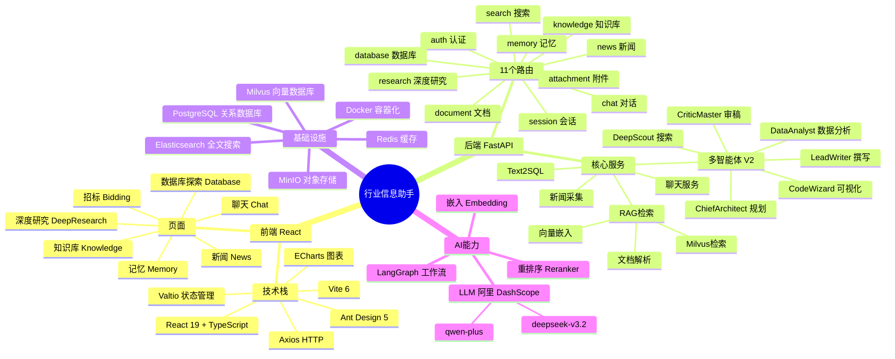
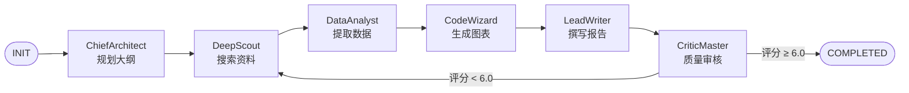
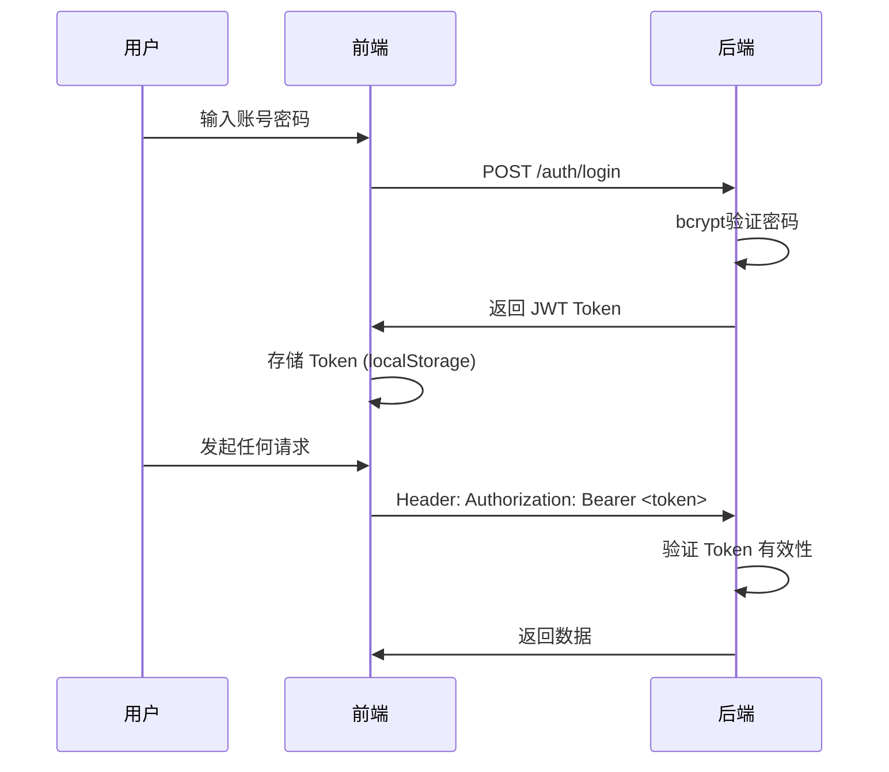
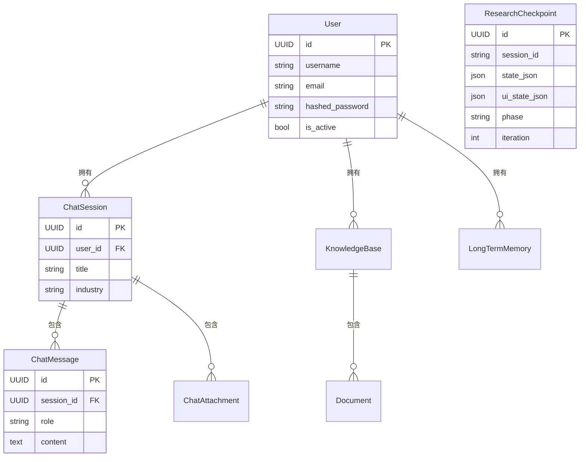
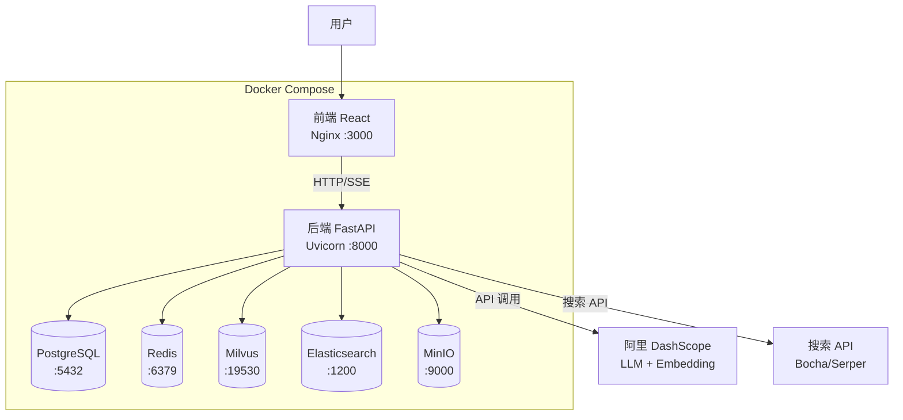

---
tags:
  - LLM
  - 项目学习
  - FastAPI
  - React
  - 多智能体
  - RAG
created: 2026-03-26
---

# 行业信息助手 — 学习笔记

> [!abstract] 项目一句话概括
> 一个基于 **多智能体 + RAG** 的行业研究平台：用户输入研究问题，系统自动调度多个 AI Agent 协作，完成「规划 → 搜索 → 数据分析 → 可视化 → 撰写 → 审稿」全流程，最终输出结构化行业研究报告。

---

## 一、思维导图



---

## 二、项目结构总览

```
industry_information_assistant/
├── backend/                ← Python FastAPI 后端
│   └── app/
│       ├── config/         ← 配置（LLM参数、行业关键词、股票映射）
│       ├── core/           ← 基础设施（数据库、Redis、安全）
│       ├── models/         ← SQLAlchemy ORM 数据模型
│       ├── router/         ← API 路由（11个）
│       ├── schemas/        ← Pydantic 请求/响应模型
│       └── service/        ← 业务逻辑（25+模块）
│           └── deep_research_v2/   ← 多智能体核心
│               ├── state.py        ← 研究状态定义
│               ├── graph.py        ← LangGraph 工作流
│               ├── service.py      ← 对外接口
│               └── agents/         ← 6个专业Agent
├── frontend/               ← React + TypeScript 前端
│   └── src/
│       ├── api/            ← 后端接口封装
│       ├── components/     ← 可复用组件
│       ├── pages/          ← 页面组件
│       ├── store/          ← Valtio 全局状态
│       └── router/         ← React Router 路由
├── docker-compose.yml      ← 一键启动全部服务
└── data/                   ← 示例PDF文档
```

---

## 三、核心概念精讲

### 3.1 RAG（检索增强生成）

> [!info] 什么是 RAG？
> RAG = Retrieval-Augmented Generation。解决 LLM「记不住私有文档」的问题：先把文档变成向量存起来，回答时先检索相关片段，再交给 LLM 生成答案。

**流程示例：**

```
用户问："华为2024年营收多少？"
         ↓
① 将问题转成向量 [0.12, -0.34, ...]
② 去 Milvus 找相似度最高的文档片段
③ 找到："华为2024年年报显示营收为7042亿元"
④ 把片段 + 问题 一起喂给 LLM
⑤ LLM 回答："根据年报，华为2024年营收为7042亿元"
```

**本项目实现位置：**
- 嵌入生成：`service/embedding_service.py`
- 向量存储：`service/milvus_service.py`
- 检索逻辑：`service/retrieval_service.py`（混合检索：向量 + 关键词）

---

### 3.2 多智能体系统（Multi-Agent）

> [!info] 为什么需要多个 Agent？
> 单个 LLM 一次性完成复杂研究报告质量差。拆分成专业分工的 Agent，每人做自己最擅长的事，最后组合输出。

**6 个 Agent 角色：**

| Agent | 角色 | 主要职责 | 使用模型 |
|---|---|---|---|
| **ChiefArchitect** | 首席架构师 | 拆解问题，生成报告大纲 | deepseek-v3.2 |
| **DeepScout** | 深度侦察员 | 联网搜索 + 知识库检索 | qwen-plus |
| **DataAnalyst** | 数据分析师 | 提取数量化数据、验证事实 | deepseek-v3.2 |
| **CodeWizard** | 代码巫师 | 生成 Python 代码并绘制图表 | deepseek-v3.2 |
| **CriticMaster** | 审稿大师 | 质量评分（1-10），提出修改意见 | deepseek-v3.2 |
| **LeadWriter** | 首席撰稿人 | 整合所有信息，撰写完整报告 | deepseek-v3.2 |

**协作流程（状态机）：**



**关键代码位置：**
- 状态定义：`service/deep_research_v2/state.py`
- 工作流：`service/deep_research_v2/graph.py`（LangGraph StateGraph）
- Agent 基类：`service/deep_research_v2/agents/base.py`

---

### 3.3 LangGraph 工作流

> [!info] 什么是 LangGraph？
> LangGraph 是 LangChain 的工作流编排库。把 Agent 的执行过程定义成一个**有向图（DAG/状态机）**，每个节点是一个函数，边是条件跳转。

**类比理解：**
- 传统代码：`if score < 6: goto research` （命令式）
- LangGraph：把这个逻辑画成图，框架自动执行 （声明式）

**本项目如何用：**
```python
# graph.py 中大致逻辑（简化）
from langgraph.graph import StateGraph

graph = StateGraph(ResearchState)
graph.add_node("architect", architect_agent.run)
graph.add_node("scout", scout_agent.run)
graph.add_node("writer", writer_agent.run)
graph.add_node("critic", critic_agent.run)

# 条件边：审稿不通过就继续搜索
graph.add_conditional_edges(
    "critic",
    lambda state: "scout" if state.quality_score < 6.0 else END
)
```

---

### 3.4 Server-Sent Events（SSE）流式输出

> [!info] 为什么用 SSE？
> 深度研究可能需要几分钟，不能让用户干等。SSE 让服务端把每一步进展实时「推送」到前端，用户可以看到进度条和中间结果。

**数据流向：**
```
后端 FastAPI
  ↓  yield "data: {phase: 'researching'}\n\n"
  ↓  yield "data: {found: '5 results'}\n\n"
  ↓  yield "data: {report: '...'}\n\n"
前端 EventSource
  ↓  onmessage → 更新 UI
```

**后端关键代码（`research_router.py`）：**
```python
@router.post("/research/stream")
async def stream_research(request: ResearchRequest):
    async def generate():
        async for event in deep_research_service.research(request):
            yield f"data: {event}\n\n"   # SSE 格式
    return StreamingResponse(generate(), media_type="text/event-stream")
```

---

### 3.5 Checkpoint（断点续研）

> [!info] 解决什么问题？
> 研究中途网络断开 / 用户关闭浏览器，整个研究进度就丢失了。Checkpoint 把每一阶段的状态存到 PostgreSQL，随时可以从断点恢复。

**存储的内容：**
- `state_json`：后端研究状态（已收集的资料、当前阶段等）
- `ui_state_json`：前端 UI 状态（进度条、已展示内容）
- `phase`：当前处于哪个研究阶段
- `iteration`：第几轮审稿

**恢复流程：**
```
用户点"继续研究"
  → GET /research/checkpoint/{session_id}/full
  → 加载 state_json + ui_state_json
  → 从上次的 phase 继续执行 LangGraph 图
```

---

### 3.6 Text2SQL（自然语言转 SQL）

> [!info] 解决什么问题？
> 普通用户不会写 SQL，但想查行业数据库。Text2SQL 让用户用自然语言提问，系统自动生成并执行 SQL。

**示例：**
```
用户输入："2024年新能源汽车行业收入最高的前5家公司"
     ↓
LLM 生成 SQL：
  SELECT company_name, revenue
  FROM company_data
  WHERE industry='new_energy_auto' AND year=2024
  ORDER BY revenue DESC LIMIT 5
     ↓
执行 SQL，返回结果表格
```

**实现位置：** `service/text2sql_service.py`

---

### 3.7 JWT 认证流程



---

## 四、数据库设计



---

## 五、前端架构

### 5.1 状态管理（Valtio）

> [!tip] Valtio vs Redux
> Valtio 使用 JavaScript Proxy，直接修改状态对象即可触发更新，比 Redux 的 reducer/action 模式简洁得多。

```typescript
// store/session.ts 示意
import { proxy } from 'valtio'

export const sessionStore = proxy({
  currentSessionId: '',
  messages: [],
  // 直接赋值就能触发 UI 更新
  setSession(id: string) {
    this.currentSessionId = id
  }
})
```

### 5.2 API 层架构

```
src/api/
├── index.ts          ← Axios 实例 + 全局配置
├── request/
│   ├── index.ts      ← Axios 创建
│   └── plugins/
│       ├── auth.ts       ← 自动注入 JWT Token
│       ├── error-toast.ts ← 全局错误提示
│       ├── loading.ts    ← Loading 状态管理
│       └── repeat.ts     ← 防重复请求
├── auth.ts           ← 认证相关接口
├── session.ts        ← 会话相关接口
└── ...
```

### 5.3 页面路由

```
/               → 首页
/login          → 登录
/chat/:id       → 聊天页（含深度研究）
/knowledge      → 知识库管理
/memory         → 长期记忆
/news           → 行业新闻
/bidding        → 招标信息
/database       → 数据库探索
```

---

## 六、部署架构



---

## 七、关键设计模式

| 模式 | 位置 | 说明 |
|---|---|---|
| **依赖注入** | 所有 router | FastAPI `Depends()` 注入 service/db |
| **服务层模式** | `service/` | 业务逻辑与路由分离 |
| **状态机** | `state.py` | 研究阶段用枚举管理流转 |
| **观察者/事件流** | SSE 输出 | 研究进展实时推送 |
| **单例模式** | `llm_config.py` | `get_config()` 全局配置实例 |
| **策略模式** | V1/V2 研究 | 两套研究实现可切换 |
| **工厂模式** | `agent` 实例化 | 根据配置创建不同 Agent |

---

## 八、V1 vs V2 对比

| 对比项 | V1 (ReAct) | V2 (Multi-Agent) |
|---|---|---|
| **架构** | 单 Agent 循环 | 6 Agent 专业分工 |
| **编排** | 手动循环 | LangGraph 状态图 |
| **质量控制** | 无 | CriticMaster 审稿循环 |
| **可视化** | 无 | CodeWizard 自动生成图表 |
| **断点续研** | 不支持 | Checkpoint 持久化 |
| **适用场景** | 简单问答 | 复杂行业研究报告 |

---

## 九、优化方向

> [!tip] 可以改进的地方

1. **并行搜索**：DeepScout 目前串行搜索各子话题，可改为并发（`asyncio.gather`）
2. **缓存策略**：相同查询的搜索结果可缓存到 Redis，减少 API 调用
3. **Agent 超时**：没有单个 Agent 的超时控制，长时间运行会阻塞
4. **Milvus 索引**：向量检索可以加 HNSW 索引，提升大规模检索速度
5. **前端状态持久化**：深度研究中途刷新页面会丢失进度展示（已有后端 checkpoint，但前端恢复逻辑待完善）
6. **流量控制**：多用户同时发起深度研究，可能超出 API 速率限制，需要加队列
7. **评估指标**：CriticMaster 的评分标准较主观，可引入结构化评估框架

---

## 十、测试题

> [!question] 回答以下问题检验学习效果，答案见 [[行业信息助手_测试题答案]]

**基础概念（理解层）**

1. RAG 与纯 LLM 问答有什么本质区别？本项目的 RAG 流程涉及哪些服务模块？

2. 为什么深度研究功能要拆成 6 个 Agent，而不是让一个 LLM 完成所有工作？

3. SSE（Server-Sent Events）和 WebSocket 的区别是什么？本项目为什么选择 SSE 而不是 WebSocket？

4. Checkpoint 功能解决了什么问题？它把哪两种状态分开存储，为什么要这样设计？

**架构分析（分析层）**

5. 画出一次完整「深度研究请求」的数据流：从用户点击「开始研究」到最终报告展示，经过哪些模块？

6. `llm_config.py` 中，不同 Agent 使用了不同的温度（temperature）参数：DeepScout 是 0.5，LeadWriter 是 0.7，DataAnalyst 是 0.3。请解释这样设计的原因。

7. 本项目中 Redis 和 Milvus 分别承担什么职责？能否互换？

8. `research_router.py` 中研究接口同时提供了 POST 和 GET 两个版本（`/research/stream`），为什么要提供 GET 版本？

**代码理解（应用层）**

9. 如果要新增一个「法规分析师」Agent（LegalAnalyst）负责搜索法规政策，需要修改哪些文件？列出至少 4 个。

10. 前端 `store/` 目录使用了 Valtio 而不是 Redux。在深度研究场景中，如果需要实时更新研究进度（从 0% 到 100%），用 Valtio 应该如何设计这个状态？写出大致代码结构。

**扩展思考（评估层）**

11. CriticMaster 的质量阈值设为 6.0（满分 10），最大迭代次数为 1。如果把迭代次数改为 5，可能带来哪些问题？

12. 本项目有一个 `stock_mapping.py` 文件，维护了公司名称到股票代码的映射。这种硬编码方式有什么局限性？提出一个更好的设计方案。
