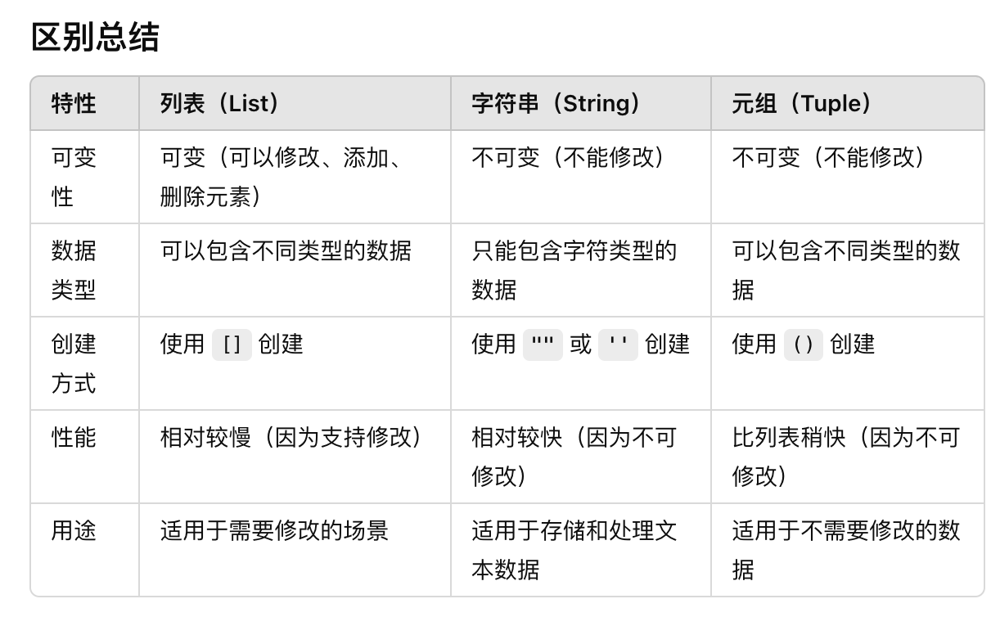

# python速通

## 变量类型
Python是动态类型语言，变量无需声明类型。常见数据类型有整数（int）、浮点数（float）、字符串（str）、布尔值（bool）

```python
# 整型（int）：存储整数
age = 25  # 变量名见名知意
print(age * 2)  # 输出50（数学运算）

# 浮点型（float）：存储小数
price = 9.99
print(price / 3)  # 输出3.33（除法运算）

# 字符串（str）：文本需用引号包裹
name = "小明"
print("Hi " + name)  # 字符串拼接

# 布尔型（bool）：只有True/False两个值
is_rain = False
print(not is_rain)  # 输出True（逻辑非运算）

# 类型转换（重点！）
num_str = "123"
num_int = int(num_str)  # 字符串→整型
print(num_int)
print(num_str  + '7')  # 输出'1237'（字符串拼接）
```

```text
50
3.33
Hi 小明
True
123
1237
```

## 基本运算符
- 算术运算符：用于常见数学运算，如加法、减法等。
- 比较运算符号：== !=
- 逻辑运算符：or and not

```python
a = -11
b = 3
print('a+b:',a + b)  # 加法: 10 + 3 = 13
print('a-b:',a - b)  # 减法: 10 - 3 = 7
print('a*b:',a * b)  # 乘法: 10 * 3 = 30
print('a/b:',a / b)  # 除法: 10 / 3 ≈ 3.33
print('a%b:',a % b)  # 取余: 10 % 3 = 1
print('a//b:',a // b) # 整除: 10 // 3 = 3
print('a**b:',a ** b) # 幂运算: 10 ** 3 = 1000

c = 1110
print('a==c:',a==c) #输出False
print('a!=c:',a!=c) # 输出True
print(a>c)

print('a or c:',c or a) # or运算只要有一个为真则为真
print('a and c:',a and c) # &操作两个均为真才为真
print('not c:',not c)
```

```text
a+b: -8
a-b: -14
a*b: -33
a/b: -3.6666666666666665
a%b: 1
a//b: -4
a**b: -1331
a==c: False
a!=c: True
False
a or c: 1110
a and c: 1110
not c: False
```

## 数据类型

**列表操作：** 列表是一个可变的、有序的容器。

```python
# 创建与修改
scores = [85, 90, 78] 
print(scores[1])
scores[1] = 95    # 修改第二个元素 → [85,95,78]
print(scores)

scores.append(88) # 末尾添加 → [85,95,78,88]
print(scores)
scores.pop()     # 删除第一个元素 → [95,78,88]
print(scores)

# 列表切片（重点！）
letters = ['a','b','c','d','e']
print(letters[1:3])   # ['b','c']（左闭右开）
print(letters[-2])    # 'e'（倒数第一个）

# 列表推导式（快速生成列表）
squares = [x**2 for x in range(5)]  # [0,1,4,9,16]
print(squares)

list_1=[1,2,'str']
print(list_1)
```

```text
90
[85, 95, 78]
[85, 95, 78, 88]
[85, 95, 78]
['b', 'c']
d
[0, 1, 4, 9, 16]
[1, 2, 'str']
```

**字典操作：**
字典是一种无序、可变的键值对数据结构。

```python
# 创建与访问，key-value对
student = {
    "name": "李华",
    "age": 22,
    "courses": ["Math", "CS"]
}
print(student["name"])
# print(student["gender"])
print(student.get("gender",'未知'))  # 安全访问，避免KeyError

# 修改字典
student["gender"] = "female"  # 新增键值对
print(student)
del student["age"]          # 删除键值对
print(student)

# 遍历字典
for key, value in student.items():
    print(f"{key}: {value}")

# 提取kv
print(student.keys())
print(student.values())
print(student.items())
```

```text
李华
未知
{'name': '李华', 'age': 22, 'courses': ['Math', 'CS'], 'gender': 'female'}
{'name': '李华', 'courses': ['Math', 'CS'], 'gender': 'female'}
name: 李华
courses: ['Math', 'CS']
gender: female
dict_keys(['name', 'courses', 'gender'])
dict_values(['李华', ['Math', 'CS'], 'female'])
dict_items([('name', '李华'), ('courses', ['Math', 'CS']), ('gender', 'female')])
```

**元组：**

```python
my_tuple = (1, 2, 3, "a")
print(my_tuple[0])
# my_tuple[0]=5
```

```text
1
```

**区别和转化**



```python
my_list = ['h', 'e', 'l', 'l', 'o']
my_string = '-'.join(my_list)  # 合并成字符串
print(my_string)  # 输出 "hello"
```

```text
h-e-l-l-o
```

```python
my_string = "hello xiaoming"
my_list = list(my_string)
print(my_list)  # 输出 ['h', 'e', 'l', 'l', 'o']
```

```text
['h', 'e', 'l', 'l', 'o', ' ', 'x', 'i', 'a', 'o', 'm', 'i', 'n', 'g']
```

```python
my_list = [1, 2, 3, "a"]
my_tuple = tuple(my_list)
print(my_tuple)  # 输出 (1, 2, 3, 'a')
```

```text
(1, 2, 3, 'a')
```

列表 → 元组 → 字符串 转换时，可以通过 tuple()、list()、str.join() 来进行，但要记住，转换为字符串时必须确保容器内的元素可以连接成一个字符串。
字符串 → 列表 → 元组 的转换会将每个字符作为一个元素，特别是对于字符串，需要理解它会按字符拆分。

```python
str_1='i love china'
print(str_1.split())
```

```text
['i', 'love', 'china']
```

## 条件判断
使用if、elif、else判断条件。
- 解释：Python的条件语句用来根据不同的条件执行不同的代码块。if是最基本的条件判断，elif为多个条件的扩展，else在其他条件不成立时执行

```python
age = 50
#注意：和空格
if age < 18:
    print("未成年")
elif age < 45:
    print("成年人")
elif 45<=age<65:
    print("更年期")
else:
    print("老年人")
```

```text
更年期
```

## 循环
for 循环用于遍历一个可迭代的对象（如列表、元组、字符串、字典、集合，或者是通过 range() 函数生成的数字序列）。它会依次获取序列中的每个元素，直到遍历完所有元素为止。

```python
# for 循环
for i in [0,1,2,3,4]:  # range(5) 生成一个从0到4的数字
    print(i**2)

# while 循环
count = 0
while count < 5:
    print(count)
    count += 0.5
    if count>4:
        continue
    print(count)
```

```text
0
1
4
9
16
0
0.5
0.5
1.0
1.0
1.5
1.5
2.0
2.0
2.5
2.5
3.0
3.0
3.5
3.5
4.0
4.0
4.5
```

```python
# range() 函数：
# range() 函数常用于生成一个数字序列。它的语法是：
# range(start, stop, step)

for i in range(2, 10, 3):  # 从2开始，直到10（不包括10），步长为2
    print(i)
```

```text
2
5
8
```

## 函数定义
原理：封装重复代码，提高复用性

```python
# 定义带默认参数的函数
def greet(name, greeting="你好"):  # greeting有默认值
    return f"{greeting}, {name}!"

print(greet("Alice"))        # 使用默认参数 → 你好, Alice!
print(greet("Bob", "Hello")) # 覆盖默认参数 → Hello, Bob!

# 返回多个值（实际返回元组）
def calculate(a, b):
    return a+b, a*b  # 返回两个计算结果

sum_result, product_result = calculate(5,4)
print(f"和：{sum_result}, 积：{product_result}")  # 和：7, 积：12
```

```text
你好, Alice!
Hello, Bob!
和：9, 积：20
```

## 文件操作
读取和写入

```python
# 写入多行内容
with open("diary.txt", "w", encoding="utf-8") as f:
    f.write("2023-10-01\n")   # \n表示换行
    f.write("今天学习了Python\n")

# 按行读取文件
with open("diary.txt", "r", encoding="utf-8") as f:
    lines = f.readlines()     # 读取为列表
    print(lines)
    for line in lines:
        print(line.strip())   # 去除首尾空白
```

```text
['2023-10-01\n', '今天学习了Python\n']
2023-10-01
今天学习了Python
```

## 异常处理
通过try、except块处理错误。

```python
try:
    x = 10 / 0  # 故意引发除零错误
except ZeroDivisionError:
    x=1
    print(x)
    print("除数不能为零！")
```

```text
1
除数不能为零！
```

## 类和对象
定义类并创建实例对象。

```python
class Dog:
    def __init__(self, name, age,color):  # 构造方法
        self.name = name
        self.age = age
        self.color= coler
    
    def bark(self):  # 类方法
        print(f"{self.name} says woof!")

# 创建对象
dog1 = Dog("Buddy", 3)
dog1.bark()  # 调用方法
```

```text
Buddy says woof!
```

## 综合案例

```python
def count_words(filename):
    try:
        with open(filename, 'r') as f:
            content = f.read().lower()  # 转为小写
            words = content.split()     # 分割单词
        print(content)
        print('-'*130)
        print(words)
        print('-'*130)
        word_count = {}
        for word in words:
            word_count[word] = word_count.get(word, 0) + 1
        
        return word_count
    except FileNotFoundError:
        print("文件不存在！")
        return {}

# 使用示例
result = count_words("综合案例文本.txt")
print("单词频率:", result)
```

```text
the quick brown fox jumps over the lazy dog. 
the quick fox is very quick and jumps twice. 
dog, dog, dog! every dog likes the fox. 
hello-world, hello_world, hello!world.
----------------------------------------------------------------------------------------------------------------------------------
['the', 'quick', 'brown', 'fox', 'jumps', 'over', 'the', 'lazy', 'dog.', 'the', 'quick', 'fox', 'is', 'very', 'quick', 'and', 'jumps', 'twice.', 'dog,', 'dog,', 'dog!', 'every', 'dog', 'likes', 'the', 'fox.', 'hello-world,', 'hello_world,', 'hello!world.']
----------------------------------------------------------------------------------------------------------------------------------
单词频率: {'the': 4, 'quick': 3, 'brown': 1, 'fox': 2, 'jumps': 2, 'over': 1, 'lazy': 1, 'dog.': 1, 'is': 1, 'very': 1, 'and': 1, 'twice.': 1, 'dog,': 2, 'dog!': 1, 'every': 1, 'dog': 1, 'likes': 1, 'fox.': 1, 'hello-world,': 1, 'hello_world,': 1, 'hello!world.': 1}
```